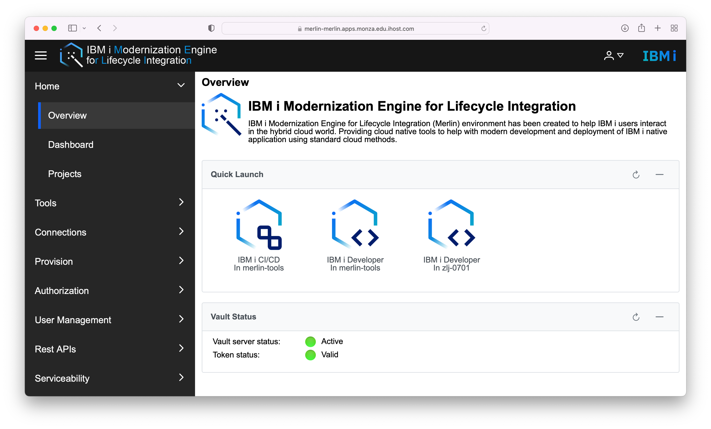

Welcome to the documentation for IBM i Merlin. This includes hands-on tutorials, user guide, and administrator guide.

IBM i Modernization Engine for Lifecycle Integration (Merlin) is a set of tools run in OpenShift containers which guide and assist software developers in the modernization of IBM i applications, allowing them to realize the value of a hybrid cloud, multi-platform DevOps implementation.  

See the [announcement](https://www.ibm.com/docs/en/announcements/i-modernization-engine-lifecycle-integration-merlin-20) for Version 2.0 details.

**News**: 
* Mar. 26, 2025 - [IBM i Guided Tour of Merlin](https://learn.common.org/products/merlin-and-modern-ibm-i-development#tab-product_tab_overview) is available!
* Mar. 25, 2025 - [Merlin as a Service](./guides/platform/MerlinasaService.md) offered by business partners!
* Mar. 17, 2025 - Version 2.0.5 is available with fixes and updates!  
* Dec. 11, 2024 - Version 2.0.4 is available with fixes and updates!  New PTFs required for debugging: 7.4 PTF SJ03026, 7.5 PTF SJ03030!
* Oct. 2, 2024 - Version 2.0.3 is available with fixes and updates!  
* Jul. 23, 2024 - Version 2.0.2 is available with fixes and updates!  
* Jul. 5, 2024 - Version 2.0.1 is available with fixes and updates!  
* Jun. 14, 2024 - Version 2.0 is available!  

#### Getting started videos

* **Overview**: [IBM i Guided Tour of Merlin](https://learn.common.org/products/merlin-and-modern-ibm-i-development#tab-product_tab_overview) with presentation and demo
* **For users**: [YouTube video playlist](https://www.youtube.com/playlist?list=PLPELYviDwCnY6L5r5ZnmCneqhakLcB7ko). Starts with set of videos for configuring the web browser, just watch the video corresponding to your system then continue with the rest.
* **For administrators**: [YouTube video playlist](https://www.youtube.com/watch?v=6UlN1vhrCPo&list=PLPELYviDwCnajC310KB2K7zfu51FPuYJS).

#### Getting help

* Submit product requests using the [IBM Power Systems Ideas Portal](https://ibm-power-systems.ideas.ibm.com/?category=7112512098562980476).
* Discuss the product with other users on the [IBM Community](https://community.ibm.com/community/user/power/communities/community-home?communitykey=f0246bc4-08f3-43c5-a7f8-b6a64d387894).
* For support, open a case on the [Support portal](https://www.ibm.com/mysupport/).  Also, subscribe to [product notifications](https://www.ibm.com/systems/support/myview/subscription/css.wss).
* **[Check out our forum](https://community.ibm.com/community/user/power/communities/community-home/digestviewer?CommunityKey=8fde9d59-7ef0-4474-941f-0184ed3d51b8) to talk to fellow users**

#### Additional resources

* See the [product page](https://www.ibm.com/products/ibm-i-merlin) for more information.
* See [Frequently Asked Questions](https://www.ibm.com/support/pages/ibm-i-modernization-engine-lifecycle-integration-merlin-overview#faq).
* Visit [YouTube](https://www.youtube.com/playlist?list=PLPELYviDwCnYe60cNHs_Hf-4Sr8h_0uVE) for a play list of videos to learn more about Merlin including the integration with ARCAD tools.
* Listen to a [podcast introducing Merlin](https://techchannel.com/Trends/05/2022/merlin-ibm-i-wizard).
* Watch a [COMMON webcast](https://learn.common.org/products/may-2022-ibm-i-updates#tab-product_tab_overview) for a Merlin overview.
* Read a [blog post](https://www.arcadsoftware.com/news-events/blog/a-wizard-for-application-development-and-modernization-on-ibm-i/) on a “Wizard” for Application Development and Modernization on IBM i.
* See the [Version 1 announcement](https://www.ibm.com/common/ssi/ShowDoc.wss?docURL=/common/ssi/rep_ca/8/897/ENUS222-128/index.html).
