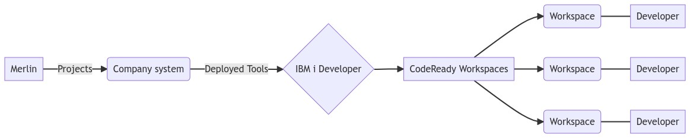
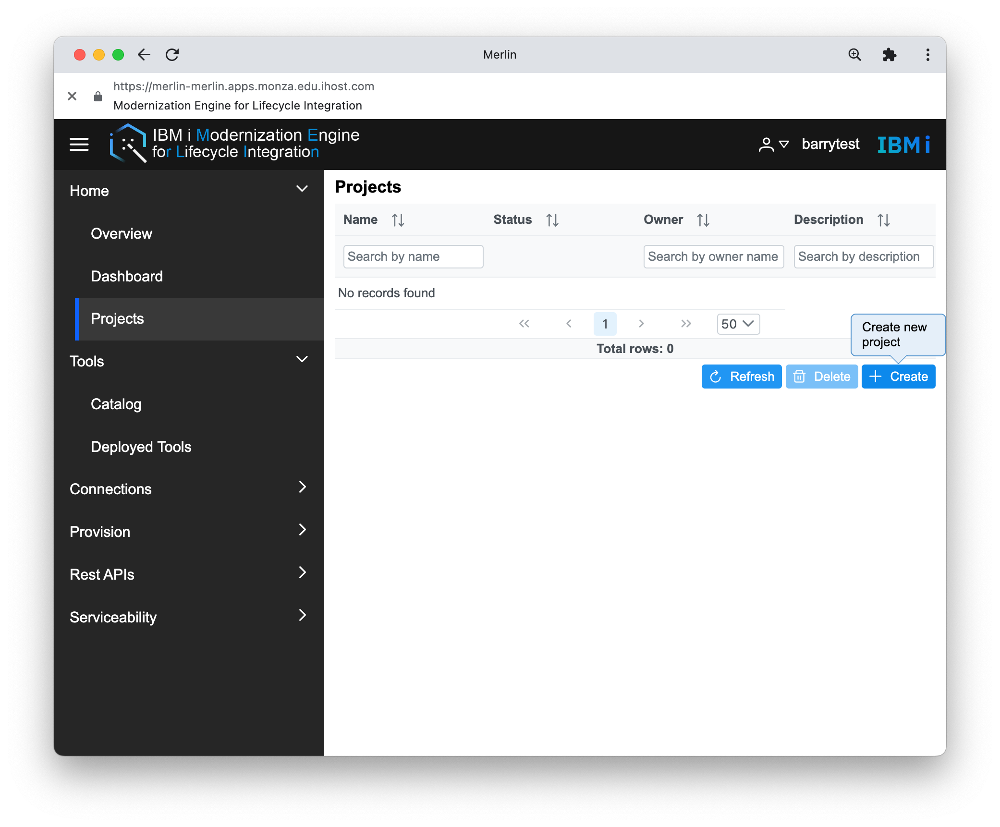
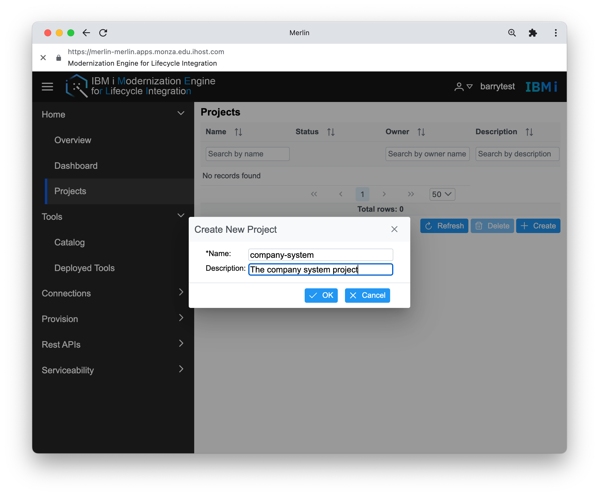
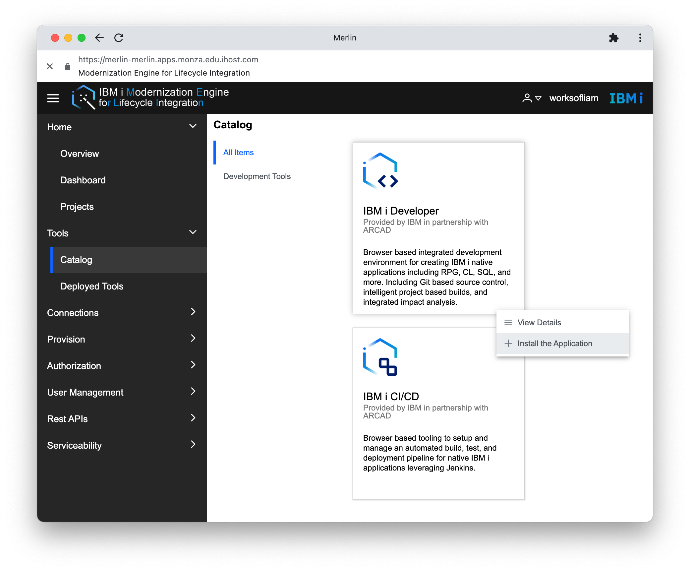
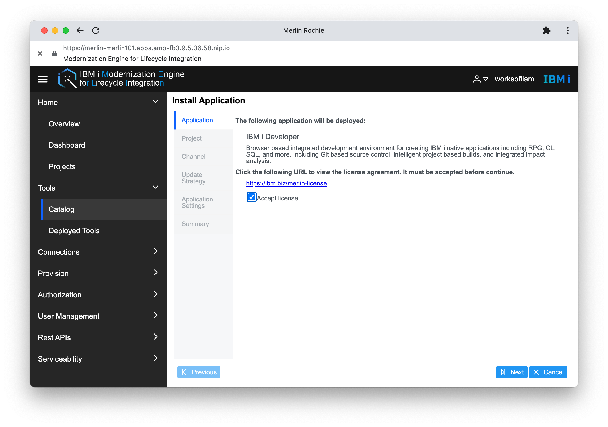
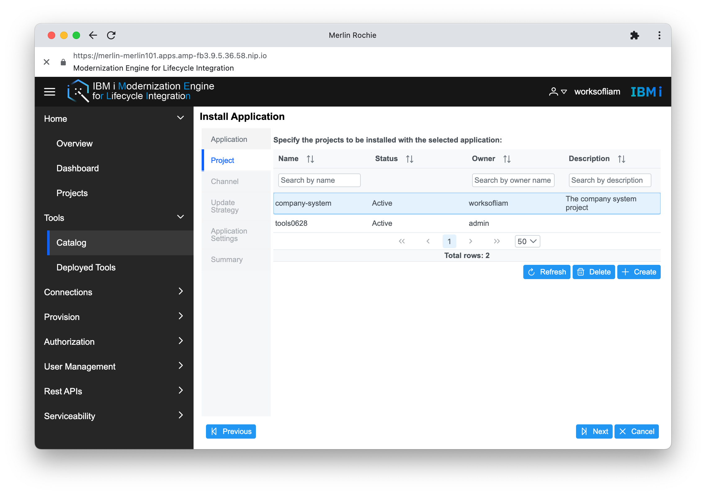
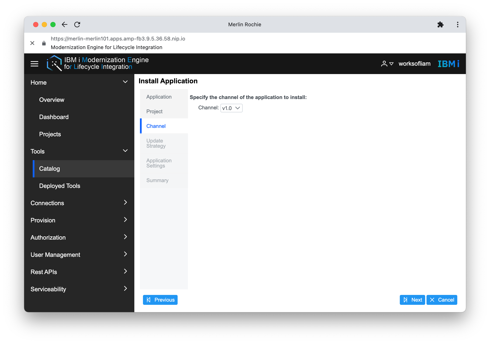
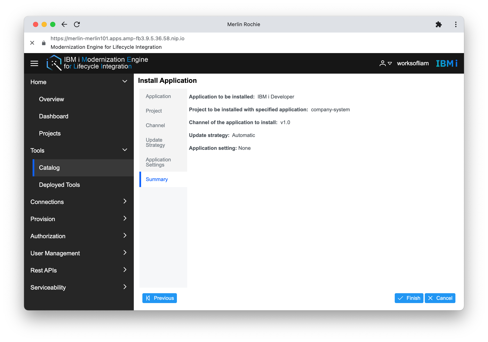
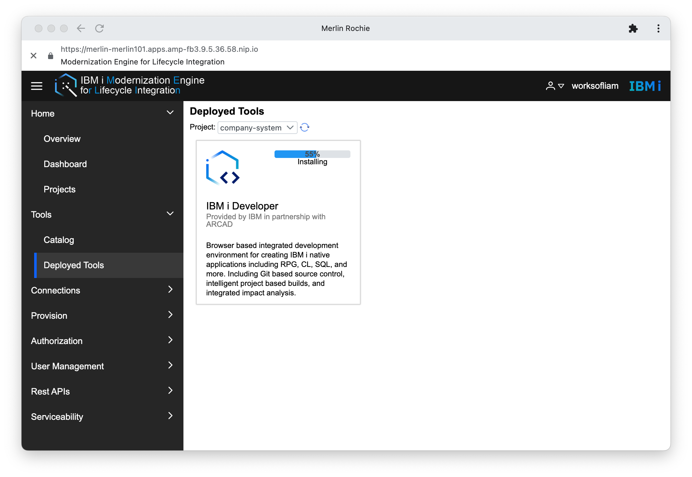

#  Install Applications

To use either Merlin IDE or Merlin CD/CD, you have to setup a project. Then, you are able to install those tools (IDE and CI/CD) into that project. You need to be an admin to create a project. Only one person should create a project. A project can be shared between developers.

[//]: # "```mermaid"
[//]: # "graph LR"
[//]: # "    A[Merlin] -->|Projects| B(Company system)"
[//]: # "    B -->  |Deployed Tools | C{IBM i Developer}"
[//]: # "    C --> D[CodeReady Workspaces]"
[//]: # "    D --> F(Workspace) --- X[Developer]"
[//]: # "    D --> G(Workspace) --- Y[Developer]"
[//]: # "    D --> H(Workspace) --- Z[Developer]"
[//]: # "```"



> Merlin components will not load until you have setup the certificates on your system. [Check out this page for the guides](guides/openshift/merlin-certs.md).

## Creating a Project

First, head over to the Projects tab and select Create.



This gives you a name and a desciption to fill out. I named this project `company-system`.



## Managing Tools

Under the tool menu item, you have two items:

* **Catalog** where you can see available tools to install
* **Deployed Tools** which shows tools that you have already installed

If you head to **Deployed Tools** and select your new project from the dropdown, you'll see nothing show. That is because we haven't installed any yet.

Applications only get installed once into a project. Future developers using this project launch right into it instead of installing their own versions.

To install a tool, head to the **Catalog** and see what tools are available. If you right click on IBM i Developer, have two options:

1. **View Details** which gives you a desciption of the tool
2. **Install the Application** which installs it into a chosen project in the next steps



After you select 'Install the Application', there is a prompt to review and accept a licence agreement.



Clicking next takes you the the following stage, where you click which project you want to install the application into. After you have selected the project, the next button becomes available.



Next, select which channel (version) of the application you want. The default should be the latest. Select the channel you would like to install and select next.



The next page asks you about your update strategy preferences. You can either select Automatic or Manual. It is recomended that Automatic is used to insure the latest updates and security patches for the Merlin tools are being used as they become available.

The Application Settings page may or may not offer you custom configuration. Earlier versions of the the IDE application did not have any configurable settings, so you can continue onto the next page.

The final page is the summary of your setup. Here you can review before either going back and making adjustments or clicking Finish to install the application.



Clicking Finish takes you back to the 'Deployed Tools' page where you can see the application installation status.



When it is finished installing, you can right-click and select 'Launch Application'. This takes you into CodeReady Workspaces.
