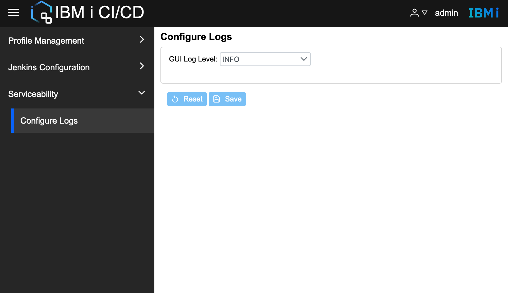

# Configure log level
IBM i CI/CD GUI supports configuring the log level. The default log level is INFO, but that sets it to a different level is supported.
The log levels supported for GUI are **OFF**, **SEVERE**, **WARNING**, **INFO**, **FINEST**, **ALL**.  

