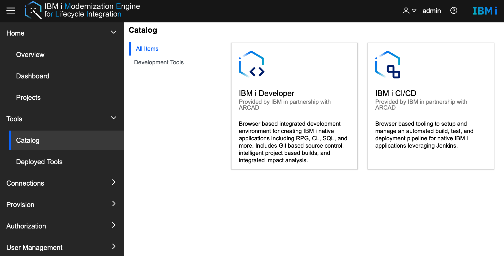
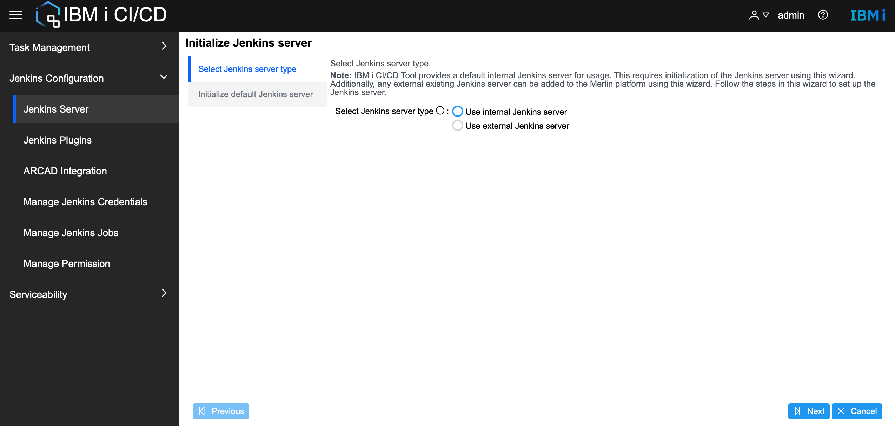
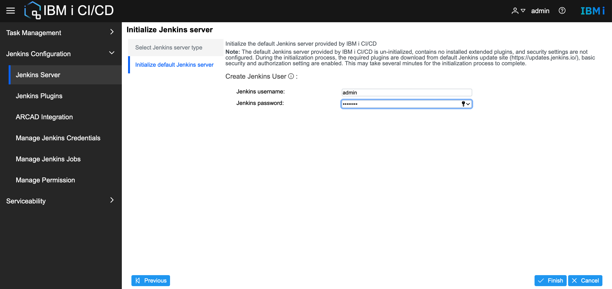
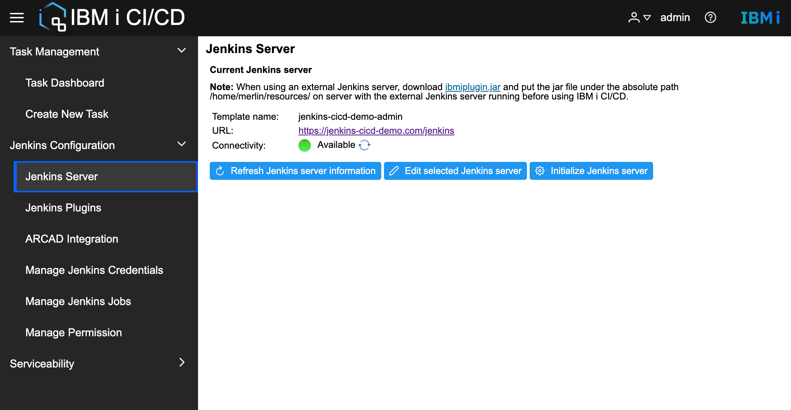
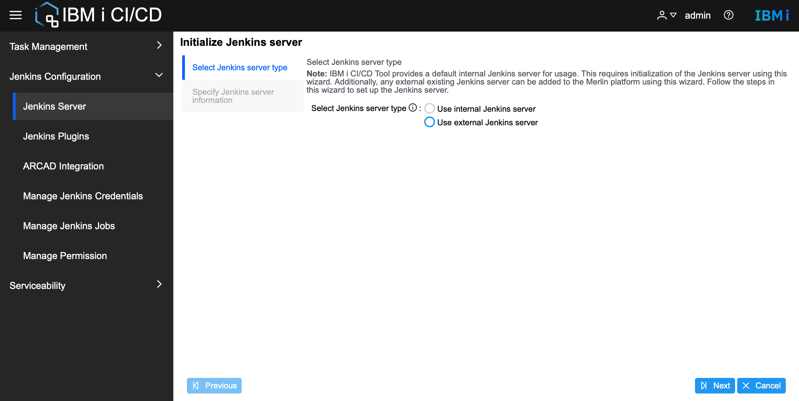
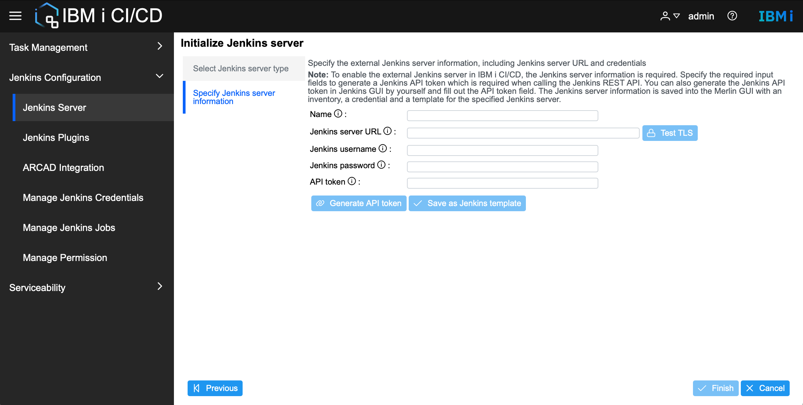
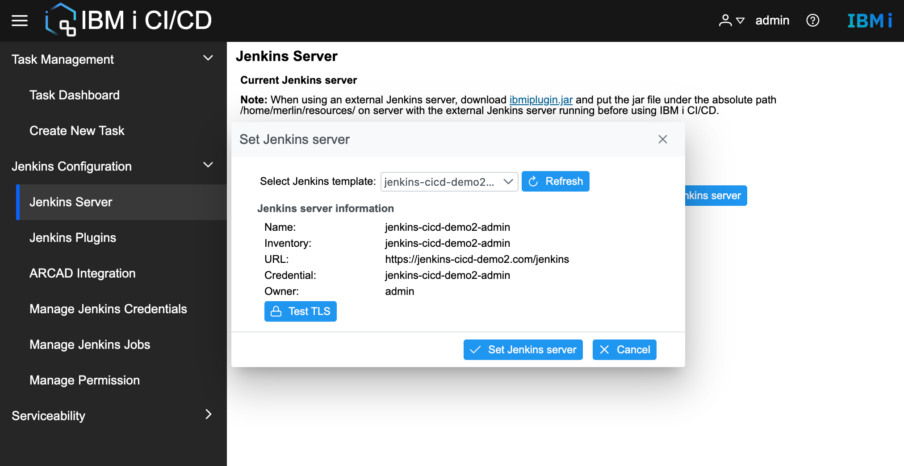
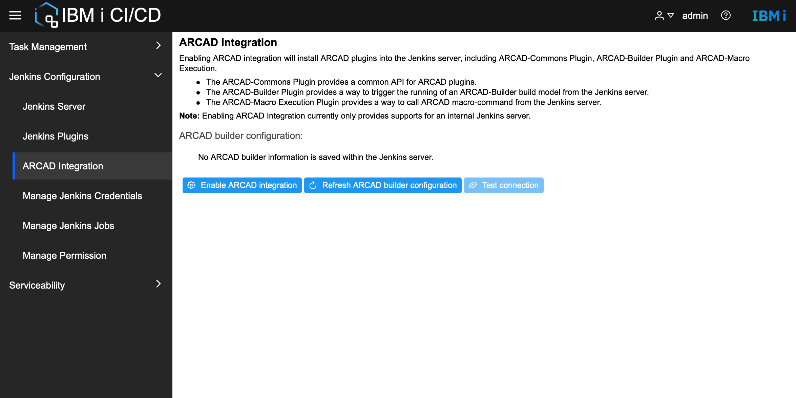

# Deploy and Initialize IBM i CI/CD

## Deploy IBM i CI/CD from Merlin platform

* Install IBM i CI/CD in the **Catalog** from Merlin platform 

    * Follow the **Installation Application** wizard to complete the installation of IBM i CI/CD.
       

* Launch IBM i CI/CD from Merlin platform

    *  Under **Overview > Quick Launch**, click to launch **IBM i CI/CD** directly.
    *  Under **Tools > Deployed Tools**, right click and launch **IBM i CI/CD** in context menu.

## Initialize Jenkins in IBM i CI/CD GUI
Jenkins is the automation server behind IBM i CI/CD which runs the actual build and deploy jobs. Both internal Jenkins and external Jenkins are supported in IBM i CI/CD, internal Jenkins comes with IBM i CI/CD and external Jenkins can be existing Jenkins.

Both internal and external Jenkins must be initialized before using in IBM i CI/CD. While the initialization of external Jenkins only saves the information (Jenkins URL, username, password, and API token) for authentication with Jenkins REST API into Merlin platform, the initialization of internal Jenkins will do the actual configuration of Jenkins. 

Use **Jenkins Configuration > Jenkins Server > Initialize Jenkins** to open the **Initialize Jenkins** wizard.   
**Note**: **Initialize Jenkins** requires an admin user role.
* Initialize internal Jenkins 
    * Select **Use internal Jenkins server** in step **Select Jenkins server type**.
    

    * Input Jenkins username and password in step **Initialize default Jenkins server**.
    The user will be created in internal Jenkins and used for later authentication with Jenkins.
    

    * Wait for the initialization of internal Jenkins to finish. Jenkins server information will be refreshed and the **Connectivity** will be **Available** if the initialization is finished successfully. 
    

* Initialize external Jenkins
    * Select **Use external Jenkins server** in step **Select Jenkins server type**.
    

    * Input external Jenkins server information in step **Specify Jenkins server information**.
        
        * **Note:** Use the **Generate API token** button to get the **API token** after filling in the Jenkins server URL, username, and password. The API token is required when authentication with Jenkins server REST API. 
        * **Note:** Use the **Test TLS** button to verify if the TLS is configured on the external Jenkins server and import the CA certificate into the trust store if it is not.
    * Wait for the initialization of external Jenkins to finish. Jenkins information will be refreshed and the **Connectivity** will be **Available** if the initialization process is finished successfully. 
* **Note**: Another option to set external Jenkins is using the **Edit selected Jenkins server** button. Add an available Jenkins template in Merlin platform first and select the added Jenkins template. Use the **Test TLS** button to verify if the TLS is configured on the selected Jenkins server and import the CA certificate into the trust store if it is not.



## Integrate ARCAD in IBM i CI/CD GUI

Integrate ARCAD will enable the capability to communicate with ARCAD builder server by installing three ARCAD plugins in Jenkins, including ARCAD-Commons Plugin, ARCAD-Builder Plugin, and ARCAD-Macro Execution Plugin.

Use **Jenkins Configuration > ARCAD Integration > Enable ARCAD Integration** to open the **Enable ARCAD Integration** dialog.   

**Note**: **Enable ARCAD Integration** requires an admin user and only supports internal Jenkins. The integration process will overwrite all the configuration of ARCAD-Builder Plugin and ARCAD-Macro Execution in internal Jenkins. 

**Note:** Currently IBM i CI/CD only supports the configuration of ARCAD builder server. The configuration of ARCAD Servers for ARCAD-Macro Execution Plugin is not supported yet while the ARCAD-Skipper CLI will be put under default location ```/merlin/cicd/gui/skipperCLI```. If the user wants to utilize the functionality of ARCAD-Macro Execution Plugin, use it in Jenkins GUI directly.

* Enable ARCAD integration

    * Input the ARCAD builder URL, and use **Test TLS** to verify if the TLS is configured on the  ARCAD builder server and import the CA certificate into the trust store if it is not.

    * Select ARCAD builder server credential in Jenkins credential list, add the credential first under **Jenkins Configuration > Manage Jenkins Credential**.

    * Wait for the ARCAR integration process to finish. And the ARCAD builder URL and selected credential name will be listed on ARCAD Integration page.
    * Use **Test Connection** to test the connectivity of ARCAD builder server.
    
    