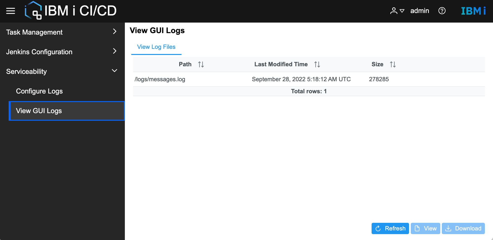

# View logs
IBM i CI/CD GUI supports viewing and downloading GUI logs.
* View or download GUI logs  
Double-click the log file or click the View button to open the log file.  
Click the **Download** button to download the log file to the local file system.

