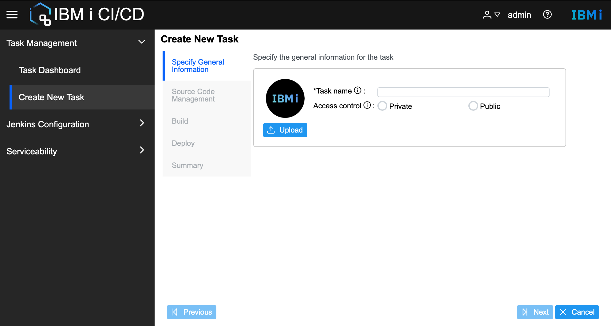
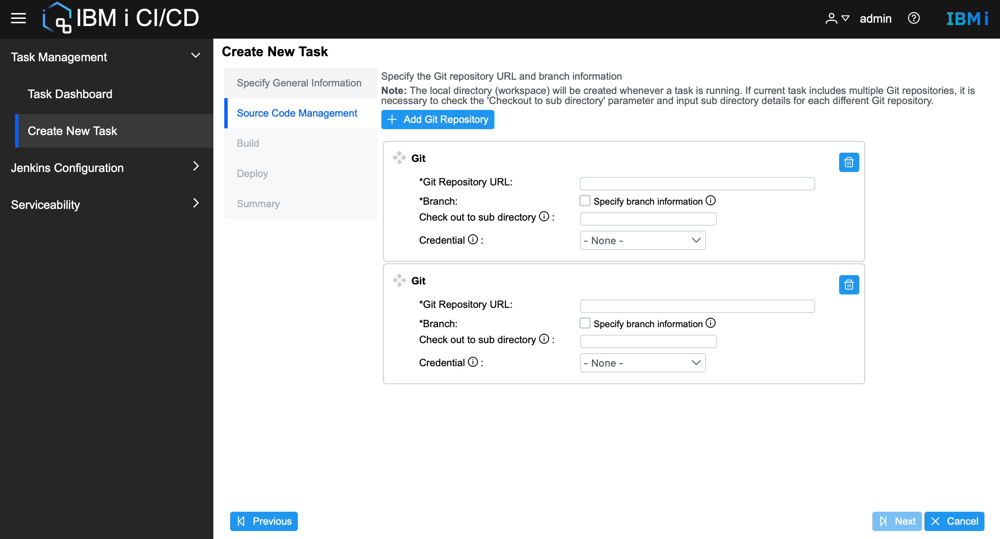
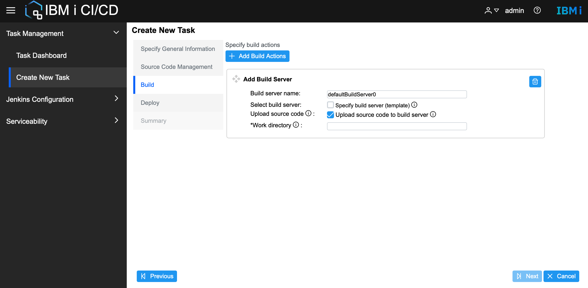
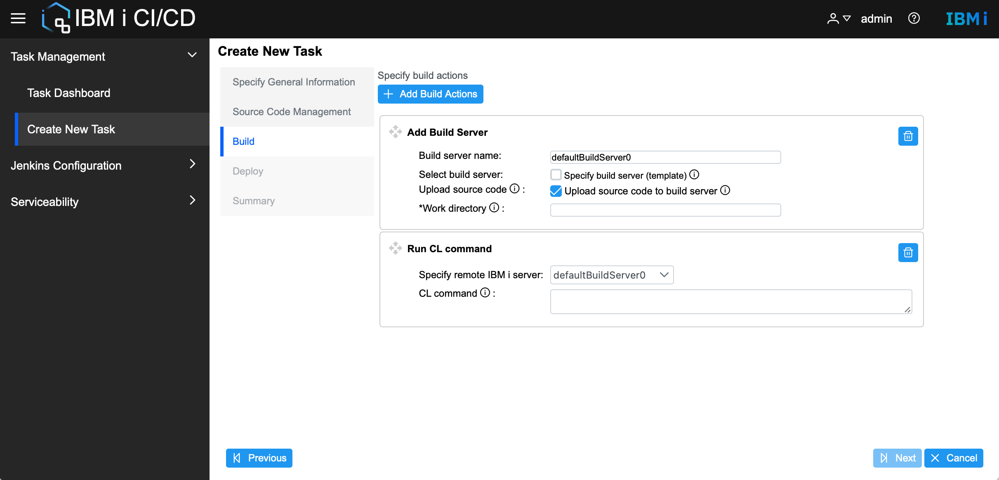
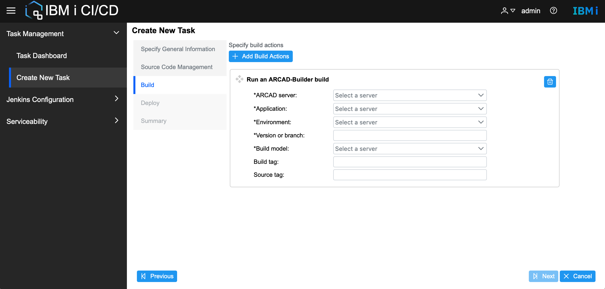
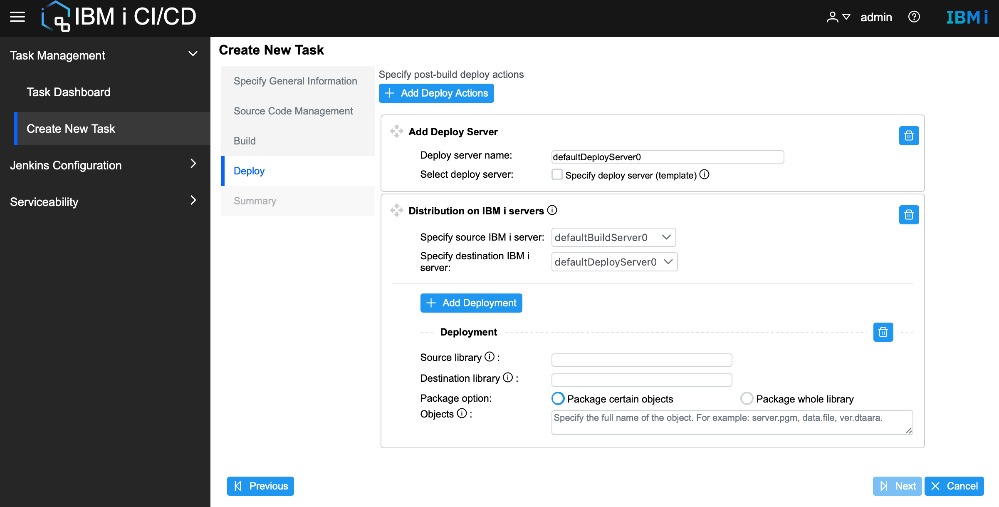
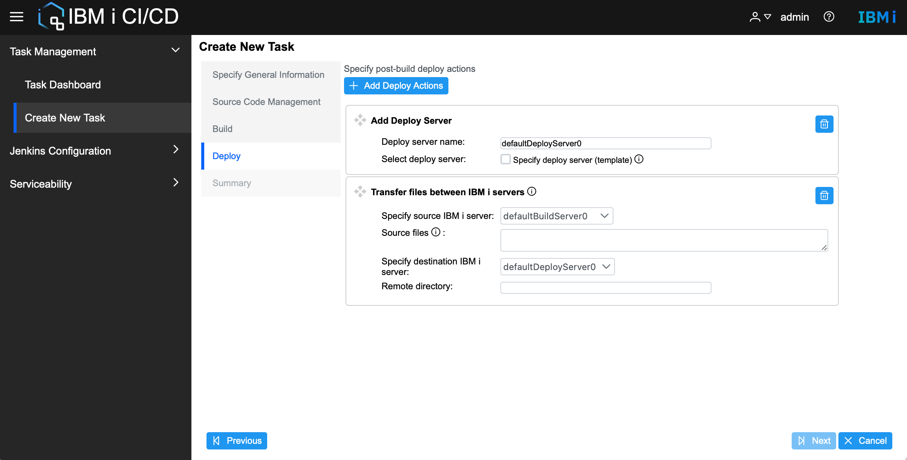
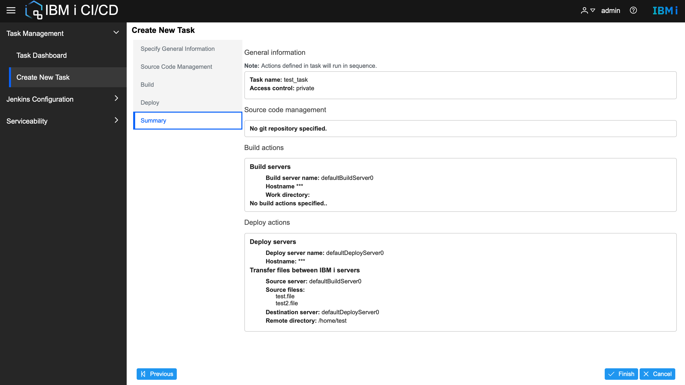

# Work with IBM i CI/CD tasks


## Create IBM i CI/CD task
IBM i CI/CD task defines the whole process of source code management, build and deploy actions. Currently IBM i CI/CD supports both private and public tasks. A private task is visible only to the user who created it while a public task is visible to all users.

Use **Task Management > Create New Task** to open the **Create New Task** wizard. 

* Specify General Information   
    * Specify the task name and the type of task, private or public.
    * Upload customized icon for the task if needed, only JPG and PNG supported.
    
* Source Code Management
    * Define Git repositories by specifying the Git Repository URL and branch information.   
     
    
        * **Note:** If multiple Git repositories are added, fill in the **Check out to subdirectory** to create a subdirectory for different repositories.
        * **Note:** Specify credential from Jenkins credential list if current Git repository is not public.
* Build
    * Add build servers
        * Specify build servers by **Add Build Server**, use customized build server name if needed. If **Specify build server (template)** is checked, select an existing server from the server list( IBM i templates defined in Merlin platform ). 
        * If you want to upload the source code defined in step **Source Code Management**, check the checkbox **Upload source code to build server** and fill in the **Work directory** on the remote server. Source code will be uploaded automatically to the defined **Work directory** when the task runs.
        

    * Send files to server
        * Send files to a remote server. Use the relative path of files. Use enter to separate multiple files. File directory is not supported.
        
    
    * Run CL command
        * Run CL command in a remote server. Use enter to separate multiple CL commands.
         
    * Run an ARCAD-Builder build
        * Run an ARCAD-Builder build by the ARCAD Jenkins plugins. Enable ARCAD integration first and make sure the connectivity to ARCAD build server is available.
        
        
* Deploy   
    * Add Deploy Server   
        * Specify deploy servers by **Add Deploy Server**, use customized deploy server name if needed.
         
       
    * Send files to server
        * The same as in Build.
    * Run CL command
        * The same as in Build.
    * Distribution on IBM i 
        *  Distribution on IBM i support transferring objects from the source library on source IBM i to the destination library on destination IBM i. 
            * **Note:** Use **Comma** to separate multiple objects.
        * Define multiple deployments for multiple library transfer actions. Make sure the source library and destination library exist.
        * Support package certain objects or package the whole library at once.
        
        
    * Transfer files between IBM i 
        * Transfer multiple single files between two IBM i. Use enter to separate multiple files. File directory is not supported.
         
       

* Summary
    * Summary of the defined Git repositories, build and deploy action in the task.
    

        

## Run IBM i CI/CD task

Right-click on the selected task and click **Run Task** to open the **Run Task** wizard. Fill in the necessary information before running the task.

Every time a task runs, a new pipeline job will be created in the Jenkins server named as ```{task name}-{username}-{current time}```. While Jenkins supports building any job multiple times, IBM i CI/CD doesn't support that now.