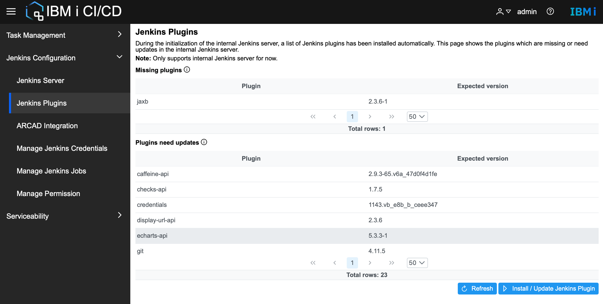
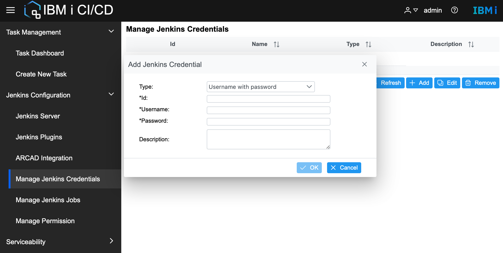
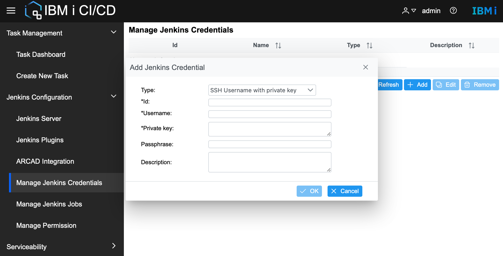
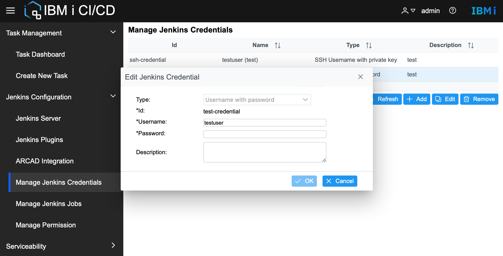
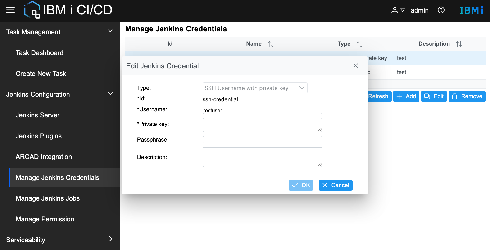
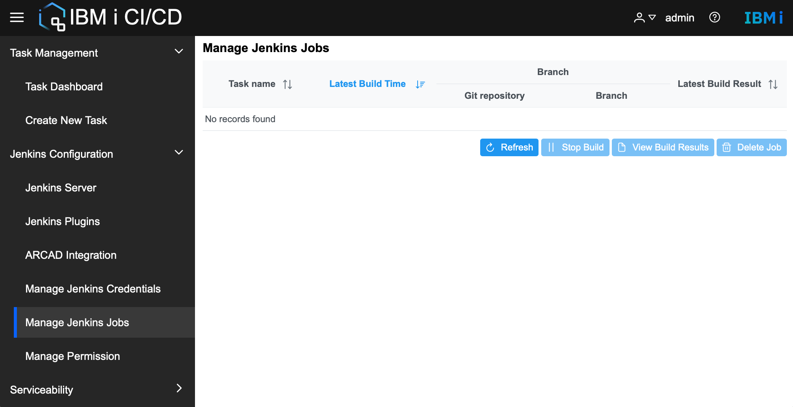
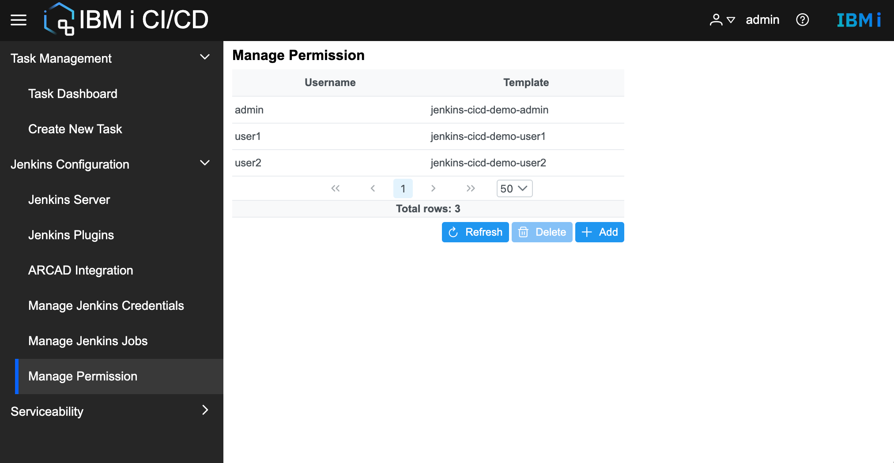
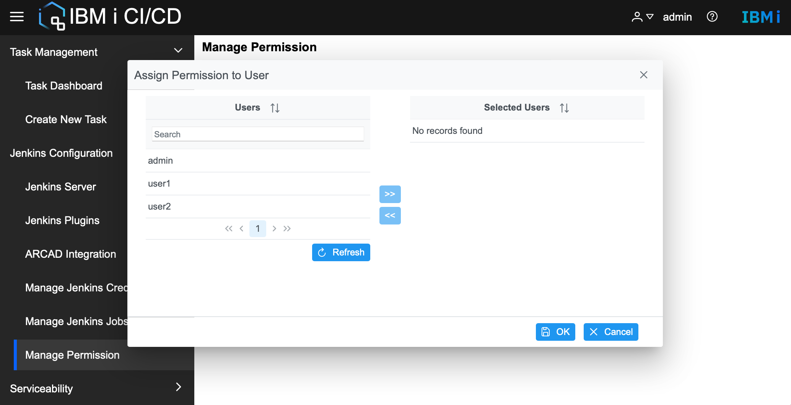

# Work with Jenkins
Jenkins is the automation server behind IBM i CI/CD which runs the actual build jobs. 

## Jenkins Plugins
During the initialization of the internal Jenkins server, a list of Jenkins plugins has been installed automatically in the internal Jenkins server. IBM i CI/CD GUI keeps a list of plugins with expected versions and supports the installation of missing plugins and the update of old plugins. 


The **Missing plugins** table lists plugins that should be installed but are missing in the internal Jenkins server.  

The **Plugins needs updates** table lists plugins that need updates in the internal Jenkins server.

Use the **Refresh** button to refresh the Jenkins plugin installation status in the internal Jenkins server.

Use the **Install / Update Jenkins Plugin** button to install the missing plugins or update the plugins which need updates.

**Note:** Jenkins plugins relative functions require an admin user role and only support the internal Jenkins server.  
**Note:** When using **Install / Update Jenkins Plugin** to install or update plugins, all the Jenkins plugins will be installed or updated to the expected version defined in IBM i CI/CD. The Jenkins server will be restarted automatically to activate the newly installed or updated plugins.  


## Manage Jenkins credential
IBM i CI/CD supports the management of Jenkins credentials, including add, edit and delete actions.
* **Note:** All IBM i CI/CD users are under the same Jenkins user, and Jenkins credentials are visible to all users.
* Add Jenkins credential
    * Add Jenkins credential with type **Username with password**
    
     * Add Jenkins credential with type **SSH Username with private key**
    
* Edit Jenkins Credential
    * Edit Jenkins credential with type **Username with password**
    
     * Edit Jenkins credential with type **SSH Username with private key**
    

## Manage Jenkins jobs
IBM i CI/CD supports the management of Jenkins job, including refreshing job list regarding task name, stopping job build, viewing build results, and deleting Jenkins job.

* **Note:** Jenkins job supports build multiple times, but not supported for the task in IBM i CI/CD now. In case the user uses Jenkins directly, the latest build is used by IBM i CI/CD when stop build or view build results.

## Manage Permission

Currently, only admin users are allowed to initialize the Jenkins server for both internal and external Jenkins. If other users want to use the same Jenkins initialized by admin, the admin user can assign the permission to users by **Jenkins Configuration > Manage Permission**.
* Manage Permission   
The Jenkins Permission table lists users able to use the current Jenkins server. The template is created when adding Jenkins permission with the Jenkins server URL, Jenkins username, password, and API token generated for every user. 


* Assign Permission to User
Assign permission of current Jenkins to other users. This process will automatically create connection resources with the default name ```jenkins-{cicd namespace}-username``` :
    * Jenkins inventory with the Jenkins URL
    * Jenkins credential with the Jenkins username, password, and automatically generated API token for every user
    * Jenkins template with the above Jenkins inventory and credential.

    

* **Note:** Permission table only lists users whose access to Jenkins is assigned through IBM i CI/CD, since extra data is added when using **Assign Permission to User**.