## Creating a profile using ARCAD Builder

Before ARCAD Builder can be used from IBM i CI/CD, the ARCAD integration must be set up. Head to the ARCAD Integration page and select 'Enable ARCAD Integration'. When that has finished, confirm the set up with the 'Test connection' button.

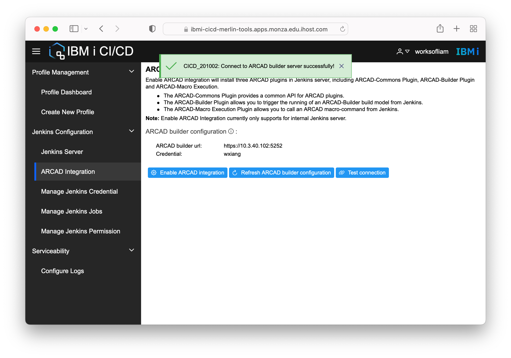

### ARCAD Builder process

When the `company_system` repository was configured in IBM i Developer, an application was created in ARCAD Builder which is tied to the git repository, both of which were part of the `iproj.json` in the git repository.

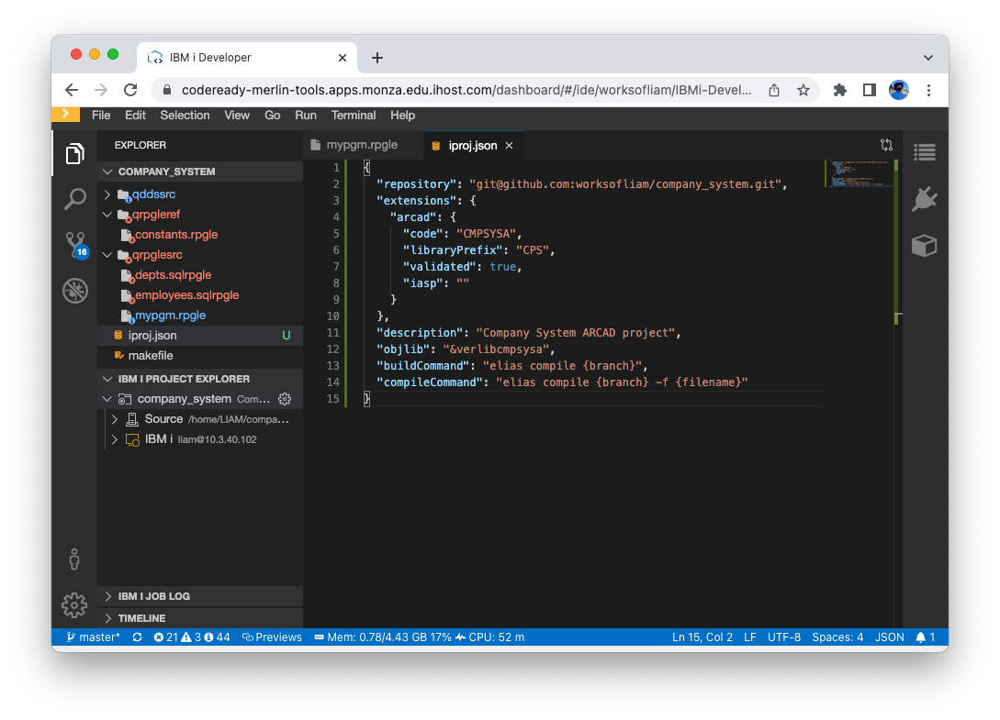

When looking at the application build on the ARCAD Builder Web UI, it shows the link to the git repository in the title that was used when initializing the application from IBM i Developer.

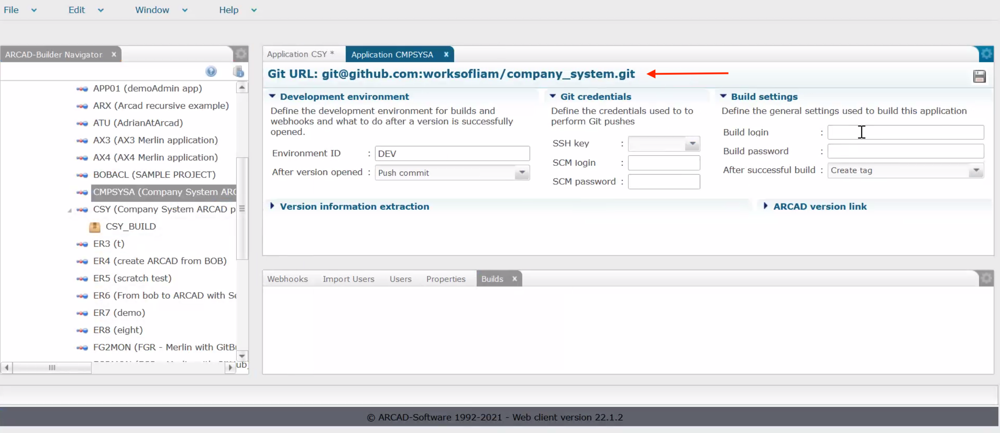

### ARCAD Builder clone process

In order for ARCAD Builder to successfully clone from the 'External source code Management' URL defined in the ARCAD application, the user profile that is running the ARCAD Builder job needs access to the repository URL.

* The `AGENSSHKEY` can be used to generate the keypair for the user running the ARCAD Builder job on IBM i. The standard directory for the public key is `/home/<user>/.ssh/id_rsa.pub`.
* The generated public key must be added to a GitHub/Azure/BitBucket account that has access to the repository being used.
* The user who runs the ARCAD Builder job can be changed with the `CHGAFSSVR` command.

It is also possible to override the user used for the clone. If you head to the ARCAD Builder Web Interface and navigate to the application, under the build model it is possible to define a 'Build' login and password (an IBM i user profile) which will be used for this application. The user profile provided also needs an SSH keypair setup.

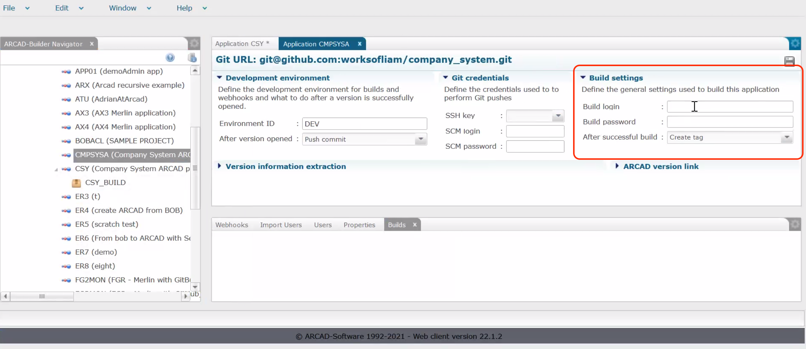

### Creating the profile

Next, select 'Create New Profile' under 'Profile Management'. A unique profile name must be provided. This short name usually describes what the profile is building, for example:

* `company_system_test` may indicate that the 'company_system' profile is being built into the test environment
* `company_system_prod` may indicate that the 'company_system' profile is being built into the production environment

Clicking 'Next' will continue to creation process.

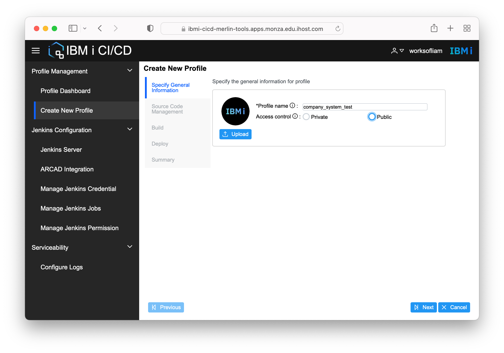

When using ARCAD Builder, a git repo is not required in the profile as it is part of the application configuration.

Only one build action is needed: 'Run an ARCAD-Builder build'.

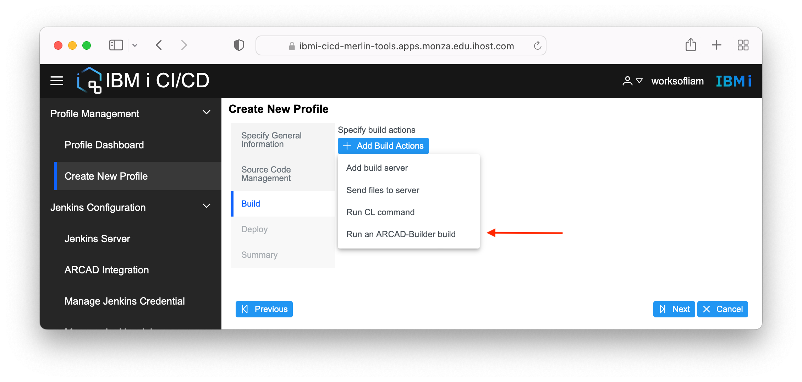

When using the dropdowns in the form, they should automatically contain available servers, applications, and environments. In the 'Version or branch' field, this can be either:

* a branch that exists in the git repository, but cannot be the default branch (usually `master` or `main`)
* a version from the application (in the `xx.xx.xx` format)

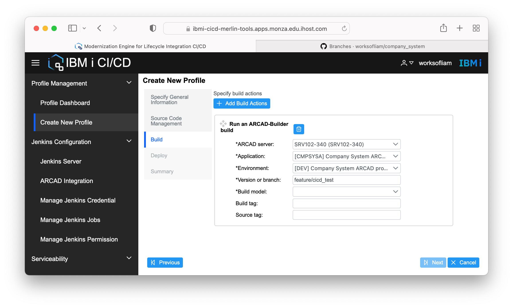

No Deploy (post-build) actions are required.

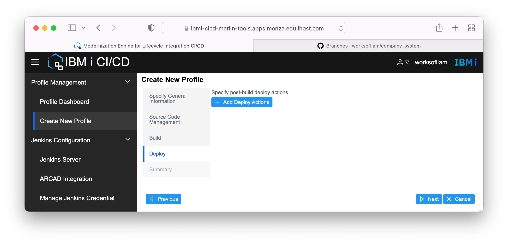

The final page is a summary of the profile, including all the build and deploy steps. The 'Previous' button will allow to navigate back to a step if changes are required. Clicking 'Finish' will finish the setup for the profile.

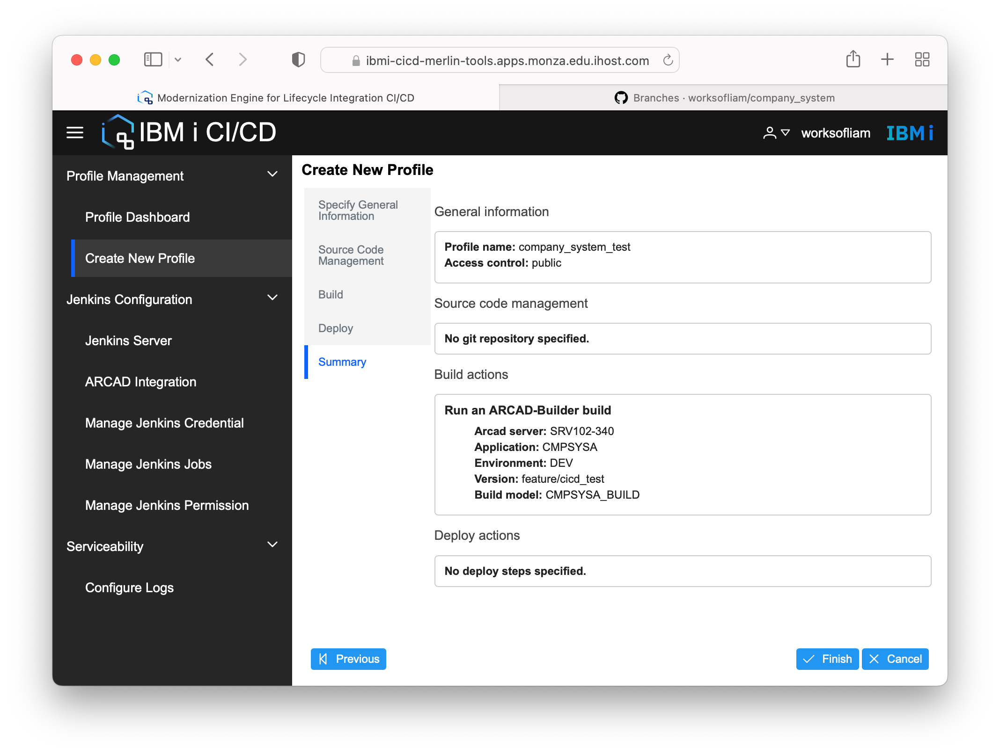

Navigating back to the Profile Dashboard will show you all public and private profiles, including the one created.

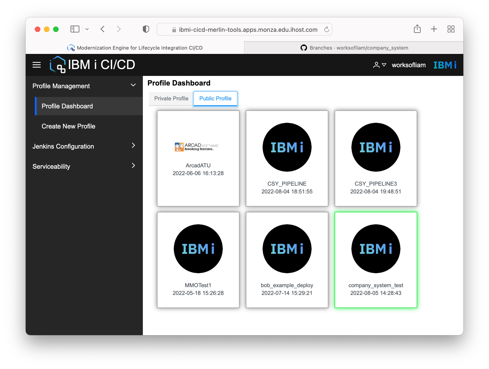

## Running a profile

To run a profile, right-click on it and select 'Run Profile'.

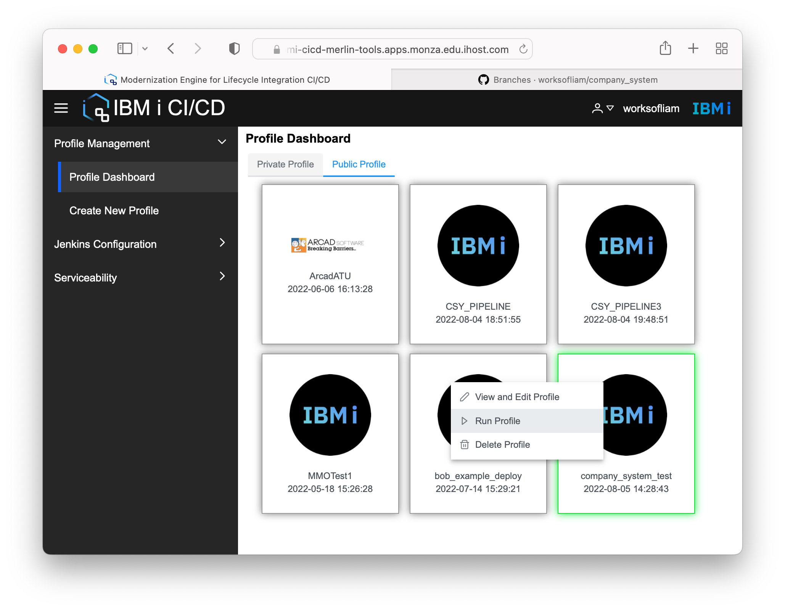

Before running the profile it can be reviewed and altered specifically for this time it is being run. Clicking 'Next' until the final page is reached shows a page where the profile, including the changes made, can be reviewed. Clicking 'Finish' starts the profile execution.

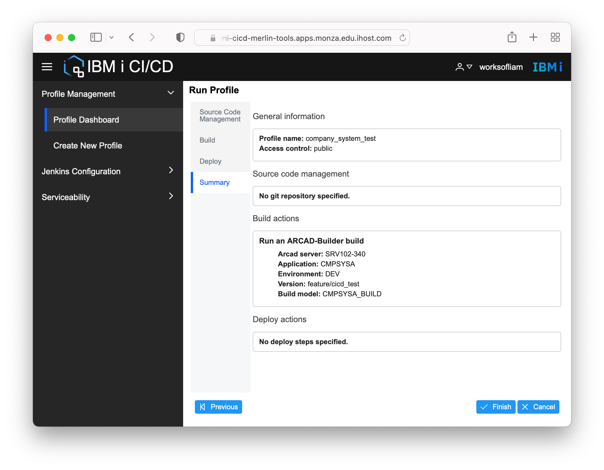

When the execution starts, a model will appear. You may have to hit the 'Refresh' button to update the 'Build Results' view with output and errors from the execution.

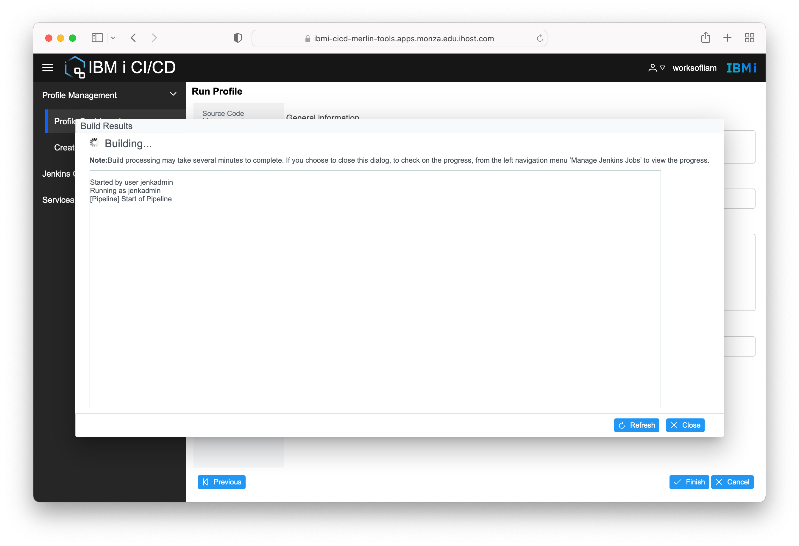
