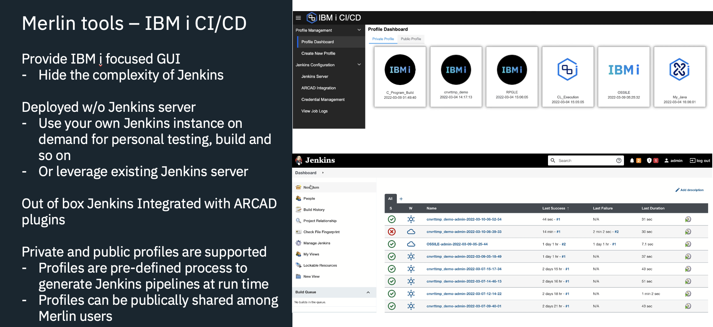

# IBM i Modernization Engine for Lifecycle Integration - DevOps CI/CD
IBM i CI/CD aims to simplify the experience of DevOps for IBM i application development.  This provides browser-based tooling to set up and manage an automated build, test, and deployment pipeline for native IBM i applications leveraging Jenkins.
Core capabilities provided:
- Out-of-box Jenkins with ARCAD integration. 
- Users can create their own Jenkins environment with capability to build and deploy IBM i programs.
- Graphic interface to simplify key operations of Jenkins. This GUI creates Jenkins pipelines specifically for IBM i programs development.

For information on using ARCAD tools, see [How to use ARCAD integration with IBM i Modernization Engine for Lifecycle Integration](https://supportcontent.ibm.com/support/pages/how-use-arcad-integration-ibm-i-modernization-engine-lifecycle-integration-merlin)
