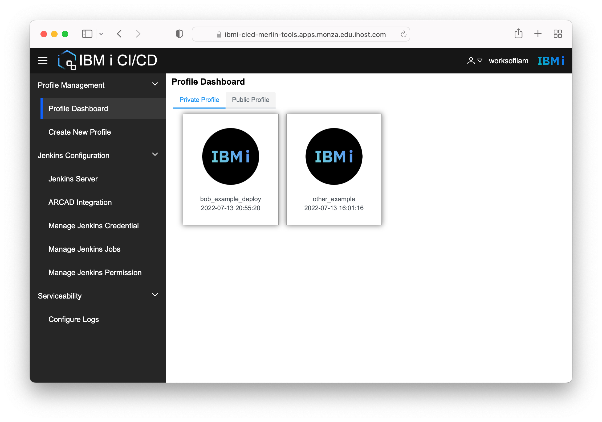

A CI/CD pipeline is composed of individual steps called 'profiles'.  This section covers setting up profiles and assumes that these 2 prerequisites have already been executed.

1. [Merlin IBM i CI/CD installed](../appinstall.md) into a project.
2. [Setup a Template](../configuration.md) within Merlin for the target IBM i for deployment.

## Launch into CI/CD

Head over to the Deployed Tools page, select the project where CI/CD is installed and launch into it with the right-click menu option.  If the CI/CD tools is not present then rerun [Merlin IBM i CI/CD installed](../appinstall.md) to install the CI/CD tool.

## Configuring a Jenkins Instance

When CI/CD is launched, a message may appear warning the user about having no Jenkins server initialized. This is normal. Configuring the Jenkins server is possible through this application.

Head into Jenkins Configuration and then into Jenkins Server. This displays a page showing information about the connected Jenkins instance for this CI/CD instance. If Merlin has many projects, each with their own CI/CD application installed, they can all have different Jenkins servers.

You are able to point CI/CD to an external Jenkins server. It is possible to setup a Template in the Merlin UI that points to another Jenkins instance. For this example the 'Initialize Jenkins' button starts an internal Jenkins server specific to this CI/CD instance. Clicking the button shows a confirmation dialog. Selecting 'Yes'  confirms the initialization.  Note that only users with administrator authority have access to the 'Initialize Jenkins' button.

Following that, the next question asks whether an internal or external Jenkins server is to be used. Select 'use internal' and move to the next page.

A Jenkins username and password must be provided. This is different from any Merlin username and password that has been created. It is unique to this CI/CD instance. Create a username and password combo before finishing.

When finished, it redirects back to the Jenkins Server information page where it shows the progress of the setup of the internal Jenkins server.

## Profile Management

The Profile Dashboard gives the user a view that lets them manage their profiles. A profile is a set of steps to build and deploy an application. A number of build tools can be used, including ARCAD Builder, Bob, and any other tool that can be invoked by regular ILE command or PASE command.

