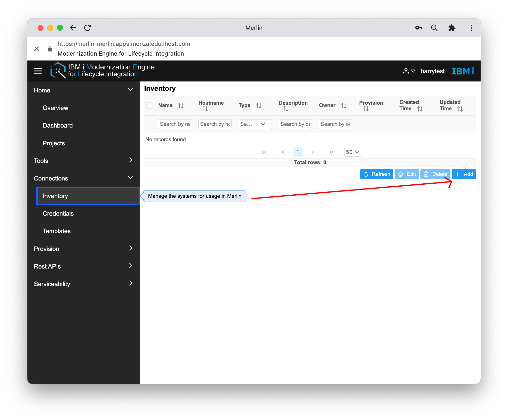
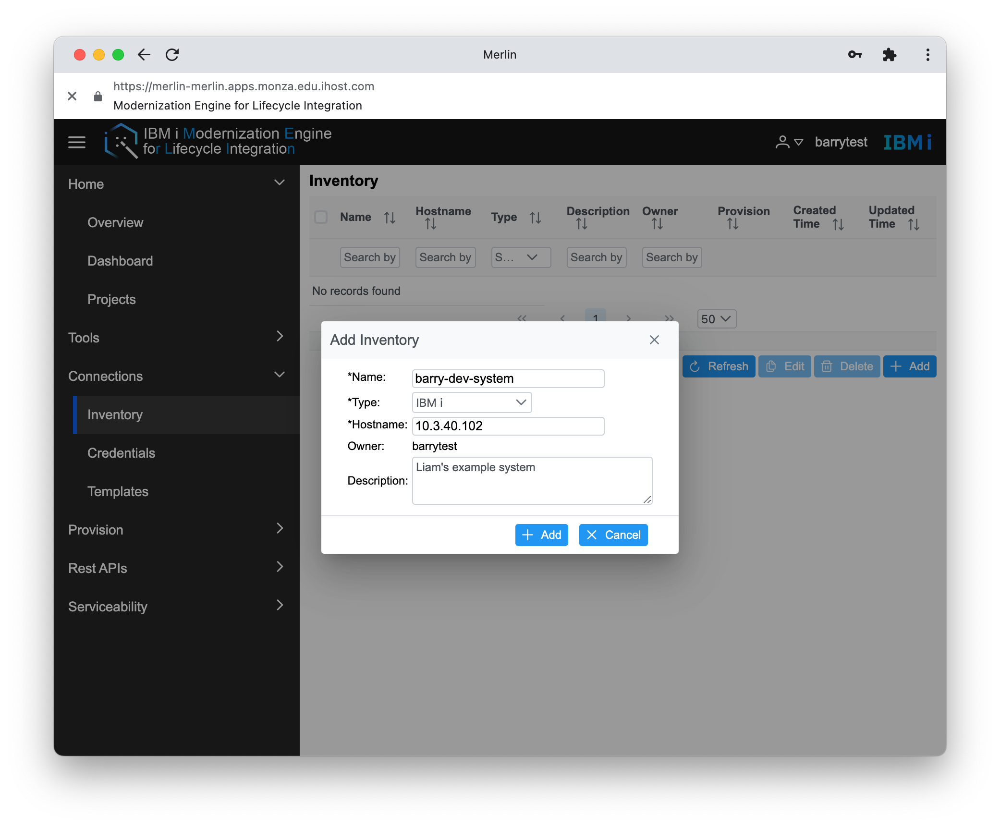
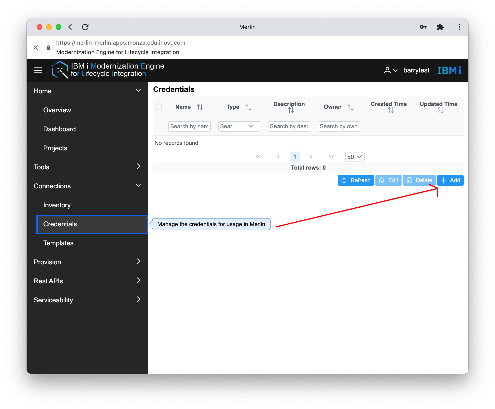
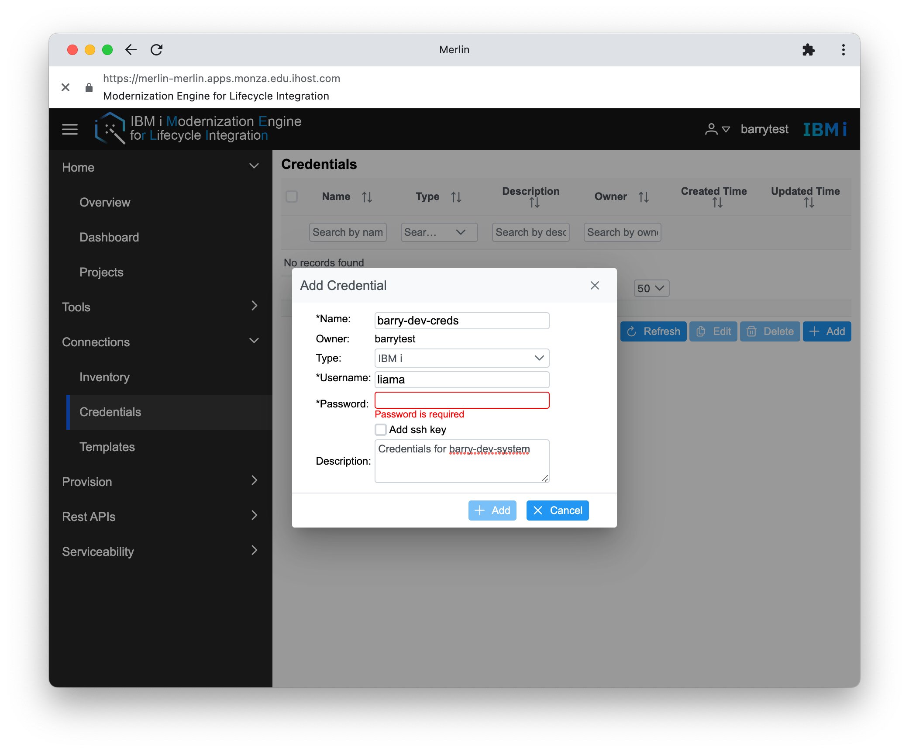
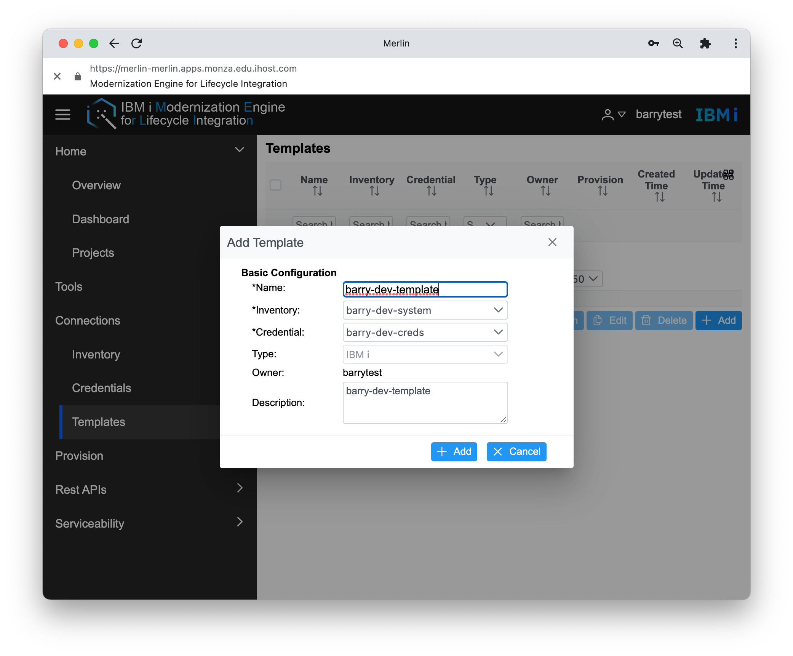
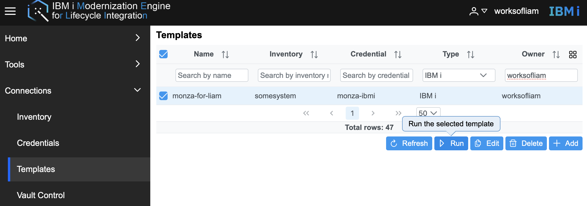
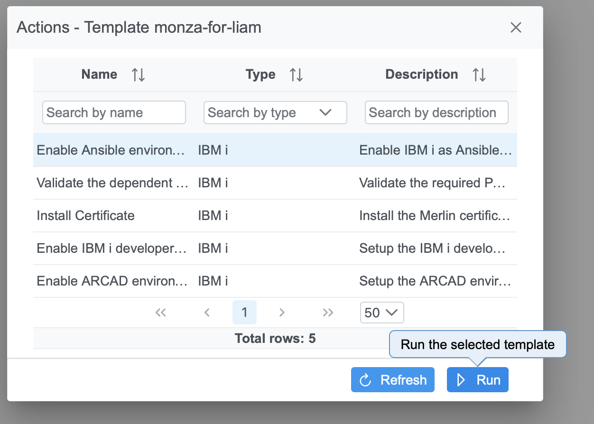

#  Merlin Configuration

Before you can make serious use of Merlin, you have to setup a number of things. When using the IBM i Developer and IBM i CI/CD support within Merlin, you have to have all endpoints (IBM i, Jenkin servers) pre-defined including the credentials that are to be used. This setup process is accomplished with the following:

* **Inventory** is where you can setup connections from Merlin to IBM i, Jenkins, and other environments
* **Credentials** your user and password and/or SSH keys belong here
* **Templates** are used to connect a defined inventory and credentials together

But of course, you have to register to your Merlin instance first.

## Setting up Your Inventory (IBM i)

In this step, we're going to head over to the Inventory tab and select 'Add':

Next, you should fill in all the required fields. The Name is unique and does not have to match the host name. The type chosen in this example is IBM i, because that is where development and builds happen. Note that for the Hostname field, you can use either a valid IP address or hostname to the target system.

Clicking Add should add it to your inventory list.

## Creating a Credential

Head over to Credentials and select 'Add':

Fill out the required fields like before, and make sure to select 'IBM i' as the Type. A password is required and sufficient, but you also have the option to setup a public/private SSH keypair. This credential can be associated with more than one system.  In the next step we will associate it with the system it provides authorization to.

Clicking Add should add it to your credential list.

## Creating a Template

A Template simply associates an inventory or system with a credential, thus providing all that is necessary to access a system. This saves much time later on when developing and creating Profiles to manage deployment.

Head to the Templates tab and select Add.

Fill out the required fields. The Inventory and Credential dropdowns only show you the items you have access to. You can give this Template another unique name, as well as custom description.

### Verifying the template

After an IBM i template has been created, the provided Ansible playbooks should be run to ensure the IBM i has the required software to allow for smooth interaction with Merlin.

Select the IBM i Template that was create and use the Run button:

Run each one of the Actions that are shown, which will install the required tools onto the chosen system if they are not present.  

> Note: Make sure your IBM i user profile has *ALLOBJ, *SECADM, *SERVICE and *JOBCTL special authorities before running these actions. 

# Setup Complete

Now, when you use Merlin IDE (IBM i Developer) and Merlin CI/CD you have access to your templates to make connecting to systems a breeze.
