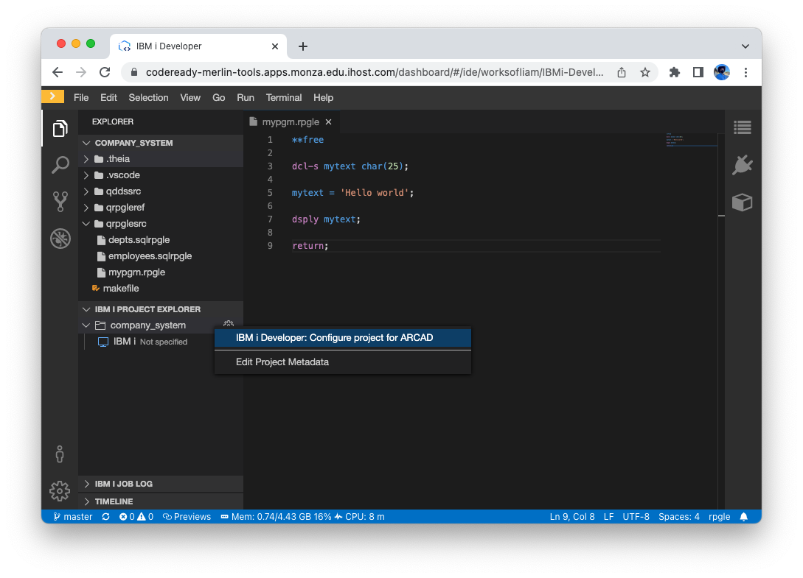
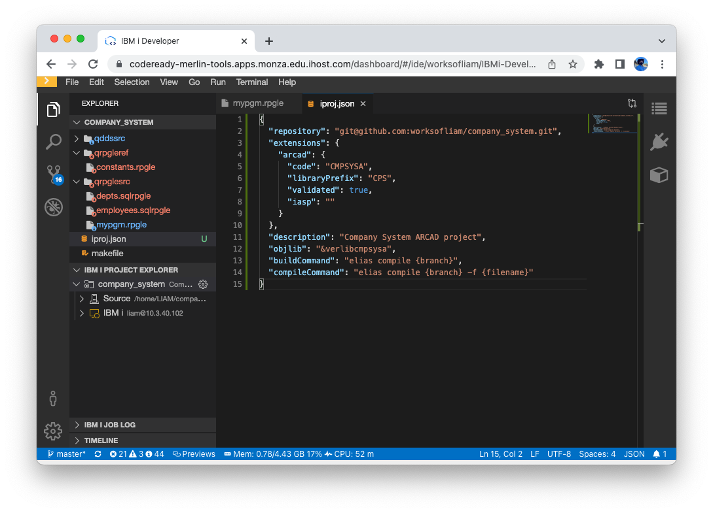
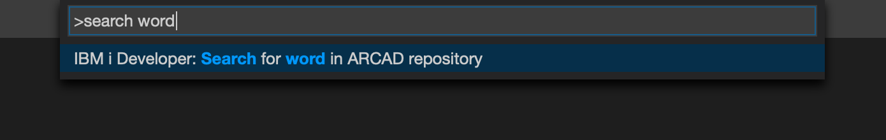

One of the benefits of Merlin are the available tools for impact analysys and intelligent build. While these tools are from ARCAD, they are integrated into Merlin at no extra cost. To use the ARCAD tools, there is some setup required:

* Have access to a git repo with application code (RPGLE, COBOL, CL, etc)
* Create a workspace in IBM i Developer
* Connecting to an IBM i through a template

Those steps can be found above. Following that, this section covers:

* Initialising the project as an ARCAD Project
* Submitting a build

## Cloning the Repository

To be able to work with the ARCAD tools, the workspace requires a git repository. For this example, [company_system repository is on GitHub](git@github.com:worksofliam/company_system.git) and can be forked/cloned from GitHub.

To clone from any repository server, an SSH keypair will likely need setting up. See '[connecting to git repositories](#connecting-to-git-repositories)' above.

Once the repository has been cloned, it should be visible in the workspace.

## Connect to IBM i

From the IBM i Project Explorer, select the IBM i that is to be used as the build server. The ARCAD tools (specifically ARCAD Builder) needs to be installed on this server. 

See '[connecting to a system](#connecting-to-a-remote-system)' for more detailed steps.

## Configuring the Project

**This only has to be done once per project.** Only one person should do this process. This is what configures the repository to line up with ARCAD tools.

* Right click on the project in the IBM i Project Explorer
* Select 'Configure project for ARCAD'

The setup process is going to prompt for some additional information about the project. It may also ask for an iASP.

### Application Code

### Application Prefix

### Project Description

### Confirmation

When all the project information has been provided, it shows a notice that the project is about to be initialised.

### Confirm the Initial Build

After the project initialisation is done, another notice appears to confirm the first build of the project. Select OK.

### Post-build

After the build has attempted to run, it may show that the build fails (highlighted in image). This is happening because you're building from the default branch (usually `main` or `master`). This usually indicates the project is ready for standard development.

### Post-setup

After the setup and build attempt, the `iproj.json` is either created or updated to show the ARCAD Project information provided during initialisation.

This file should be committed into your git repository.

## Developing with an ARCAD Project

The first step to writing and building code is to checkout to a different branch. From IBM i Developer, the branch is showm on the status bar in the bottom left. Clicking on it shows a list of other branches, as well as an option to checkout to a new branch.

Select 'Create new branch', enter in a new branch name and hit enter. The format for branches are are `<type>/short_name`. A list of types can be found in the ARCAD Builder GUI web interface.

Atfer checking out to a new branch, files can be edited and committed. Before you commit, builds can be run to confirm that programs are compiling and can be tested.

## Building the Branch

After the branch is ready to be built, open the command palette and search for 'IBM i Developer: Build Project'. Since the `iproj.json` file is using `elias` in the `buildCommand` property, it uses ARCAD Builder to build the project.

## Build Output

After the compile/build has happened, IBM i Developer pulls down many useful pieces of information:

* Output tab shows information from the ARCAD tools, like how many objects failed to build and how many were successful, as well as how many logs it downloaded from the server.
* Problems view is populated based on the compile/build. This is useful for tracking errors down to a specific line of code.
* IBM i Job Log view shows each command that has run grouped by build, then every message that returned from that command being executed.
* The `.logs` folder contains spool files specific to objects being built from the previous compile/build. It can be used to determine other errors that don't appear in the Problems view.

## Transformer

Since Merlin comes with ARCAD tools, it also ships with Transformer. This enables the user to convert fixed-format RPGLE to free-format RPGLE.

Right click on a file you'd like to convert to free-format and find 'Convert to Fully-free RPG'. For a successful transformation, the program gets built. Only with a successful build can a transform happen.

;

## Repository / Observer

When a project gets build, ARCAD Observer keeps a references of all definitions and keywords used in your source code (a repository). There are two ways this repository can be searched:

### Search

From the command pallete, there is a command that lets the user search the repository by string:

### Selection

After selecting a word in an active editor, there will be a right-click option to search for the value in the repository:

