# Using Merlin IDE (IBM i Developer)

This section covers Merlin IDE, IBM i Developer and developing applications using it. Before you use IBM i Developer, make sure [you have a template setup](./guides/configuration.md) and [IBM i Developer installed](./guides/appinstall.md) into a project.

Merlin IDE / IBM i Developer is a cloud-hosted version of VS Code with Merlin & IBM i specific extensions. IBM i Developer connects to your IBM i based on credentials you have specified in Merlin. Repositories get cloned into your Workspace and then deployed to your IBM i.

## Creating Your First Workspace

When you launch into IBM i Developer for the first time, you may not have any Workspaces. For this, we're going to start from a sample. On the Create Workspace menu, you will be able to select from samples. You should select `IBM i Developer` or `IBM i Developer and demo application`.  Other sample tools stacks might useful for developing with other programming languages and frameworks.  

When using Merlin IDE / IBM i Developer, **each user can only have one workspace running at a time**.

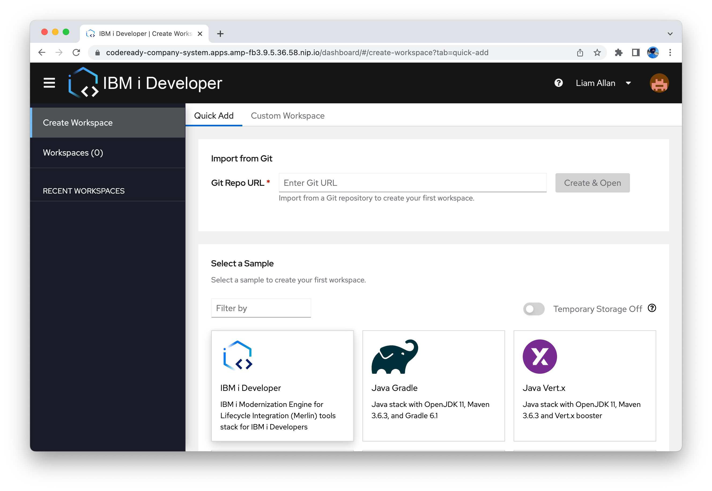

Selecting it starts a Workspace for you. This can take a moment, and  automatically launchs into the IDE when it's done.

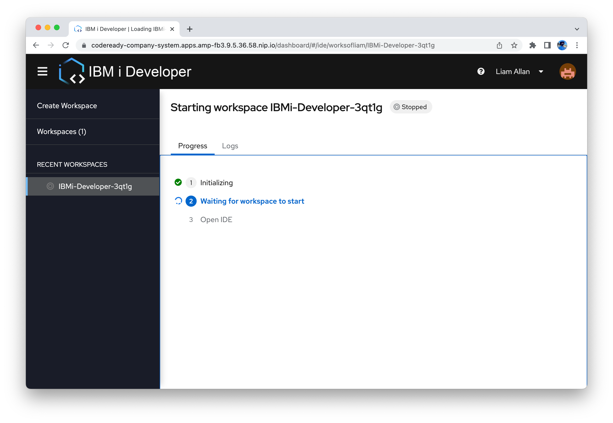

## Connecting to Git Repositories

> This section assumes you have a GitHub account. A GitHub account for this guide is not required but will prove useful as will this will run through setting up keypairs, which is a standard process in most git ecosystems. [Click here to sign up](https://github.com/signup).

Before we can write any code, we have to clone a repository. This means we have to connect to whichever git hosting service you use. For this service, we are going to use GitHub since that is where our examples are hosted.  In order to maintain source (commit, push, etc) in GitHub we need to have a private key in the local repository that corresponds to the public key configured in your GitHub account.

With an existing public/private SSH key pair, create a credential in Merlin of type `SSH Key`.  Specify the private key and the public key information.  With this saved, it will be added to your IDE workspace when started.

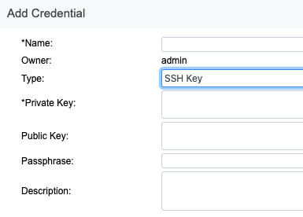

> A keypair is only needed when working with private repositories. The 'bob-recursive-example' repository is a public repository on GitHub and can be cloned via HTTPS without needing a GitHub account or setting up a public/private keypair.

### Adding Your Key to GitHub

All the major services (BitBucket, GitLab, GitBucket, etc) have similar setups. This guide should work the same for them.

Open up GitHub, go to the user settings, [go to the 'SSH and GPG keys'](https://github.com/settings/keys) page and select 'New SSH key'.

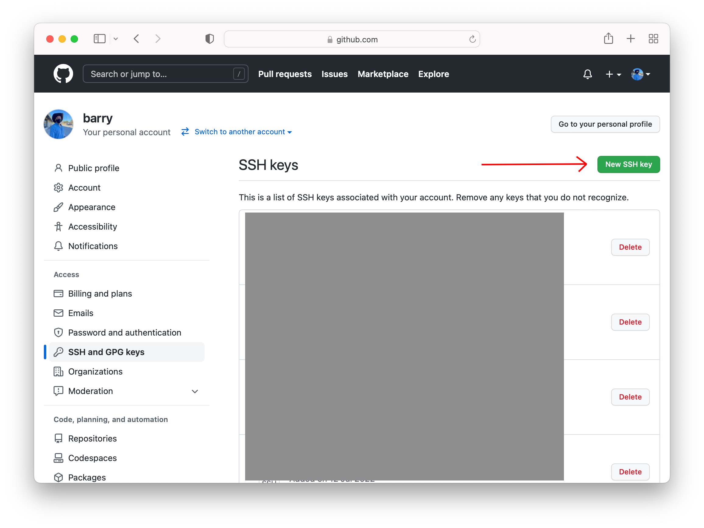

Copy and paste the public key and paste it into the Key input field. Give it a name that identify it with the Workspace you created.

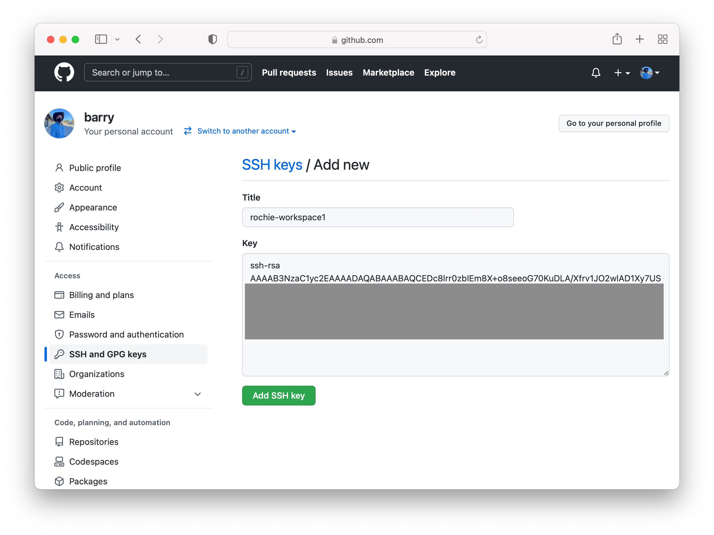

## Cloning a Repository

Now that we have setup our key pair, we can clone from GitHub. I went ahead and [made a fork of bob-recursive-example](https://github.com/edmundreinhardt/bob-recursive-example) for me to work on and I am going to clone that into my Workspace.

First, open the command palette (F1 or Control / Command + Shift + F1) and search for 'Git: Clone'. When the input box appears, paste the **SSH clone URL** for the git repository.

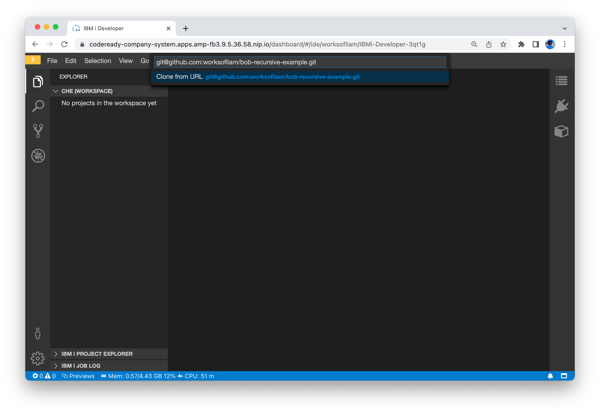

> The HTTPS clone URL can also be used if the repository being cloned is public on GitHub.

The cloning process is going to ask you where to clone the repository. By default it should use a `projects` folder. You can optionally set it somewhere else, though it is recommended to use the default. When you've made your selection, hit 'Select Repository Location' to continue the clone.

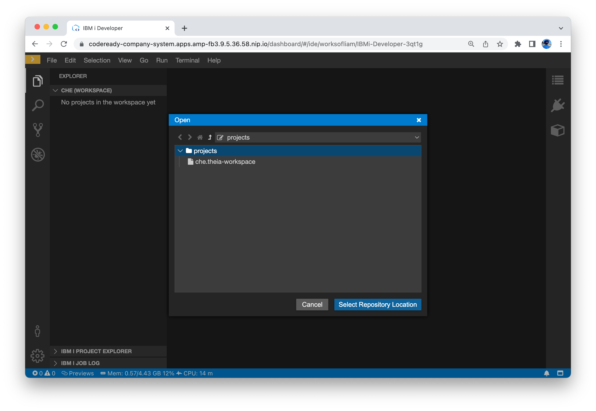

You may see a message with the following text. **This is not an error**, but a warning you will get the first time you clone from a new location. You can clone and 

> Git: Warning: Permanently added 'github.com,140.82.114.3' (ECDSA) to the list of known hosts.

After the clone is successful, you should see the directory automatically appear in the Explorer view.

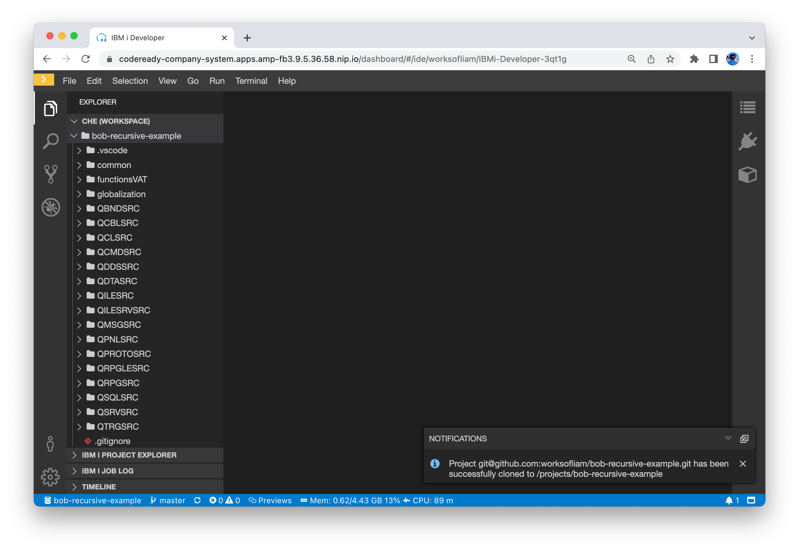

## IBM i Developer features

IBM i Developers come with lots of features that enable developers to be more productive.

* **green**: a search that scans the entire workspace for the provided string. It also supports searching with a regex string.
* **orange**: peek is a feature that shows either all references or the definitions inline without having to navigate to another view. You can use peek, as well as many other reference tools, by right clicking on any definition in the source code.
* **red**: the outline view displays all defined variables, structs and files in active editor

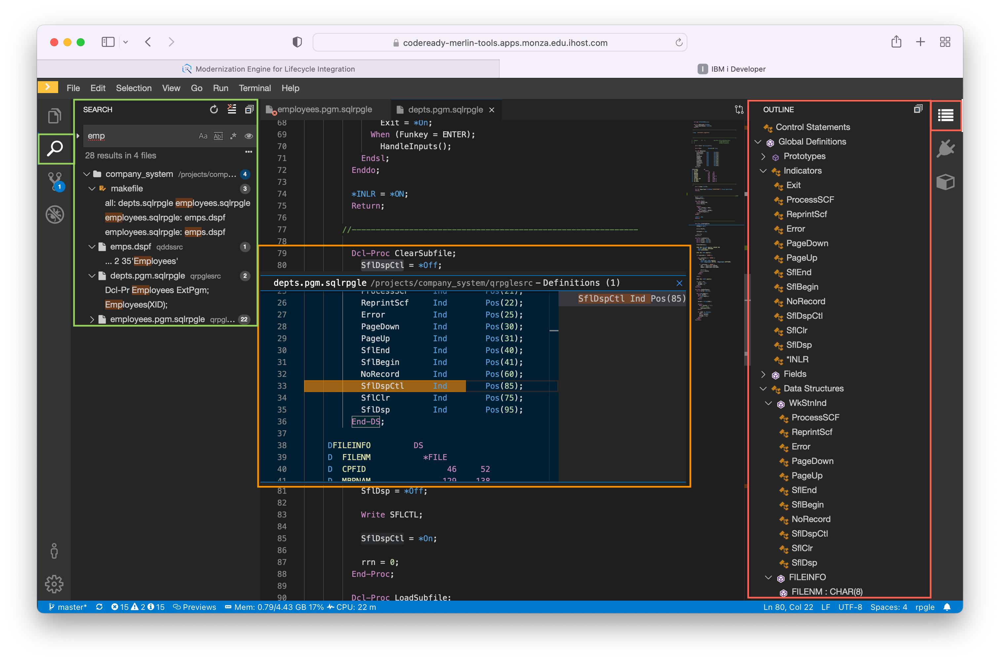

## Connecting to a Remote System

Since we're writing RPGLE code, that means the build must happen on a remote IBM i. Previously, [we setup a Template](./guides/configuration.md) which points to a developer IBM i. We're going to use that Template in our Workspace.

Open up the Project Explorer view. Inside of it, you should see the project/repository you cloned. If the project is expanded, you will see that it is not connected to any IBM i currently. Select  `Please connect to an IBM i`.

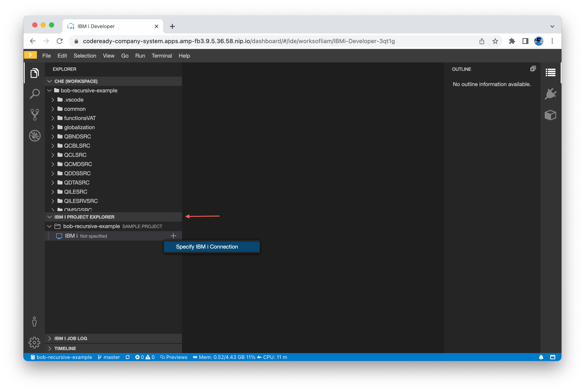

It may prompt you for your Merlin password. This is so it can fetch Templates defined in the Merlin. 

In the `Connections` view, select the template (which has the host name and IBM i credentials to use) to connect to the IBM i.

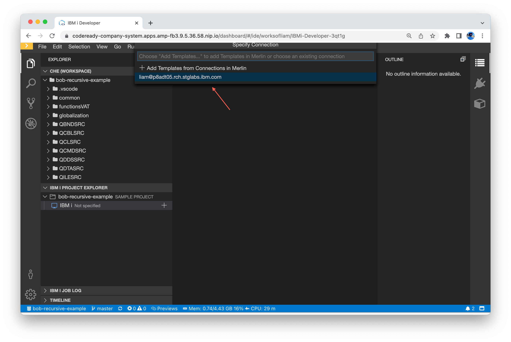

Following that, you are able to select a build directory. It is recommended that you leave it as the default. This is the IFS directory that the source gets uploaded to before they are compiled on the server. The errors seen are not important right now.

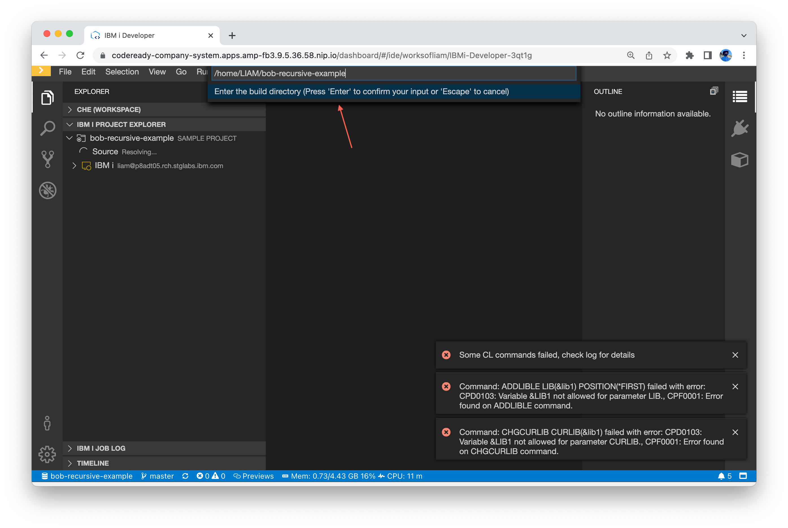

Since this is the first time using this Template from this Workspace, you may be prompted with a warning about authenticity. You can click 'Always' to not see this message about this Template again.

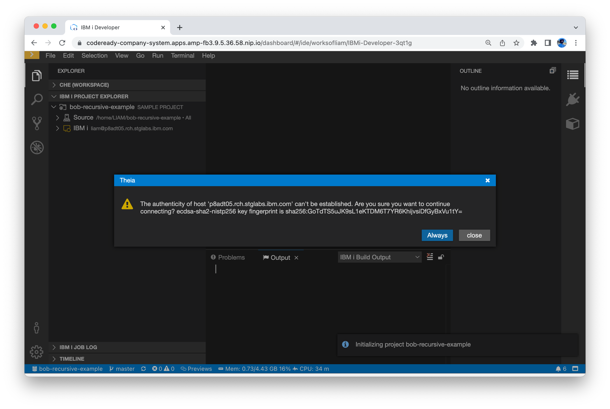

## Project Explorer

There are parts of the project explorer with our basic project:

* **Source** which allows you to browse files in the specified build directory
* **Variables** for configuring environment variables needed for the project build
* **Library List** to manage the library list for the Workspace
* **Object Libraries** for browsing libraries related to the project
* **Include Paths** to manage include paths for the project

If you expand Variables under that, you should see `&lib1`. This variable is in the list here because it is used inside of the `iproj.json` file in the repository. This variable is used to determine which library to build objects in.

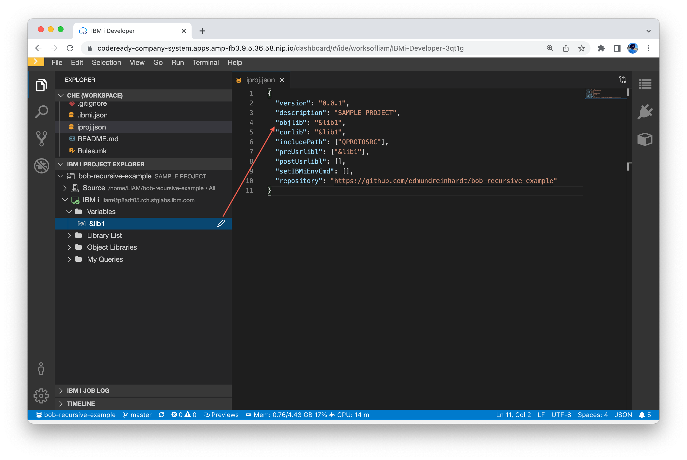

Clicking the pencil icon (edit) will open a user input box at the top of the window where you can enter a value to assign to the variable. When you are finished, the value appears next the the `&lib1` label.

## Configuring the Build

This example uses a simple git repo that uses ibmi-bob. You can use any repository you want, but the build tool must be invoked through Pase.

For example, ARCAD Builder uses `elias`, bob-recursive-example uses the `makei` command from `ibmi-bob`. It could also use `gmake` (GNU Make), or any other PASE command. Even though IBM i Developer is being used, the build happens on the IBM i. Those tools (ibmi-bob, GNU Make, etc) **need to be installed on the IBM i** used for the build.

> This guide is using ibmi-bob (`makei`) to launch the build. Assuming the Inventory was [setup in full](./guides/configuration.md) (and Actions were used to verify the Inventory), [check out the ibmi-bob installation step](https://ibm.github.io/ibmi-bob/#/getting-started/installation).

Once you have the `&lib1` variable setup, it's time to build our project. IBM i Developer has two types of 'builds':

* **Compile** which is used to compile a single source file (and maybe anything it depends on)
* **Build** to compile the entire project

The [ibmi-bob documentation](https://ibm.github.io/ibmi-bob/#/prepare-the-project/iproj-json?id=buildcommand) states what the commands should be for when using ibmi-bob.

You are able to specify them at a project level inside the `iproj.json`. This is recommend because then all developers are using the same command and if the commands have to change in the future every developer recieves the change as `iproj.json` is checked into git.

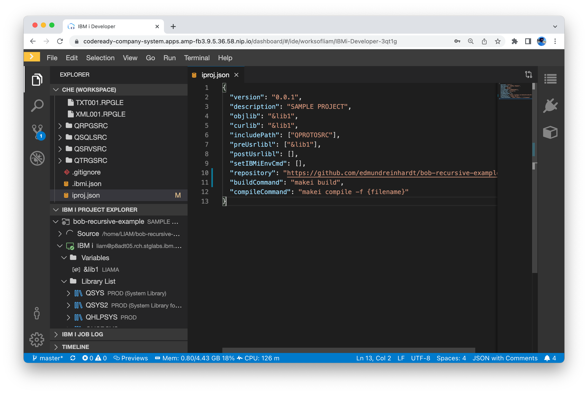

If you wanted to, you could also specify another build tool here. The `buildCommand` and `compileCommand` properties are just commands that are execute in the remote IBM i within the PASE environment, once the local source files are uploaded to the remote IFS directory.  You could use `make`, `elias` (ARCAD), or even your own existing system.

After running a build or a compile, you should get error feedback right away within IBM i Developer.

## Running the Build

To run a build (of the entire project):

1. Open the command palette (F1 or Control / Command + Shift + P)
2. Search for 'build' and select 'Project Explorer: Run Build'
3. An info message appears to let you know it has started
4. The output window appears with the output from your build tool

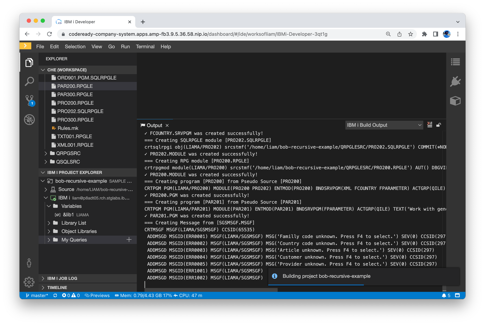

## Running a Compile

To compile (a single source and items it depends on)

1. Open the source you want to compile
2. Search for 'compile' and select 'Project Explorer: Run Compile'
3. An info message appears to let you know it has started
4. The output window appears with the output from your build tool

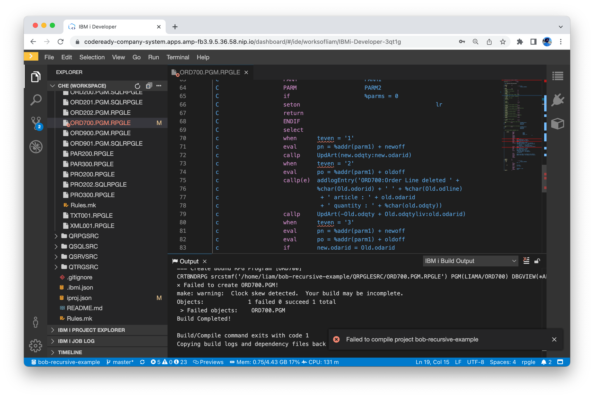

## Debugging

You can debug RPG/COBOL/C/C++/CL batch programs.  

### Prerequisites

Host PTFs are required.  Run the **Validate the dependent PTFs** from **Connections>Templates** for the IBM i to check if all PTFs are applied.  The **Enable IBM i debug service** action must be run to start the host debug service.

### Debugging from Project Explorer

With a project in IBM i Project Explorer, connect to the IBM i.  Under the IBM i connection, using Library List or a QSYS query under My Queries, show a program object.  Two debug actions will be available as inline actions or from the popup menu:  **Debug>As Batch** and **Debug>Set Service Entry Point**.  Select an action to start debug.

When debug starts, the debug panel will open on the left and the source will open in the editor.  From the debug panel, the following actions are available: **Continue**, **Step Over**, **Step into**, **Step out**, **Restart**, and **Stop**.  In the editor, breakpoints can be set on lines in the left margin.  While debugging, the **Variables** view will show the variable values.  In the editor, hovering over a variable will show its value.

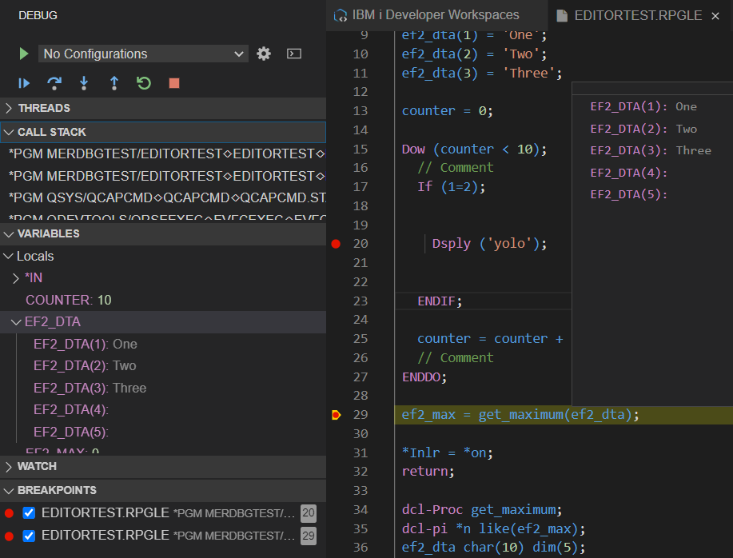

For a demonstration, see the Merlin IDE Debugging video in the [Merlin Getting Started for Users](https://www.youtube.com/playlist?list=PLPELYviDwCnY6L5r5ZnmCneqhakLcB7ko) playlist.

.
