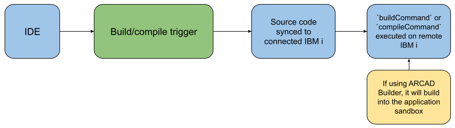
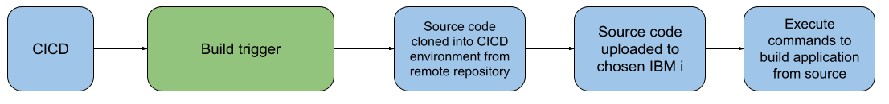
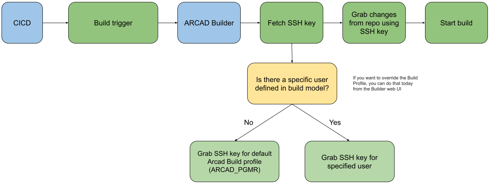

# Simple builds

## IDE

This example shows what the steps are when building/compiling from Merlin IDE. It compiles under the user profile for the connection.

## CICD

This example shows what the steps are when building from Merlin CICD. It compiles under the user profile defined in the template used for the connection.

### Understanding ARCAD Builder

ARCAD builder has a specific way it fetches source code from a repository before starting a build. It will do a fresh clone (and checkout where required) before starting the build.

In order for ARCAD Builder to successfully clone from the 'External source code Management' URL defined in the ARCAD application, the user profile that is running the ARCAD Builder job needs access to the repository URL.

* The `AGENSSHKEY` can be used to generate the keypair for the user running the ARCAD Builder job on IBM i. The standard directory for the public key is `/home/<user>/.ssh/id_rsa.pub`.
* The generated public key must be added to a GitHub/Azure/BitBucket account that has access to the repository being used.
* The user who runs the ARCAD Builder job can be changed with the `CHGAFSSVR` command.

It is also possible to override the user used for the clone. If you head to the ARCAD Builder Web Interface and navigate to the application, under the build model it is possible to define a 'Build' login and password (an IBM i user profile) which will be used for this application. The user profile provided also needs an SSH keypair setup.

