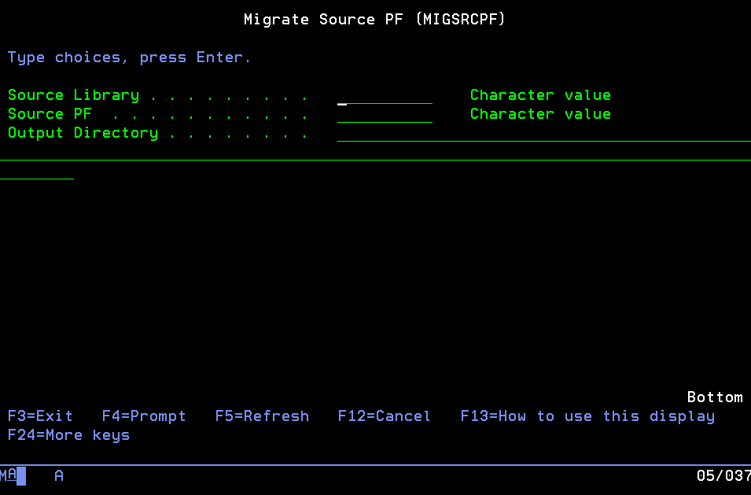

This guide will cover moving source members to a git repository.

## Migration

Migration actually means copying the source member contents to the IFS. Only one person has to do this step. If someone edits the source members while migrating the source to the IFS, you will have to re-copy the changed members.

For example, a library, source physical files and members might look like this:

```
DEVLIB
  - QRPGLESRC
    - PROGRAMA.RPGLE
    - PROGRAMB.RPGLE
    - PROGRAMC.RPGLE
  - QSQLSRC
    - CUSTOMERS.SQL
    - INVENTORY.SQL
  - QCLLESRC
    - STARTJOB.CLLE
  - QCMDSRC
    - STARTJOB.CMD
```

Where the resulting layout in the IFS could be very similar:

```
/home
  /barry
    /.git
    /qrpglesrc
      programa.rpgle
      programb.rpgle
      programc.rpgle
    /qsqlsrc
      customers.sql
      inventory.sql
    /qcllesrc
      startjob.cmd
    /qcmdsrc
      startjob.cmd
```

**Notes about migrating to the IFS**:

1. The TEXT column that source members have will be lost, which is usually used for describing what the source is. Although, you can still put that in the program as a comment. More on this later.
2. The type of the source member becomes the extension when in the IFS.
3. Files and directories of sources can be any case, though should usually stored as all lowercase.
4. Sources on the IFS should be stored as encoding 1208 (UTF-8).

## Initialise the repository on the IFS

Since the first step is moving the source from source members to an IFS directory, the repository needs to be created first. The repository is also created in the IFS and appears just like any other IFS directory.

> Before continuing, git needs to be installed onto the IBM i where the migration is going to take place. Git can be installed via yum. [See these docs on installing yum and installing packages (like git!)](https://ibmi-oss-docs.readthedocs.io/en/latest/yum/README.html?highlight=yum#installation).

From an ssh session, use `mkdir` to create the directory which you will migrate the sources to. Then use `git init` to create the repository

```
$ cd /home/BARRY/myproject
$ git init
Initialized empty Git repository in /home/BARRY/myproject/.git/
```

The `.git` directory created inside is what indicates that it is a git repository.

## Tools used for migration

Initially migrating the source code can be the hardest part of the entire process, but once it's done: it's done. There are many ways to do it, but this will only describe two.

### 1. Manually migrating

All a migration consists of is moving source members to the IFS. To our benefit, the `CPYTOSTMF` command exists, which can be used to copy a source member to a stream file. For example:

```
CPYTOSTMF FROMMBR('/QSYS.lib/DEVLIB.lib/QRPGLESRC.file/PROGRAMA.mbr') TOSTMF('/home/barry/myproject/qrpglesrc/programa.rpgle') STMFOPT(*REPLACE) STMFCCSID(1208)
```

On the basis of this command, you would have to run this command for each source member you want to migrate.

### 2. cvtsrcpf (ibmi-bob)

Convert source physical file members to ASCII IFS files. This uses [ibmi-bob](https://github.com/IBM/ibmi-bob), which is available through yum.

```
makei cvtsrcpf [-h] [-c <CCSID>] <file> <library>
```

Converts all members in a source physical file to properly-named (Bob-compatible), ASCII-ish, LF-terminated source files in the current directory in the IFS. Generally speaking, the source member type will become the filename extension.

For example, RPGLE source member `AB1001` will become IFS source file `AB1001.RPGLE`. Four exceptions exist, however: source member types CMD, MENU, and PNLGRP result in filename extensions .CMDSRC, .MENUSRC, and .PNLGRPSRC, respectively, and source member type C residing in source physical file H results in filename extension .H.

By default, source files will be encoded in UTF-8; this can be overridden by using the `-c` option and supplying a CCSID value.
It is likely that the same destination directory will contain converted members from many source physical files.  Therefore, name collisions are possible.  In the event of a duplicate member name and type, the source file name will be adjusted from `member.type` to `member (n).type`, with `n` incremented until a unique name is achieved.

If the source physical file was created successfully, a `.ibmi.json` file with the same CCSID value will be created in the same directory. Note that It will not override an existing `.ibmi.json` file. 
Just a note that the target ccsid in the .ibmi.json is NOT the encoding of the stream file but rather the EBCDIC encoding used by the compiler. So it is misleading to generate the .ibmi.json with that encoding as it will not be EBCDIC.

#### Example

- Convert source members for file MYLIB/MYSRCFILE into directory `newdir` using the default (UTF-8).'
  ```bash
  cd newdir
  makei cvtsrcpf mysrcfile mylib
  ```

- Convert source members for file MYLIB/MYSRCFILE into directory `newdir` using Windows Latin-1.
  ```bash
  cd newdir
  makei cvtsrcpf -c 1252 mysrcfile mylib
  ```

### 3. Using the migrate tool

There is an open source migrate tool, simply named 'migrate', which automates the copying of source members into a directory. It also creates the streamfiles with the correct extensions.

To use the migrate tool, you will need to clone it and build it manually.

```
git clone https://github.com/worksofliam/migrate.git
cd migrate
gmake
```

Building this solution will create the `MIGRATE` library and inside is the `MIGSRCPF` command. `MIGSRCPF` has three simple parameters.



If we had a library with source physical files and wanted to migrate them into a new project directory, we would have to run the command once to migrate the source physical file. It will copy the source member into the IFS as a 1208 (UTF-8) streamfile. If the file or folder it tries to create already exists, it will fail.

```
MIGSRCPF LIBRARY(TESTPROJ) SOURCEPF(QRPGLESRC) OUTDIR('/home/BARRY/myproject')
MIGSRCPF LIBRARY(TESTPROJ) SOURCEPF(QRPGLEREF) OUTDIR('/home/BARRY/myproject')
MIGSRCPF LIBRARY(TESTPROJ) SOURCEPF(QCLLESRC)  OUTDIR('/home/BARRY/myproject')
```

This would create three directories in `/home/BARRY/myproject` like the following:

```
/home
  /BARRY
    /myproject
      /qrpglesrc
        /somesource.rpgle
        /somesource.rpgle
      /qrpgleref
        /whatever.rpgle
      /qcllesrc
        /pgm1.clle
        /pgm2.clle
        /pgm3.clle
```

Note that it will create all directories and stream files with lowercase names.

### Don't forget to commit changes

Make sure, when you've finished migrating source code into your local developer repository. For example:

```
git add --all
git commit -m "Initial migration step"
git push
```

You will want to do this again (maybe multiple times) as you change the copybooks too.

## Handling 'copybooks' (`/COPY` & `/INCLUDE`)

Once the source has been migrated. But, another tedious task is changing all the copy books to point to your newly migrated streamfiles. We're lucky that the C, RPG and COBOL compilers for IBM i all support bringing includes in from the IFS. In this chapter, we will use RPG as it's the primary target audience for this book.

Let's say we have a program that has `/COPY` (or `/INCLUDE`) statements like the following at the top of the source:

```

      /COPY QRPGLEREF,OBJECTS
      /COPY QRPGLEREF,OBJECT
      /COPY QRPGLEREF,FORMATS
      /COPY QRPGLEREF,MEMBERS

      ** --------------------------

     D testproj        PI
     D    pLibrary                   10A   Const

      ** --------------------------
      
```

Even though this source might be in the IFS, `/COPY` (or `/INCLUDE`) can still bring in source from source members in the QSYS file system (and vice versa). What the developer should do is change the statements to use a relative path based on the root of the project to the respective streamfile on the IFS. For example `/COPY QRPGLEREF,OBJECTS` might translate to `/COPY './qrpgleref/objects.rpgle'`.

```
      /COPY `./qrplgeref/objects.rpgle`
      /COPY `./qrplgeref/object.rpgle`
      /COPY `./qrplgeref/formats.rpgle`
      /COPY `./qrplgeref/members.rpgle`
```

The reason you use a path relative to the root of the project is so we can build from the root of the project within our command line, IDE or our build system (which you will see later). It's not required that you do this to all your source at once, because you can still depend on the existing source members during a migration period - although **it is recommended you change them as soon as possible**. While it's not recommend, you can do it iteratively and change them when you work on the source. This is dangerous because the source members aren't under change control.

If you are using a 3rd party tool, like the HTTPAPI, which has it's headers in source members, then you can leave those `/COPY` (or `/INCLUDE`) statements along side your includes which point to the IFS:

```
      /COPY `./qrplgeref/objects.rpgle`
      /COPY `./qrplgeref/object.rpgle`
      /COPY `./qrplgeref/formats.rpgle`
      /COPY `./qrplgeref/members.rpgle`
      /COPY QRPGLEREF,HTTPAPI_H
```