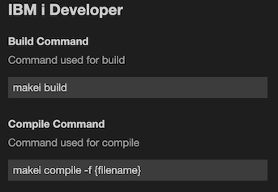
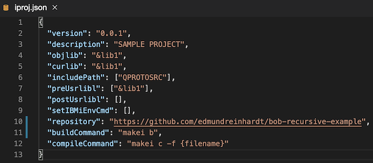
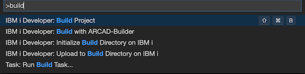
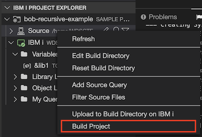
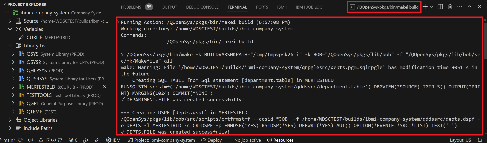
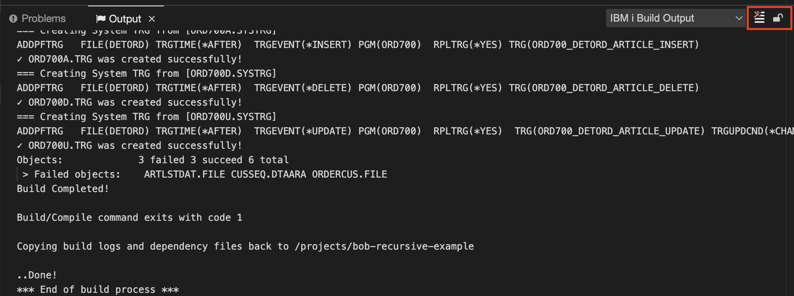
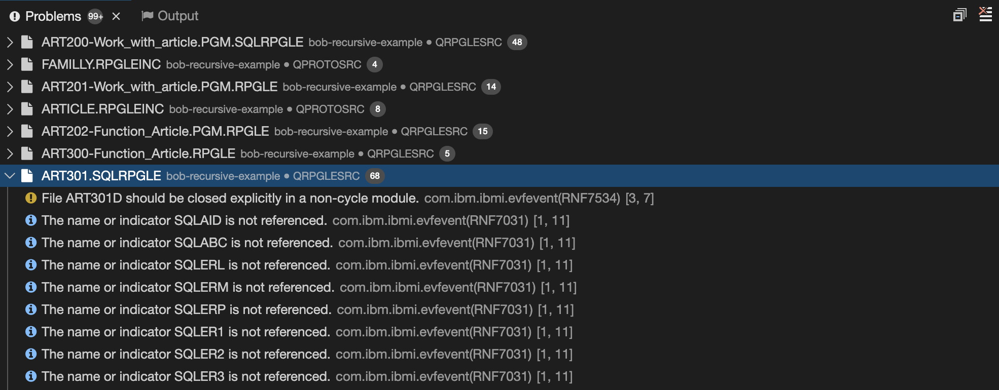
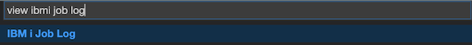
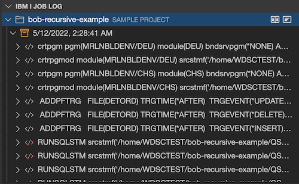
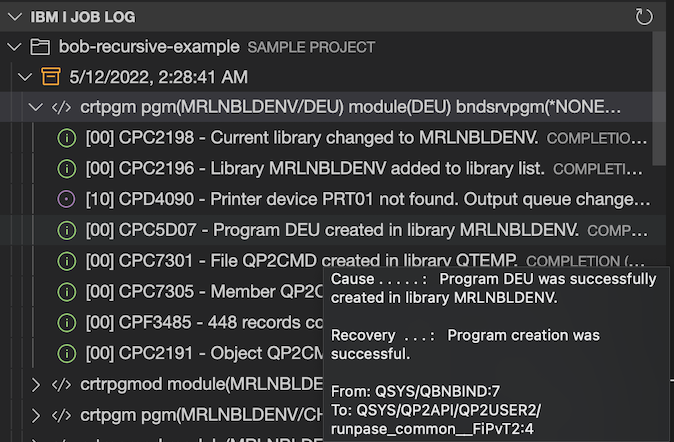

# Developer build

IBM i Developer allows the user to run the project-based developer builds. IBM i Developer **does not** restrict users from using any specific building technology. For example, users may use Better Object Builder (BOB) or ARCAD tooling for the builds. Alternatively, users may even write their scripts and invoke them as long as those build tools respect the [IBM i Projects Standard](https://ibm.github.io/ibmi-bob/#/prepare-the-project/project-metadata).

## Prepare the Workspace and the Project

Before getting started, please make sure you have set up your [IBM i Projects](./guides/ide/ibmiprojectexplorer.md).

- Specify an IBM i Connection
- Specify the Build Directory
- Set the values for any variables defined in the project.

## Configure the Build Command and the Compile Command

You may configure to use different build technologies by specifying different build/compile commands. The build command is for building an entire project. The compile command is for building a single file. There are two ways you can define those two commands.

1. The default way of building a project is specified in the Preferences. Those settings apply to all the projects in the workspace and can be overwritten by a project's `iproj.json`. To change the commands, go to **File>Settings>Open Preferences** (or Ctrl/Cmd + ,)>scroll down to the Build command or compile command.

   

2. For project specific build setup, the build/compile commands can be specified in the project's iproj.json. See the [documentation](https://ibm.github.io/ibmi-bob/#/prepare-the-project/iproj-json?id=buildcommand) on how to set the commands.

   

Both methods support the substitution of variables.

| Variable   | Description                                                  |
| ---------- | ------------------------------------------------------------ |
| {files}    | resolves to the list of files being selected or the active editor. |
| {filename} | resolves to the base file name being edited. **Deprecated**  |
| {path}     | resolves to the full IFS path corresponding to the source in the editor. |
| {host}     | resolves to the IBM i hostname.                              |
| {usrprf}   | the user profile that the command will be executed under.    |
| {branch}   | resolves to the name of the current git branch if this project is managed by git. |

Note: For more information about how to use [BOB](https://github.com/IBM/ibmi-bob)'s `makei` utility, please view the [documentation for makei](https://ibm.github.io/ibmi-bob/#/cli/makei).

## Perform a Build/Compile

Select **View>Find Command** and enter **IBM i Developer: Build** (or Ctrl/Cmd + Shift + B) to invoke the build command.

You can also find a shortcut in the [project explorer](./ibmiprojectexplorer.md) to directly perform a build for a specific project.

The compile command will compile the currently active file in the workspace by default. To invoke the compile command, you must first open the source file you want to compile. And then select **View>Find Command** and enter **IBM i Developer: Compile** or **IBM i Developer: Build** (or Ctrl/Cmd + F7).

You can tell the build/compile command is running from the pop-up output channel.

## Getting Feedback

### Output from Build/Compile Command

The **Output** view contains a channel showing all the standard outputs for the running build/compile commands.

Those outputs can be found under the **OUTPUT** tab (**View->Output**, or Ctrl/Cmd + Shift + U). Select **IBM i Build Output** in the drop-down on the right.

You may clear the outputs or turn on and off the auto-scrolling feature using the buttons on the right.

### Compiler Feedback

IBM i Developer will populate the problem view (View->Problems, or Ctrl/Cmd + Shift + M) with compiler feedbacks. Those feedbacks come from the event files under `.evfevent` directory.By default, the build tools will create those event files, and IBM i Develop will then pull them back in the Build/Compile process.

You can click on any line to jump to the source directly.

### Job Log Results

IBM i Developer will also read `.logs/joblog.json` files to populate the **IBM i Job Log** view (**View->Find View**, and enter **IBM i Job Log**).

The job logs are grouped by commands and you can always find the latest at the top.
Click on the command to show all the job logs related to this command. You can also hover on a job log message to show details.

You may find the [schema for joblog.json](https://ibm.github.io/ibmi-bob/#/reference/joblog-json) under BOB's documentation.

For information on using ARCAD tools, see [How to use ARCAD integration with IBM i Modernization Engine for Lifecycle Integration](https://supportcontent.ibm.com/support/pages/how-use-arcad-integration-ibm-i-modernization-engine-lifecycle-integration-merlin)    

