# Editing RPG

Apart from those common language features mentioned in [Edit](edit.md), ILE RPG source editing also has these capabilities:

- outline view - structured view of source that allow navigation to source, filtering the items  
  Use **View > Outline** to open outline view.  
   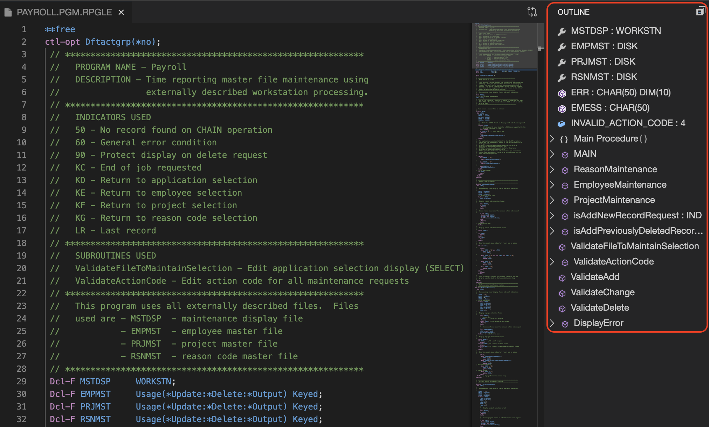

  Click a field or a variable in the Outline view will position the editor to its definition and highlight it.  
   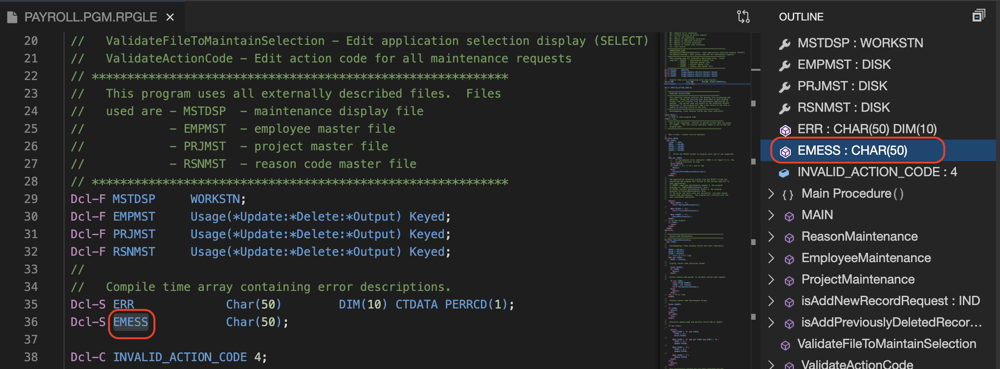

  Outline view supports filtering the items by name. Click on an item in the outline view and then start typing
  the string that you would like to filter items by. A popup with the string you were typing will appear at the top right corner of the outline view. Hover your mouse over the popup, and it will expand to reveal three options to filter items by name,
  go to previous matching item, and go to next matching item.  
   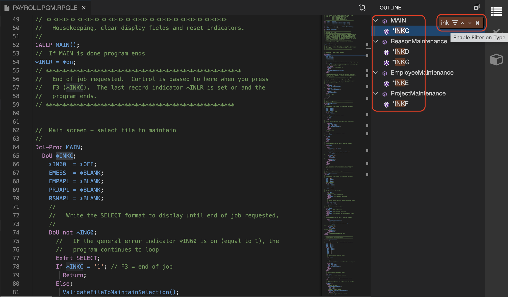

- hover - show information for item under cursor  
  Put the mouse over the variable and the hover will appear and show the definition of the variable.  
   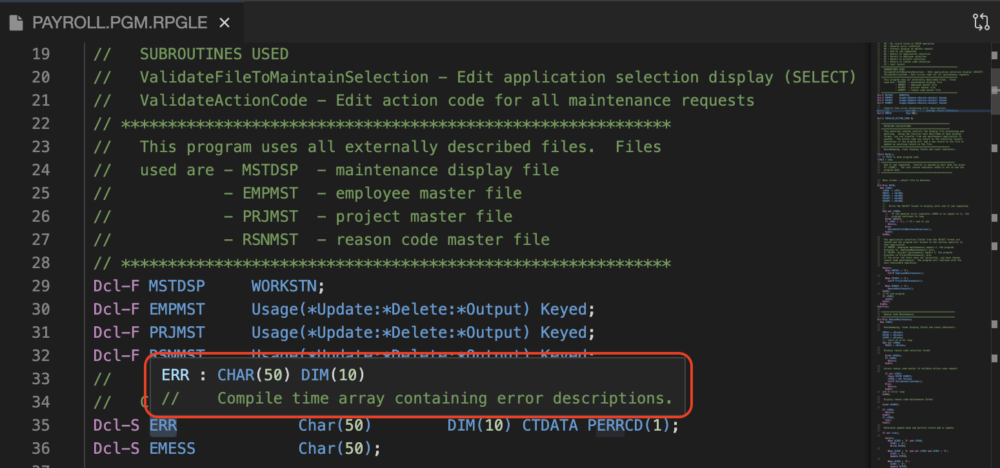

- references - show particular code element is referenced throughout the codebase  
  After right clicking on a specific variable, users can select either **Go to References** or **Peek References** to show all references embedded inline. You can navigate between different references in the peeked editor and make quick edits right there.
   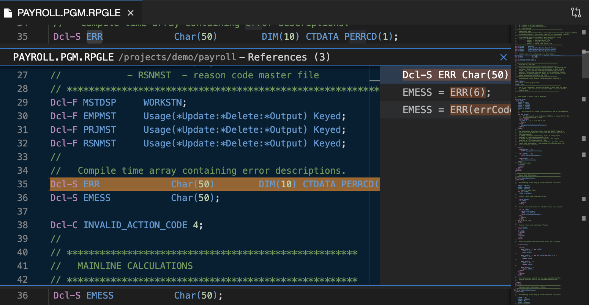

  Users can also select **Find all references**, but will manually need to open the references view from the left sidebar, to reveal the references.  
   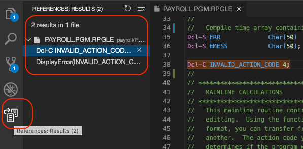

- definition - show source of particular code element  
  After right clicking on a specific variable, users can select **Go to Definition** to go to the definition of the variable.  
   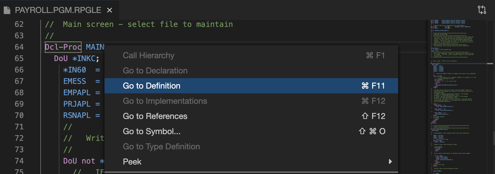

- formatting - format the whole document or selected region  
  Formatting options can be found at [Preferences](settings.md).  
   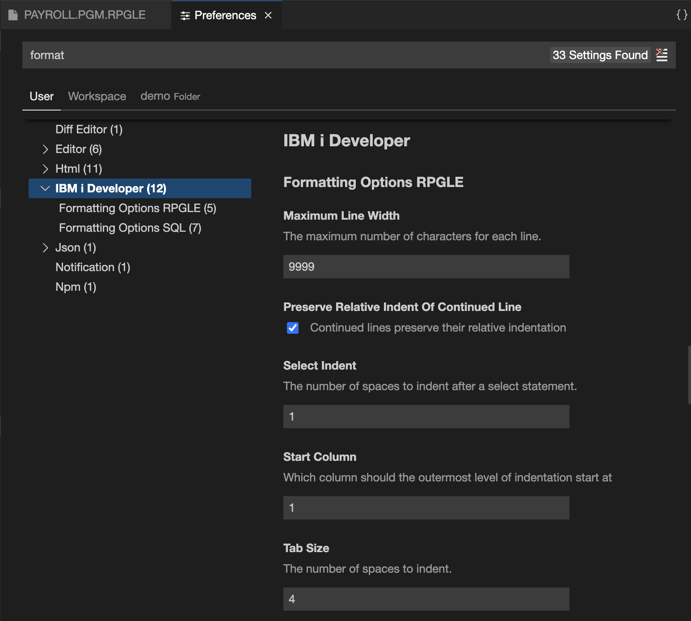
  
  Users can select **Format Document** to format the whole document or **Format Selection** to format the selected region after right clicking in the source file.  
   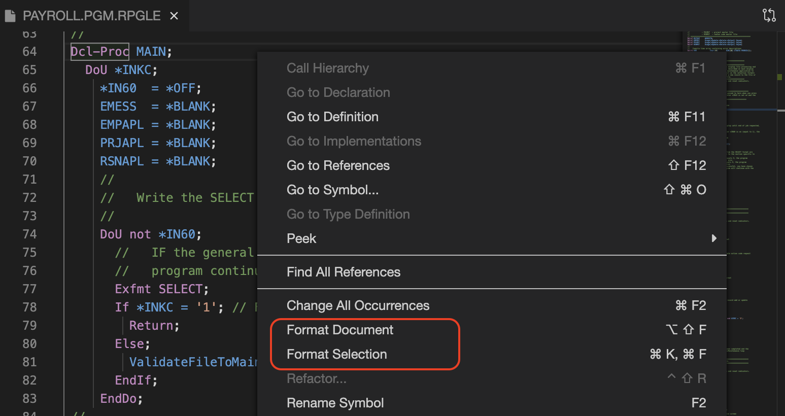

- content assist - code and variable completion  
  Content assist can be triggered in editor window by typing **⌃/CTRL+SPACE**.  
   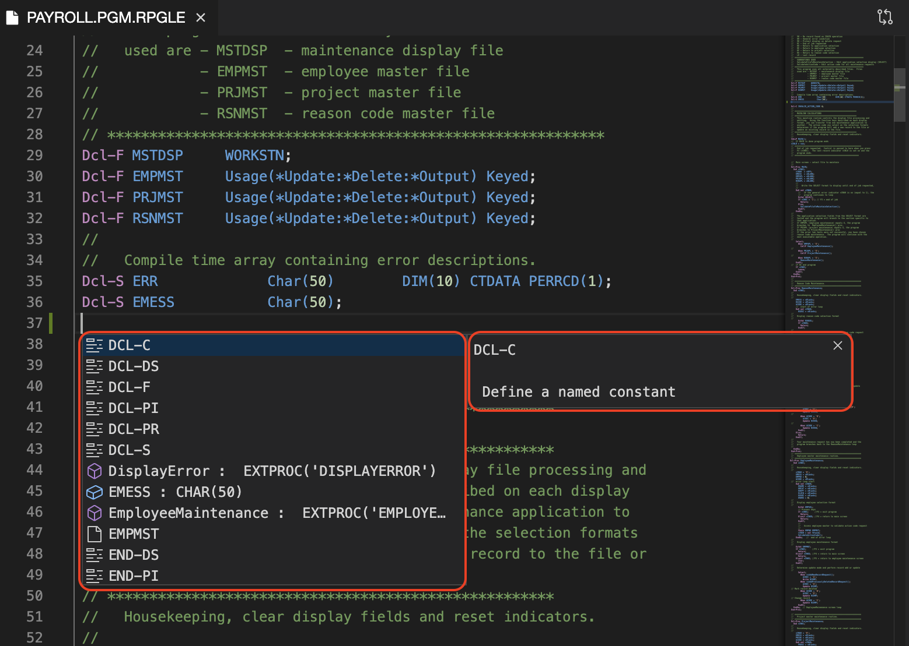

- rename - intelligently rename all references to variables  
  Select **Rename Symbol** and then type the new desired name and press Enter. All usages of the symbol will be renamed, across files.  
   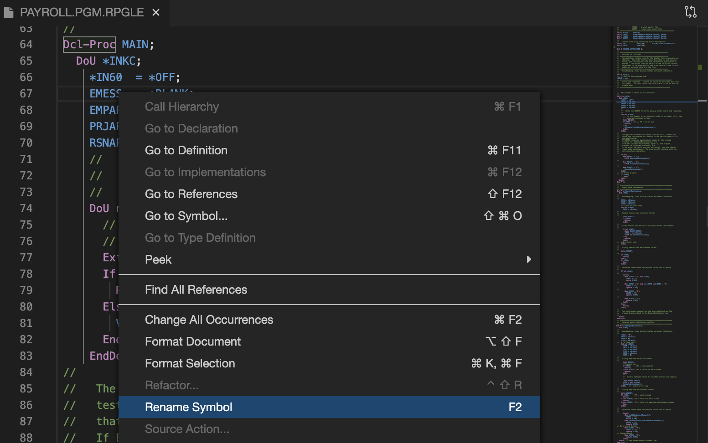

- extract constant - extract a literal value into a constant  
  Click on a literal value, and then click the light bulb icon that appears to the left. Two options will be available: 
  **Extract constant to enclosing scope** and **Extract constant to global scope**. Clicking one of these options will create
  a new constant in the selected scope, with the extracted literal value. The literal value will be replaced
  in your code with the new constant.
   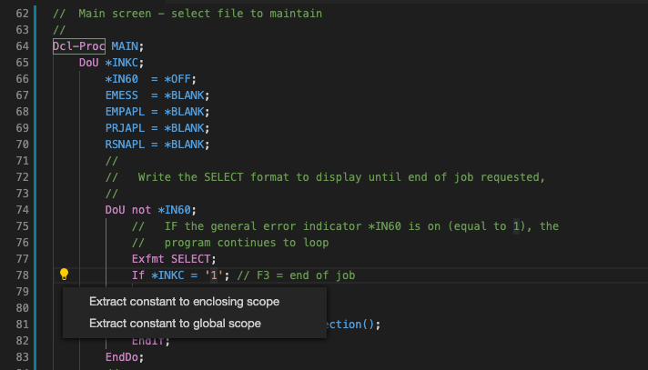

- source error reporting - errors are shown beside the text in the editor and **Problems** view  
  Use **View > Problems** to open problems view.  
  The errors display in both editor and problems view. In the editor, if the cursor hovers over the problem, it will show the details of the error. In the problems view, clicking a specific problem will position the editor to the location of the error.  
   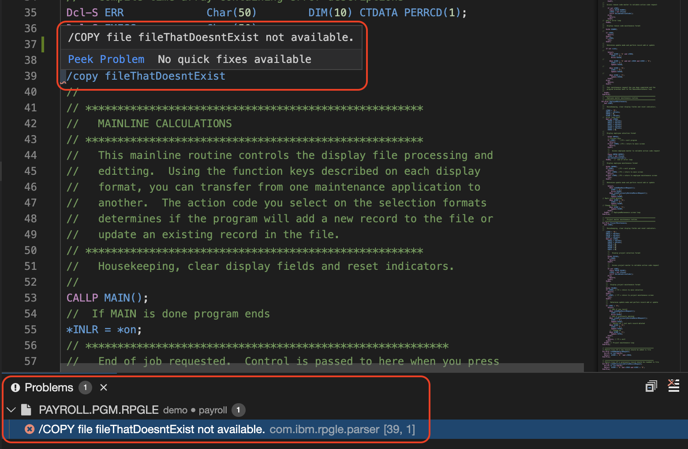

For information on using ARCAD tools, see [How to use ARCAD integration with IBM i Modernization Engine for Lifecycle Integration](https://supportcontent.ibm.com/support/pages/how-use-arcad-integration-ibm-i-modernization-engine-lifecycle-integration-merlin)
