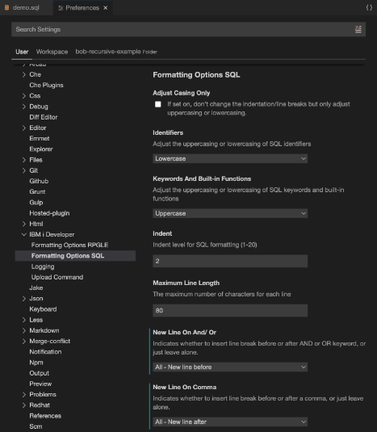
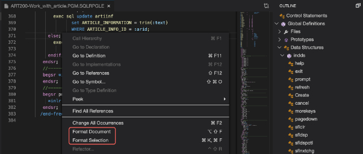
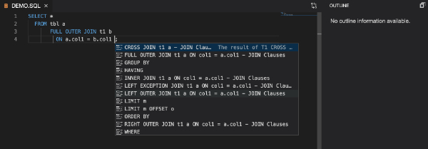
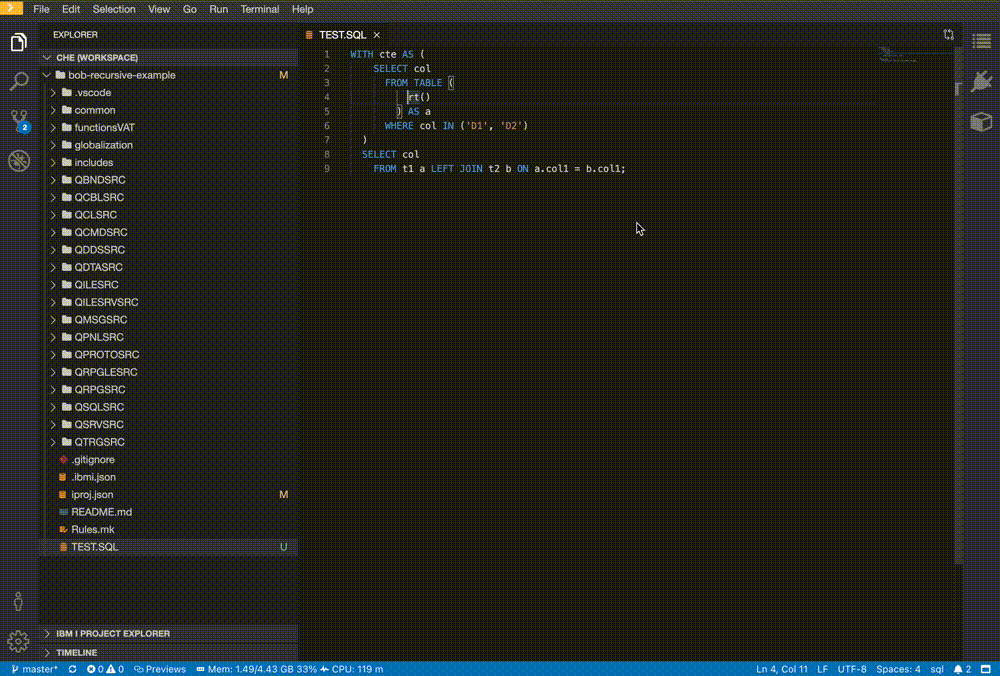

# Editing SQL

SQL source editing capabilities:

* formatting  
Formatting options can be found at [Preferences](settings.md).  
  
Formatting supports both **Embedded SQL formatting** and **Pure SQL formatting**. Users can select **Format Document** to format the whole document or **Format Selection** to format the selected region after right clicking in the source file.  

* content assist  
The content assist provides both SQL keyword and database element completion. Content assist can be triggered in editor window by typing **⌃/CTRL+SPACE**.  

  * Content assist for SQL keyword  

  * Content assist for database element  
  Before using content assist for database element, please refer to the [documentation](https://ibm.github.io/ibmi-bob/#/prepare-the-project/iproj-json?id=sql) on how to set the SQL properties in `iproj.json` of the project.  

For information on using ARCAD tools, see [How to use ARCAD integration with IBM i Modernization Engine for Lifecycle Integration](https://supportcontent.ibm.com/support/pages/how-use-arcad-integration-ibm-i-modernization-engine-lifecycle-integration-merlin)