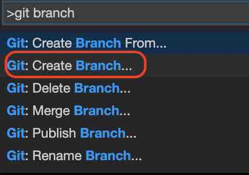
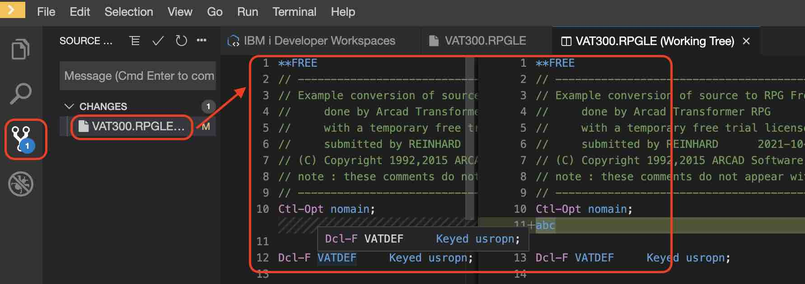
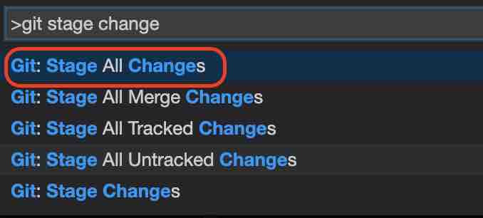
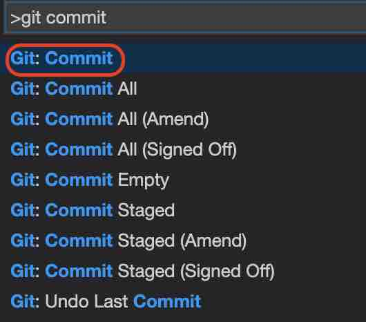

# Git Integration

**Git** is integrated within the IDE, which means you can run commands like `git clone`, `git pull`, `git commit`, and so on, to help you with source control management. 

In order to run a Git command, go to **View > Find Command...**, then type in "git" to find the Git command you wish to run. If you are more familiar with Git on the command line, you may also run the Git commands from an opened terminal. To open a terminal, do **Terminal > Open Terminal in specific container**, then select the terminal you wish to open. 

The **Source Control: Git** View is helpful to see the status of your git branch. here you can see the changes you have made since the last commit and perform various git actions.

Below is an example using Git within the IDE showing the steps from cloning a project to committing your changes to a newly created branch.

Steps:
1. Use **Git: Clone** command to load source from a Git repository  

1. Create a new branch for development with **Git: Create Branch**  

1. After making some changes, you will see the list of your changes in the **Source Control: Git** View. You may see the *diff* between the original files and the changed files when you click on a file.   

1. Now to stage the changes with **Git: Stage**.  

1. Use **Git: Commit** to commit your changes  

For information on using ARCAD tools, see [How to use ARCAD integration with IBM i Modernization Engine for Lifecycle Integration](https://supportcontent.ibm.com/support/pages/how-use-arcad-integration-ibm-i-modernization-engine-lifecycle-integration-merlin) 