# IBM i Projects

IBM i projects are designed to self-describe how they will build themselves as much as possible. These projects leverage the use of a project level JSON file (`iproj.json`) to store project metadata information such as a description, Git repository, version, license, and several IBM i related attributes (target object library, library list, initial CL commands, and include directories). Optional directory level JSON files (`.ibmi.json`) can be used to override the target library and CCSID for that directory. For more information on the project metadata definition of IBM i projects, see [Project Metadata](https://ibm.github.io/ibmi-bob/#/prepare-the-project/project-metadata).

The **IBM i Project Explorer** view is what you will use to define IBM i connections for your projects. In doing this, you will be able to work with your desired libraries, objects, members, and IFS files.

## Getting Started

To get started with working on an existing IBM i project that lives in Git, use *Git Clone* to load the source from a Git repository. For more information, see [Git Integration](gitintegration.md). 

If you are working on a new IBM i project, follow these steps:

1. Navigate to the command palette and run the command **Create IBM i Project**.
2. Select the workspace in which you want to create the project in.
3. Modify the selected workspace path to include the name of your project.
4. (Optional) Enter a description for your project.
5. Select from the list of connections that were defined in the Merlin **Connections**.
6. Modify or confirm the suggested build directory you would like to proceed with for the project.

## IBM i Connections

To specify an IBM i connection on your project, follow these steps:

1. Open the **IBM i Project Explorer** view.
   * Note: By default, the **IBM i Project Explorer** view should be visible under the **Explorer** view container. If not visible, navigate to **View** > **Open View...** and select the **IBM i Project Explorer** option.
2. Expand your project.
3. Right click on the IBM i and select the **Specify IBM i Connection** action.
4. Select from the list of connections that were defined in the Merlin **Connections**.
   * Note: The **Add Templates from Connections in Merlin** option can be selected if you wish to be navigated to define a new Template.
5. Modify or confirm the suggested build directory you would like to proceed with for the project.

Once an IBM i connection is defined on a project, it will be visible in the **IBM i** description. The following connection related actions are available upon right clicking the **IBM i** connection:

* **Edit Connection**: Change to another IBM i connection defined in the Merlin **Connections**.
* **Restart Connection**: Restart the current IBM i connection.
* **Logout Connection**: Logout from the current IBM i connection.

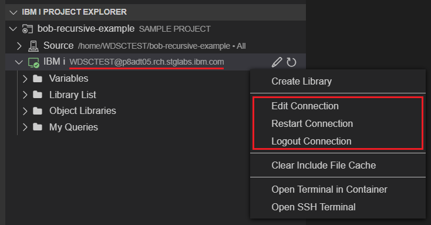

## Source

The **Source** is what will be used to work with source files that exist locally in your workspaces and remotely on IFS/Git. With source filters and queries, you will be able to work with the desired source files while also being able to compare the changes between your local and remote source.

### Build Directory

The **Source** description will render the current build directory for the project which will be used when performing developer builds. This build directory will be initially set upon specifying an IBM i connection where the user will be suggested to proceed with using the default build directory (`{userHomeDirectory}/{projectName}`). If the user's home directory cannot be retrieved, a temporary build directory will be suggested instead.

To modify the build directory, the following actions are available upon right clicking **Source**:

* **Edit Build Directory**: Change to another build directory.
* **Reset Build Directory**: Reset to the default build directory.

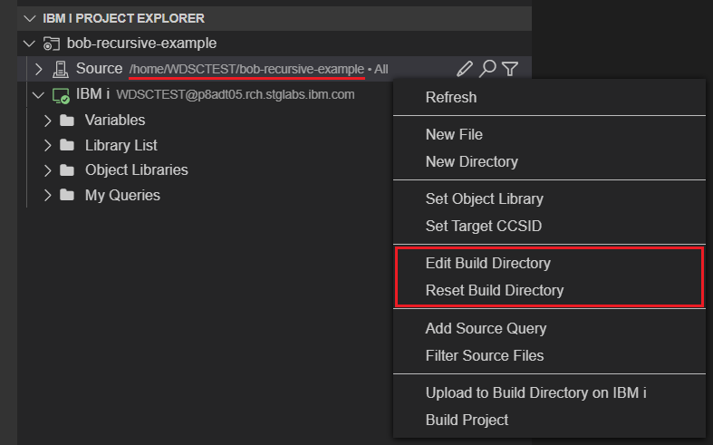

### Developer Build

By right clicking the **Source**, you can access the following related actions to perform developer builds on a project:

* **Upload to Build Directory on IBM i**: Upload the source to the build directory.
* **Build Project**: Build the source into the target library.

For more information on the behaviour of these actions, see [Developer build](developerbuild.md).

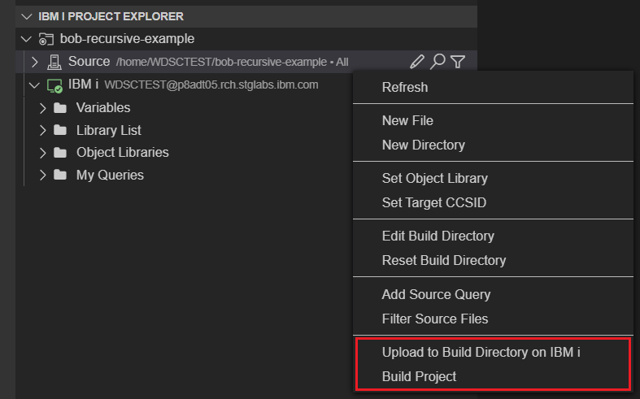

### Source Filters

Source filters can be used to filter the source files that are visible under the **Source**. By right clicking on the **Source** and selecting the **Filter Source Files** action, you can choose from a selection of filters:

* **All**: All local and remote source files.
   * Note: Upon defining an IBM i connection on a project, the **Source** will default to the **All** filter.
* **Changed**: Source files that are out of synch with the remote build directory.
* **Remote IFS**: Remote source files on IFS.
* **Local Project**: Local project source files.
* **Branch Changes**: Changes in local source files compared to the latest tagged commit on Git.
   * Note: This filter uses local tag information and so will not be visible if no tag can be found. Perform a `git pull` to retrieve any tags that exist in the remote repository before trying to use the Branch Changes filter.

For certain source filters, you will be able to observe that the source files have icons that distinguish the state in which they are in. For more information on these different states, refer to [Source Files and Directories](#source-files-and-directories).

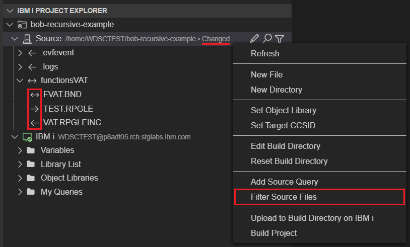

### Source Queries

To further simplify the set of source files visible under the **Source**, queries can be added on top of any filter by right clicking the **Source** and selecting the **Add Source Query** action. Upon doing this, you can create a new source query or select from any previously added ones. The currently selected source query will be displayed in the Source description. By right clicking the **Source**, the following related actions are also available:

* **Clear Source Query**: Clear the current source query.
* **Delete Source Query**: Delete from a set of previously added source queries.

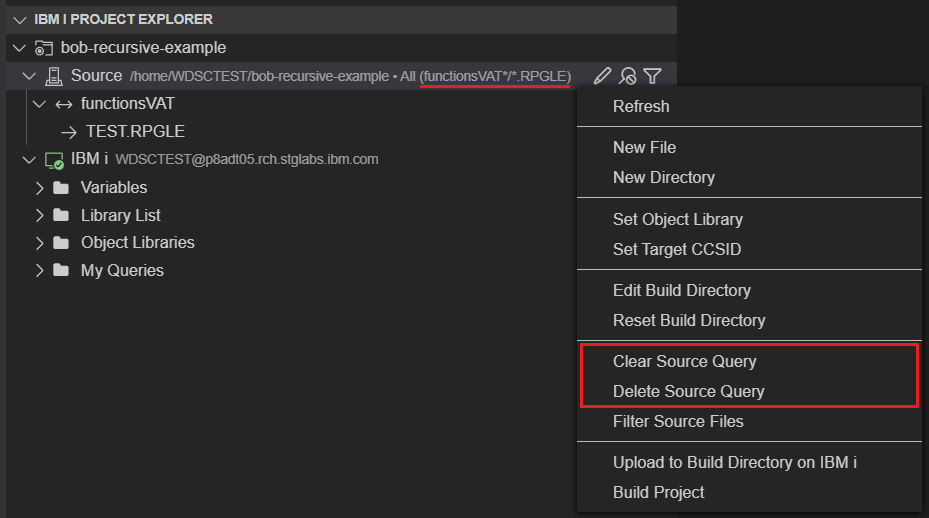

### Source Files and Directories

For source files and directories under the Source, various icons are used to distinguish the state in which local files or directories are in compared to the remote build directory. When files and directories are in-synch, no icon is used. When out of synch, the following icons are used:

* Local-only: Right arrow
* Remote-only: Left arrow
* Changed: Bidirectional arrow

By right clicking on any source directory, you can access the following related actions:

* **New File**: Create a new local file with a specified name.
  * Note: When used on a source directory under the **Remote IFS** filter, create a remote file.
* **New Directory**: Create a new local directory with a specified name.
  * Note: When used on a source directory under the **Remote IFS** filter, create a remote directory.
* **Paste**: Paste remote content to local directory.
  * Note: To use this action, the **Copy** action must first be used on any remote IFS directory/file or QSYS object/member.
* **Assign To Variable**: Assign the remote path of the source directory to an existing variable.
* **Set As Build Directory**: Set the build directory to the remote path of the source directory.
* **Append To Include Path**: Append the remote path of the source directory to the project's include path.
* **Set Object Library**: Set the object library for the `.ibmi.json` of the source directory.
* **Set Target CCSID**: Set the target CCSID for the `.ibmi.json` of the source directory.
* **Compile**: Compile the local path of the source directory.
  * Note: This action can also be performed on source files.

Note: A subset of the actions can be found upon right clicking the **Source** itself to perform such actions at the project level.

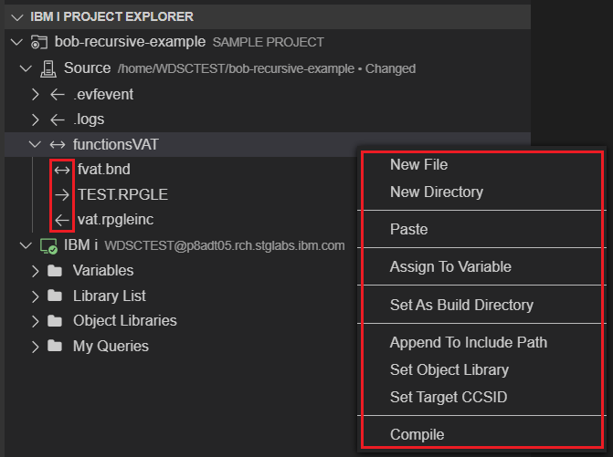

## IBM i

The **IBM i** heading is where you will be leveraging the IBM i connection defined on a project. Once connected, you will be able to work with your desired libraries, objects, members, and IFS files.

### Variables

The project metadata for IBM i projects support the use of variables in the following fields: `objlib`, `curlib`, `preUsrlibl`, `postUsrlibl`, `setIBMiEnvCmd`, `buildCommand`, `compileCommand`, and `includePath`. Variables are always prefaced with an `&`. By levering the use of variables, the same project definition can be used to target a different build library from one developer to another. 

The **Variables** heading is where you will be able to visualize the set of variables defined in the `iproj.json`. Upon right clicking a variable, the **Edit Variable** action can be used to define a value for that variable.

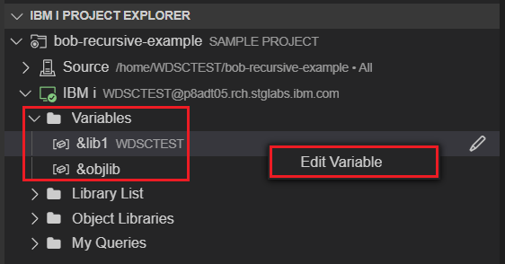

### Library List

The **Library List** heading is where you will be able to view your system libraries, user libraries and current library. The library list is initially set according to your user profile but can be modified based on the fields set in the project's `iproj.json`. Refer to the following guide to distinguish the types of libraries in the library list based on color:

* System libraries: Blue
* Current library: Green
* Pre and post user libraries from project's `iproj.json`: Yellow
* User libraries from user profile: White

To modify the library list, the following actions can be used upon right clicking the **Library List**:

* **Add Library List Entry**: Add a specified library to the pre or post user portion of the library list.
* **Set Current Library**: Set the current library to a specified library.
* **Remove USERLIBL entries specified by USRPRF**: Remove all user libraries that are specified from the user profile.
  * Note: Once this action is invoked, it will be replaced by an action called **Add USERLIBL entries specified by USRPRF** to undo the change.

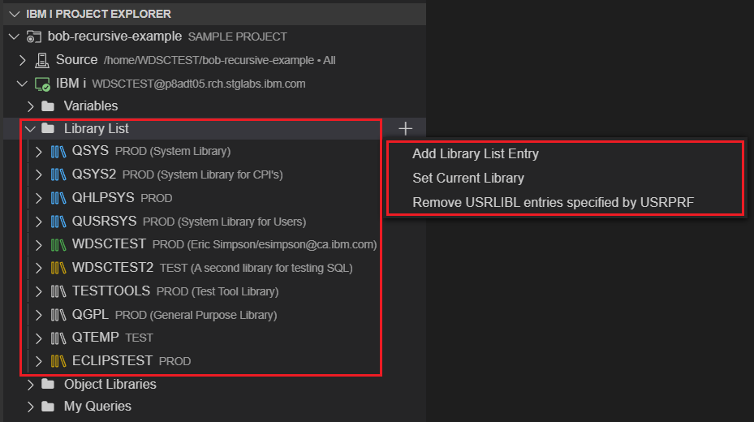

Additional actions can be found upon right clicking any library. However, certain actions are only visible on specific types of libraries. Refer to the following set of all possible actions:

* **Refresh**: Refresh the library.
* **Assign To Variable**: Assign the library to an existing variable.
* **Rename Library**: Rename the library to a specified name.
* **Clear Library**: Delete all objects in the library that you have the authority to delete.
* **Delete Library**: Delete the library from the system after all objects in the library have been deleted.
* **Set as Object Library**: Set the library to be the project's object library.
* **Set as Current Library**: Set the library to be the project's current library.
* **Move Up In Library List**: Move the library up one position in the library list.
* **Move Down In Library List**: Move the library down one position in the library list.
* **Add to Beginning of Library List**: Add the library to the beginning of the user portion of the library list.
* **Add to End of Library List**: Add the library to the end of the user portion of the library list.
* **Remove From Library List**: Remove the library from the library list.

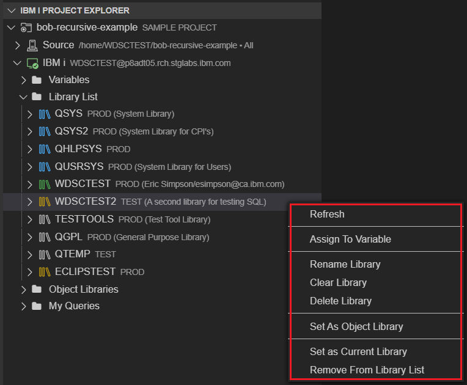

Note: To create a new library, right click on the **IBM i** and select **Create Library**. To also delete or name any objects under a library, right click on the object and select **Delete Object** or **Rename Object** respectively.

### Object Libraries

The **Object Libraries** heading is where you will be able to view library variables defined in the `curlib`, `objlib`, `preUsrlibl`, and `postUsrlibl` of the project's `iproj.json`

Note: When the `objlib` is defined (or `curlib` if the `objlib` is not defined) strictly with a library name instead of a variable, it will also be listed here.

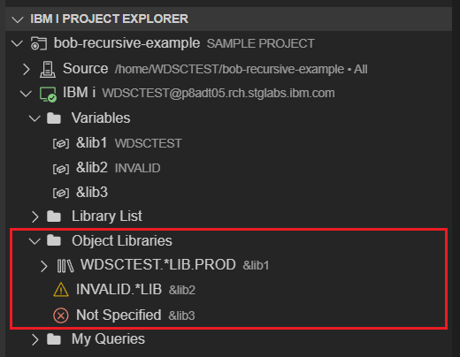

### My Queries

The **My Queries** heading is where you will be able to create QSYS and IFS queries. After selecting the **Add Query** action, enter a query of the following format:

* Library query: `{libraryName}`
* Object query: `{libraryName}/{objectName} {objectType}:{objectAttribute}`
   * Note: If the query is entered as `{libraryName}/{objectName}`, you will be prompted to proceed or modify the default object type and object attribute.
* Member query: `{libraryName}/{objectName}({memberName}.{memberType})`
* IFS query: `{ifsPath}`

Note: Queries support the use of variables. Generic names can also be used in the above parameters excluding the `{libraryName}` for object queries and member queries.

By right clicking on any created query, you can access the following related actions:

* **Refresh Query**: Refresh the specified query.
* **Delete Query**: Delete the specified query.

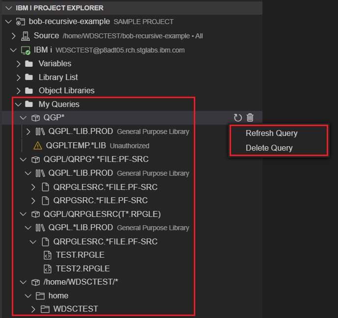

When working with IFS directories under an IFS query, the following actions can be found upon right clicking the IFS directory:

* **New File**: Create a new remote file with a specified name.
* **New Directory**: Create a new remote directory with a specified name.
* **Assign To Variable**: Assign the remote path of the IFS directory to an existing variable.
* **Set As Build Directory**: Set the build directory to the remote path of the IFS directory.
* **Append To Include Path**: Append the remote path of the IFS directory to the project's include path.

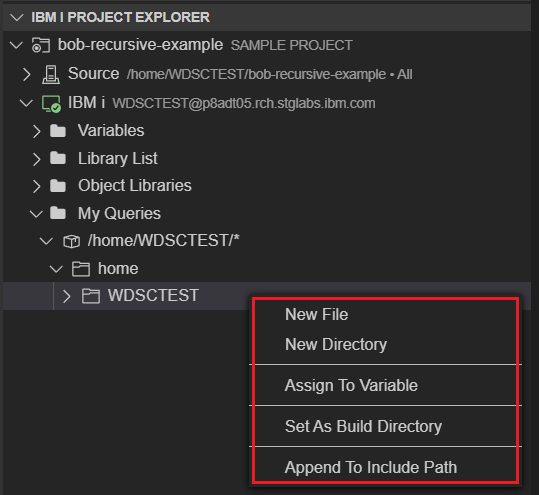

### SSH Terminals

To a launch a terminal for a project, the following actions can be used upon right clicking on the **IBM i**:

* **Open Terminal in Container**: This will open a terminal and navigate to the project in the workspace.
* **Open SSH Terminal**. This will open a terminal, SSH to the IBM i machine, and navigate to the build directory.

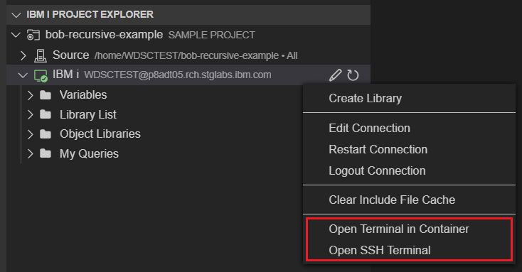

For information on using ARCAD tools, see [How to use ARCAD integration with IBM i Modernization Engine for Lifecycle Integration](https://supportcontent.ibm.com/support/pages/how-use-arcad-integration-ibm-i-modernization-engine-lifecycle-integration-merlin) 