# Overview
  
## Dashboard
The IBM i Developer Dashboard allows the user to create, start, manage, and delete workspaces. Here you should see the workspaces available.  
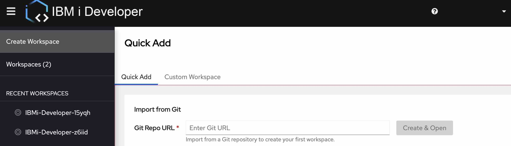
* The sidebar shows frequently used shortcuts and can be toggled with the top left menu icon  
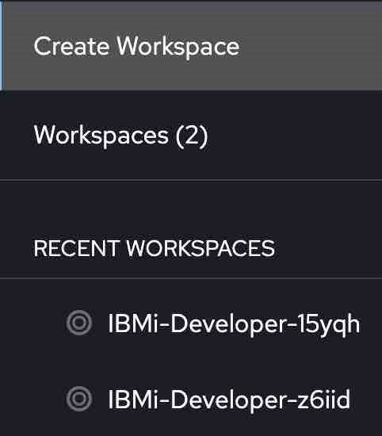
* To create a new `IBM i Developer Workspace`, click on the **IBM i Developer** or **IBM i Developer and demo application** tool stack from **Create Workspace**
   * Other tool stacks are also available. 
   * Custom Workspace option is also available.  
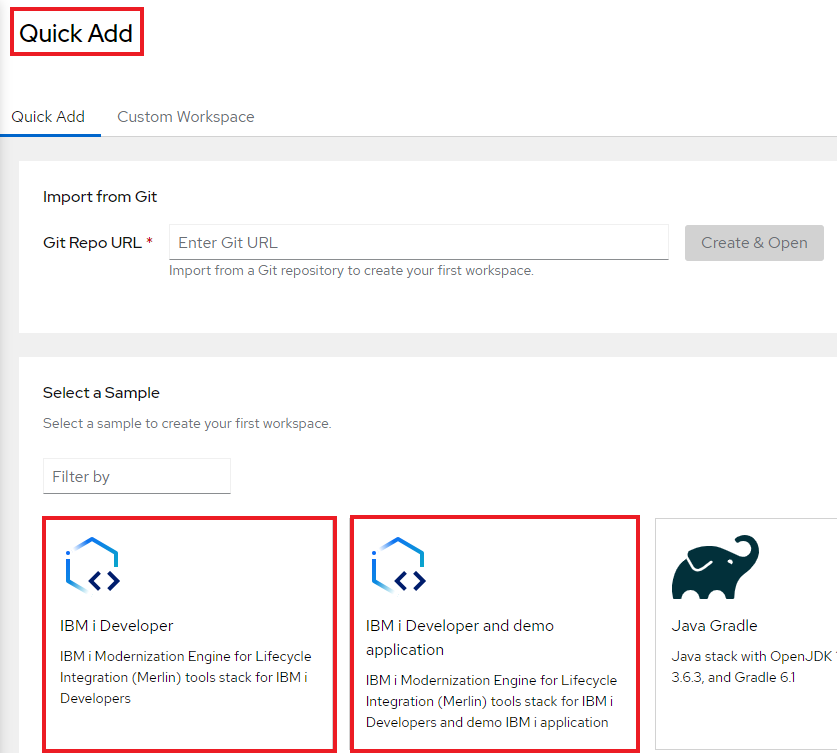
 * To start an existing workspace, go to **Workspaces** and click on the workspace you want to open.
	 * You may also start a workspace in **Recent Workspaces** in the sidebar
	 * Note: You can only have **ONE** workspace running at a time.  
 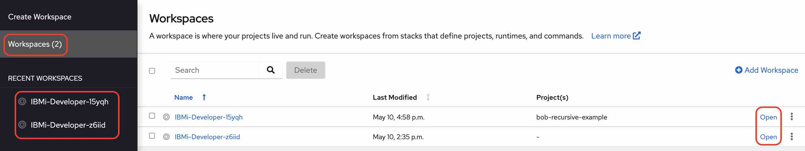

## Workspace
Once a Workspace is started, you should see the IBM i Developer Integrated Development Environment (IDE) displayed on your browser. This is where the user can develop, build, and modernize their applications. 

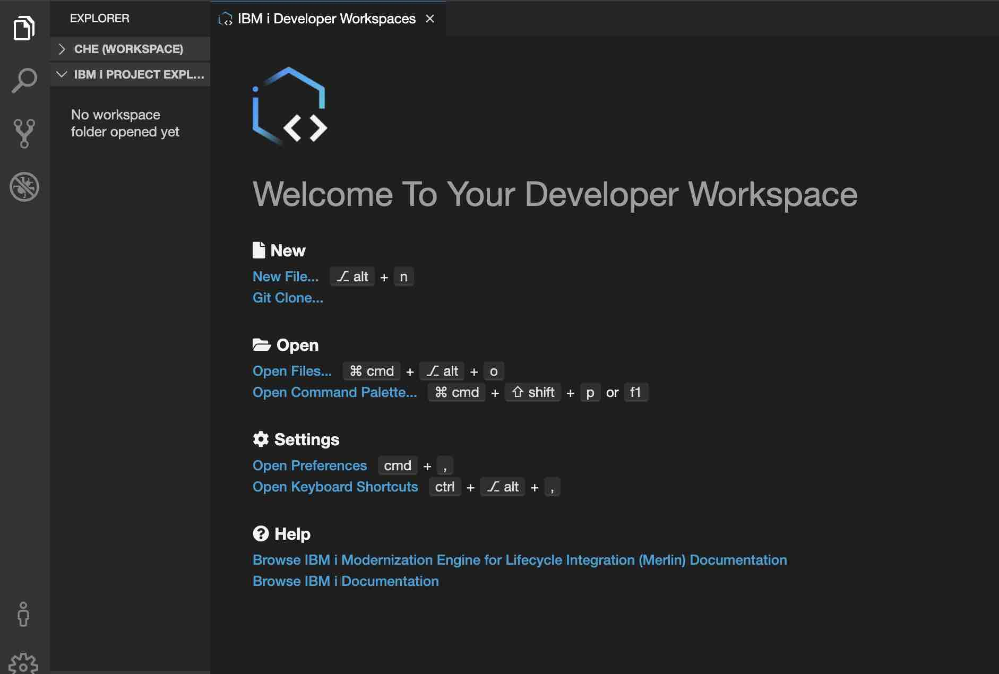

If this is your first time accessing this workspace, you should see the documentation links from the welcome page in the editor. Refer to these documents for additional support.   
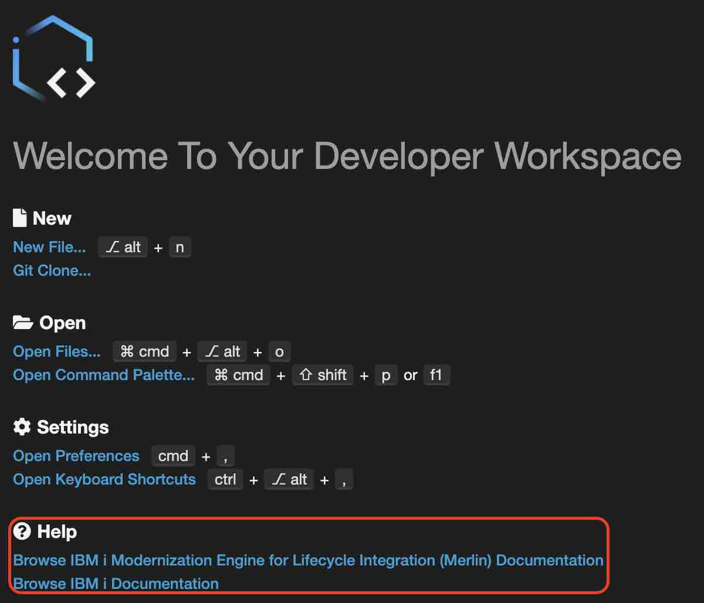

The Workspace contains:
* Explorer - to organize the current workspace. 
	* File System:
		* Files and Folders in your current workspace
	* IBM i Project Explorer
		* Work with IBM i projects in your current workspace
	* IBM i Job Log
		* Shows the logs from IBM i jobs started in the workspace
	Note: Right click on the **Explorer** heading to toggle views.  
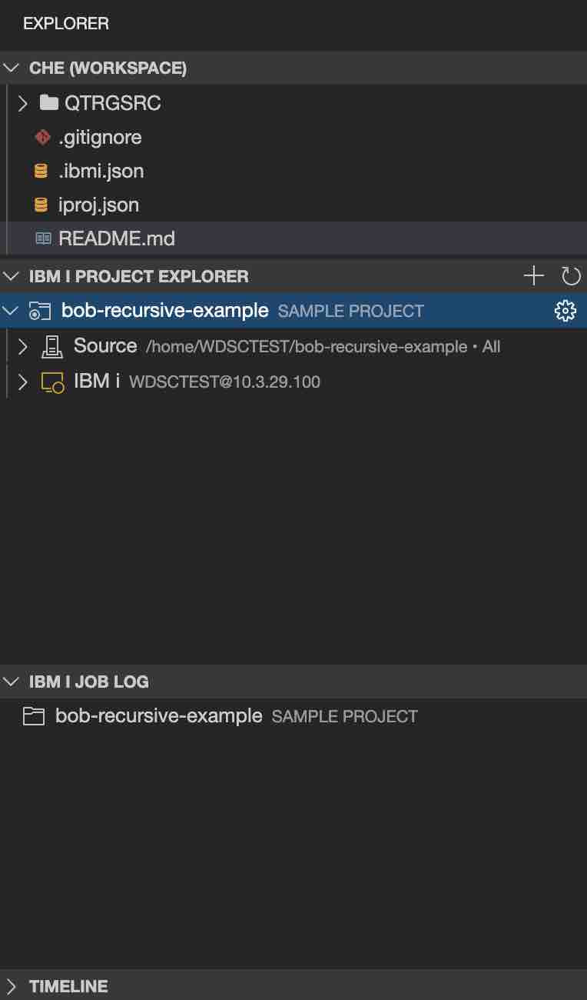
* Editor area in the center. For information on the editing features, go to the [Edit](./guides/ide/edit.md) Page.   
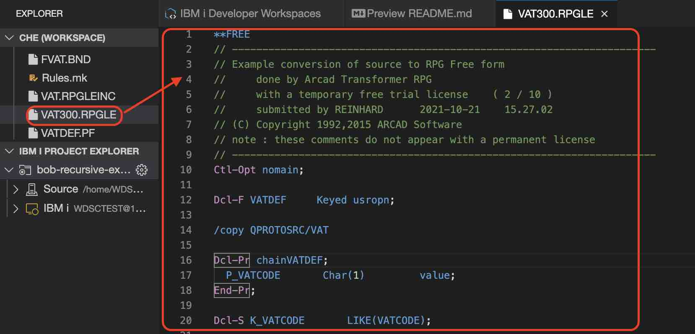
* Tabs on the left for Explorer, Search, Git, etc  
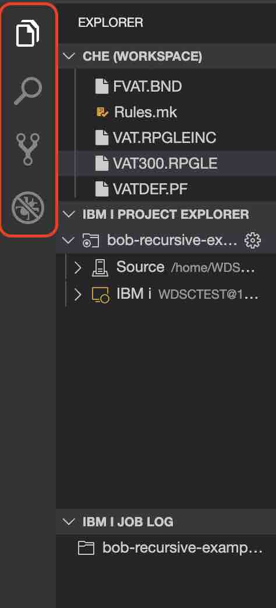
* Settings from bottom left
	* Preferences
		* [IBM i Developer settings](./guides/ide/settings.md) can be accessed here
	* Keyboard shortcuts
	* Color theme  
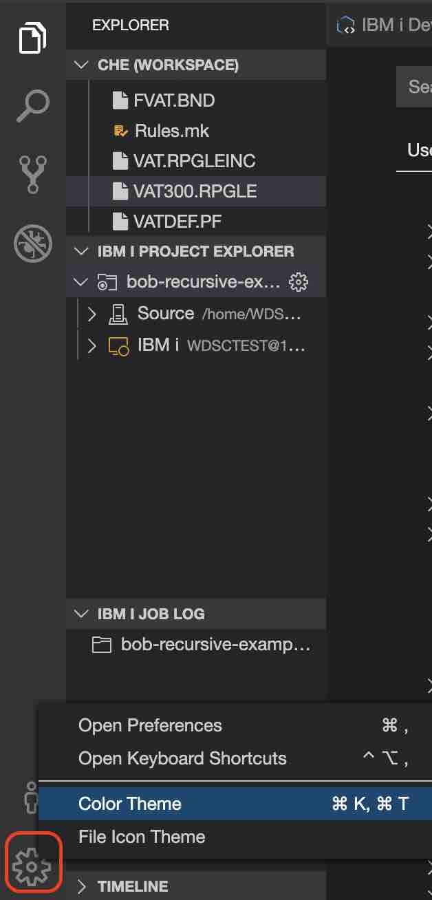
* Running commands - **View > Find Command...**, then find the command to run  
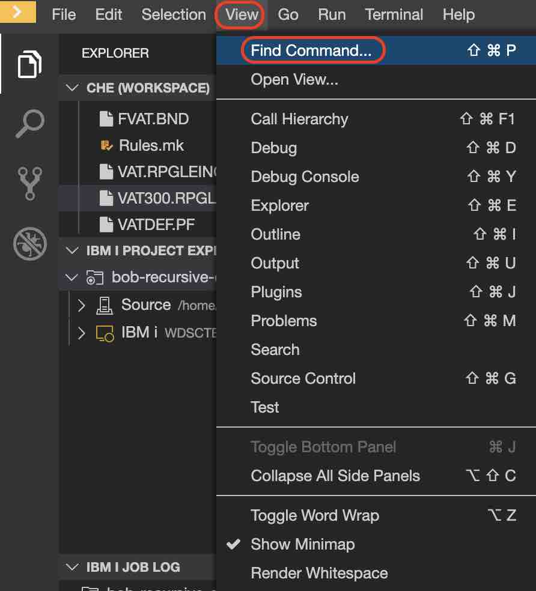
* Terminal View - **Terminal > Open Terminal in specific container**, then choose the container to open a terminal with  
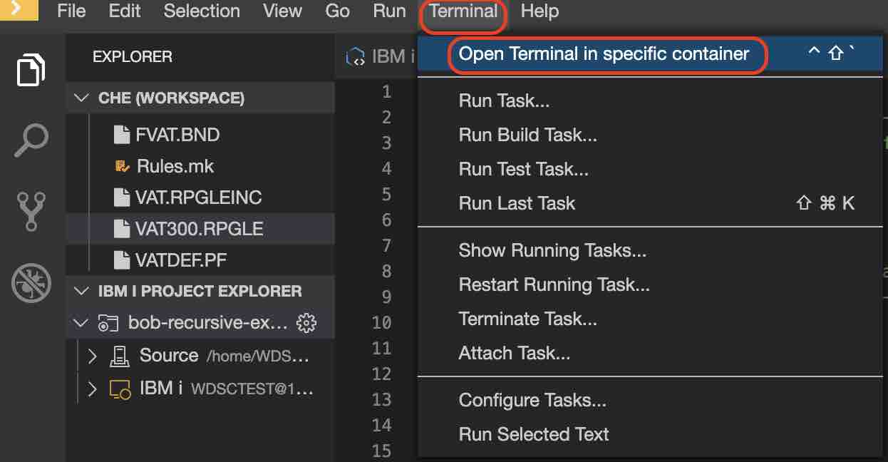
* Return to dashboard - yellow button to open the workspace list  
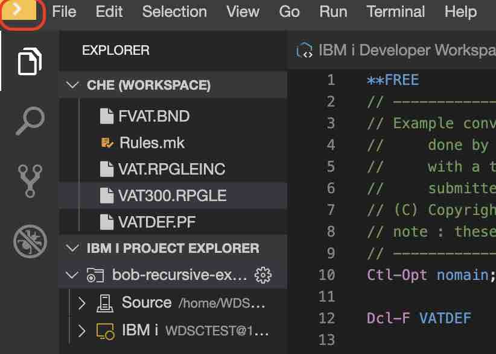

For information on using ARCAD tools, see [How to use ARCAD integration with IBM i Modernization Engine for Lifecycle Integration](https://supportcontent.ibm.com/support/pages/how-use-arcad-integration-ibm-i-modernization-engine-lifecycle-integration-merlin)