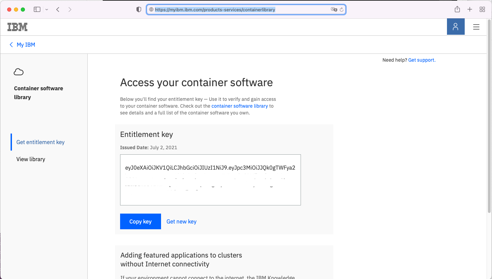
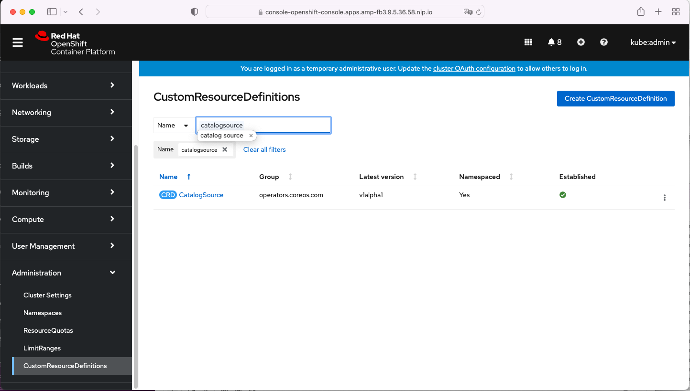
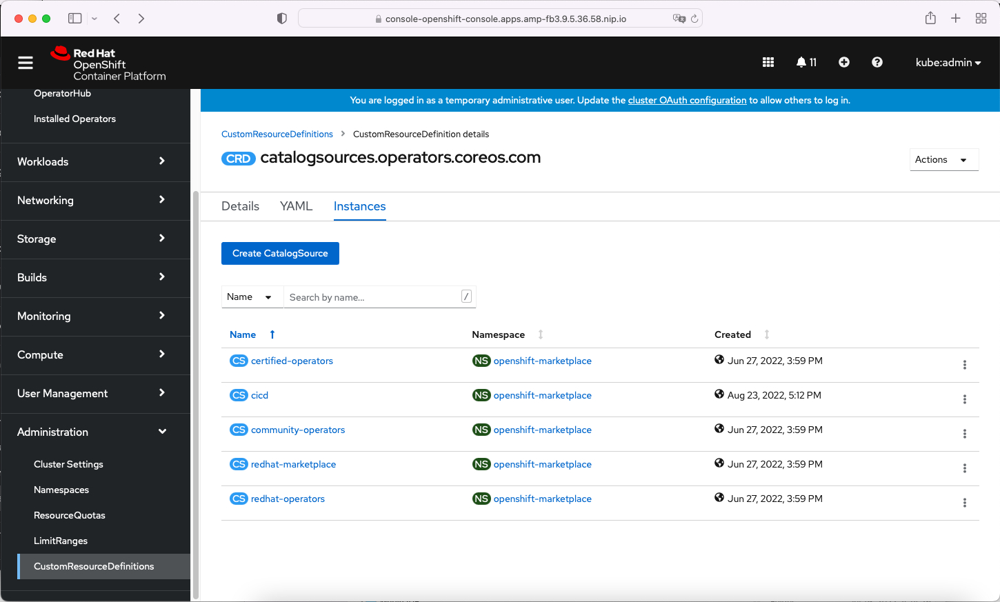
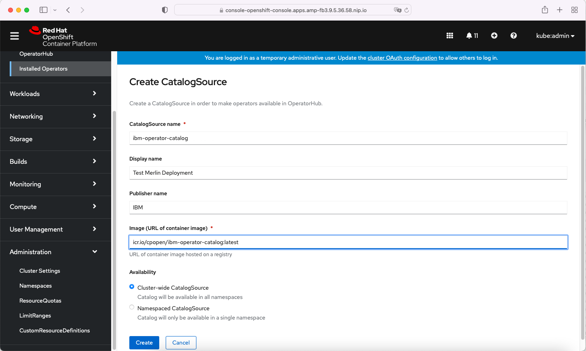
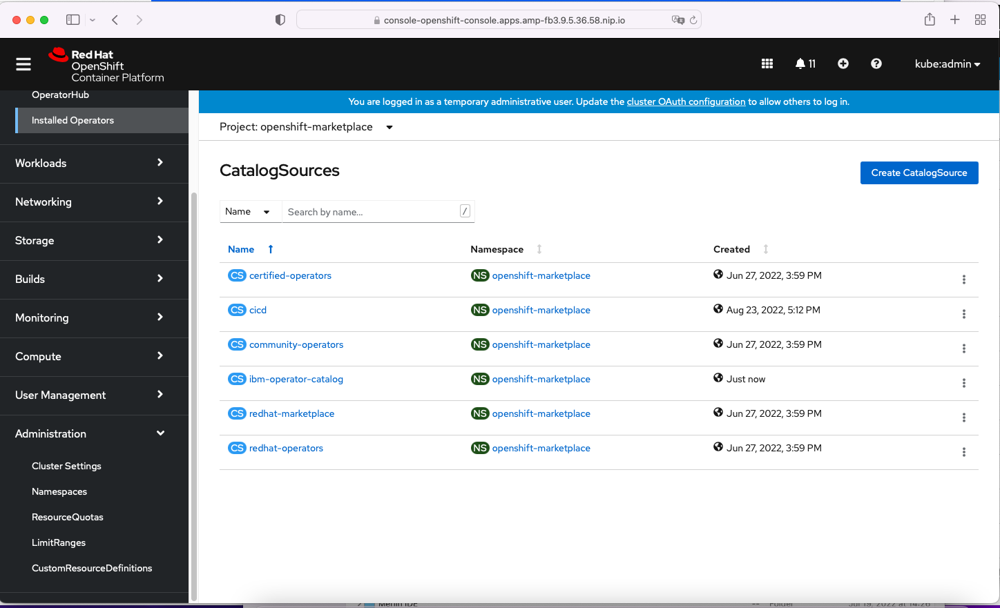

## Getting an entitlement key

Clients are to purchase Merlin from [IBM Passport Advantage.](https://www.ibm.com/software/passportadvantage/pao_customer.html)  Users sign-on to passport advantage with their IBM ID. After the purchase of Merlin, this user will have an entitlement key  enabled in the  [IBM Marketplace](https://myibm.ibm.com/dashboard/). The entitlement key combined with an active paid entitlement allows the customer to access the container images from the Entitled Registry.



## Register the entitlement key in OpenShift
 
Configure the global image pull secret on the OpenShift environment:
 
Extract the current global image pull secret from the cluster into a file named `.dockerconfigjson` in current directory:

```
oc extract secret/pull-secret -n openshift-config --to=.
```

Create a base64 encoded string with the entitlement key and IBM ID:

```
printf “cp:<entitlementkey>” | base64
```

Edit the `./docker/config.json` file and add a new JSON object to the `auths` object with the credentials for the staging repository. For example:

```json
"cp.icr.io”: {
    “auth”: “base64-value-from-above”,
    “email”: “Replace-With-Your-IBMid-Email”
}
```

**It is recommended you use an editor with JSON syntax checking capabilities to ensure the JSON is value**. Visual Studio Code is an option.

Update the global image pull secret with the updated credentials:

```
oc set data secret/pull-secret -n openshift-config --from-file=.dockerconfigjson
```

- Monitor the node status using the command: `oc get nodes`
- When the nodes are finished restarting, the cluster is now ready to pull images from the staging registry with the production image references.

## Install the IBM catalog source

Head to 'Administration' and then into 'CustomResourceDefinitions'. Search for the name 'CatalogSource'.



When the list is displayed, press 'Create CatalogSource'.



On the form, the following fields are required with these values:

* **CatalogSource name**: `ibm-operator-catalog`
* **Image URL**: `icr.io/cpopen/ibm-operator-catalog:latest`
* **Availability**: Cluster-wide CatalogSource

The other fields are optional, but should refer to the Merlin instance.



Clicking 'Create' will add the CatalogSource.


