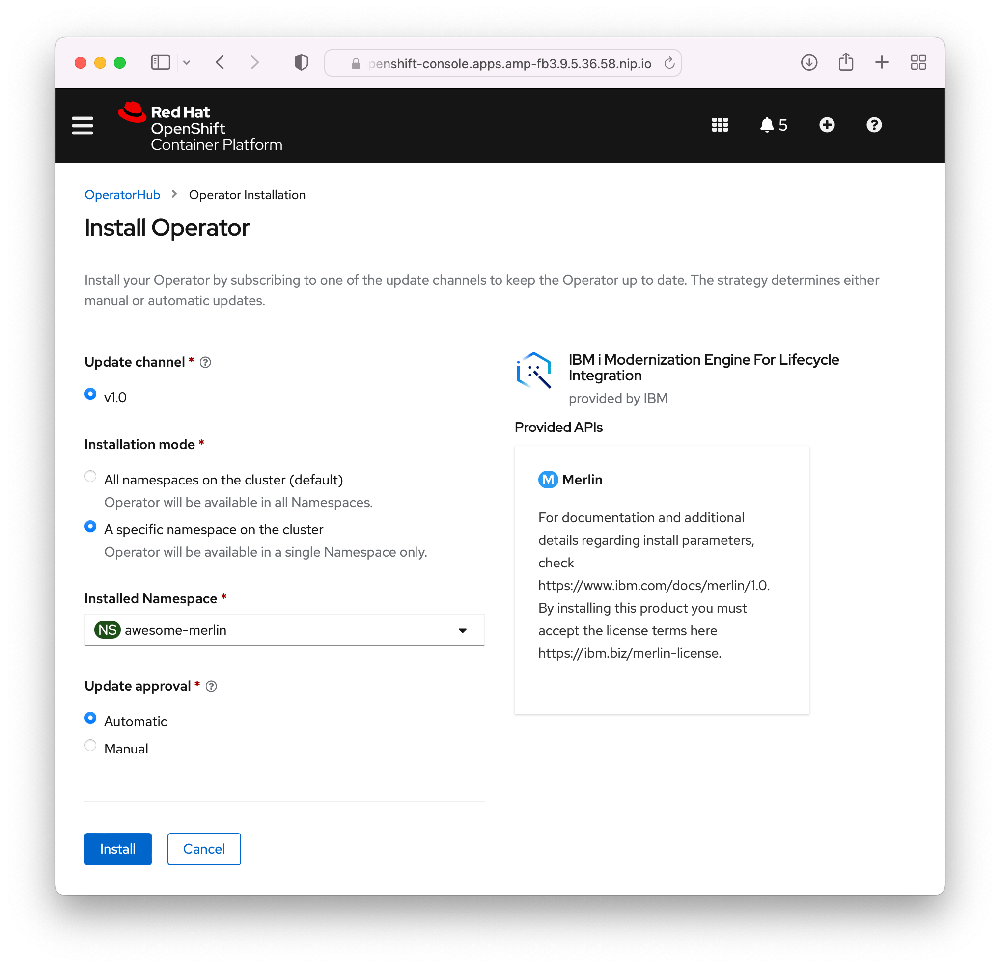
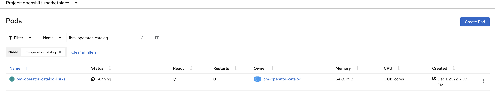

## Upgrading Merlin

When installing Merlin, you have the choice of Automatic or Manual updates.

When you select Automatic and the CatalogSource sees that there is an update available to Merlin, it will be installed automatically. When Manual is selected, an administrator must go into the OpenShift Web Console and should see a notification about an available upgrade to Merlin. If the upgrade is accepted, Merlin will start the upgrade.

If there is a Merlin update available but the OpenShift Web Console does not see it, then the CatalogSource should be restarted. When the CatalogSource starts up, it will go and fetch the latest information about versions of Merlin available.

## Upgrade actions

Post-Merlin upgrade, the vault will be sealed. To create new configuration (inventory, credentials, templates, etc), the vault must be unseal. In the Merlin installation section, it will recommend that the admin keep the secrets and token provided when the vault is initialized. They can be used to unseal the vault, which will allow standard usage of Merlin again.

After an upgrade, it is recommended that an admin run the playbooks on configured IBM i templates. This is to ensure that those IBM i systems have the latest and required functionality for Merlin to run as expected.

