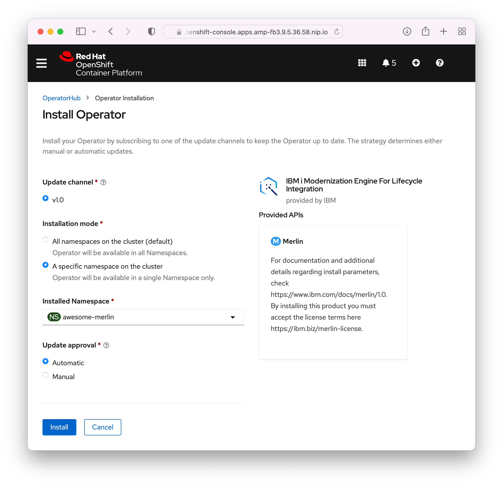
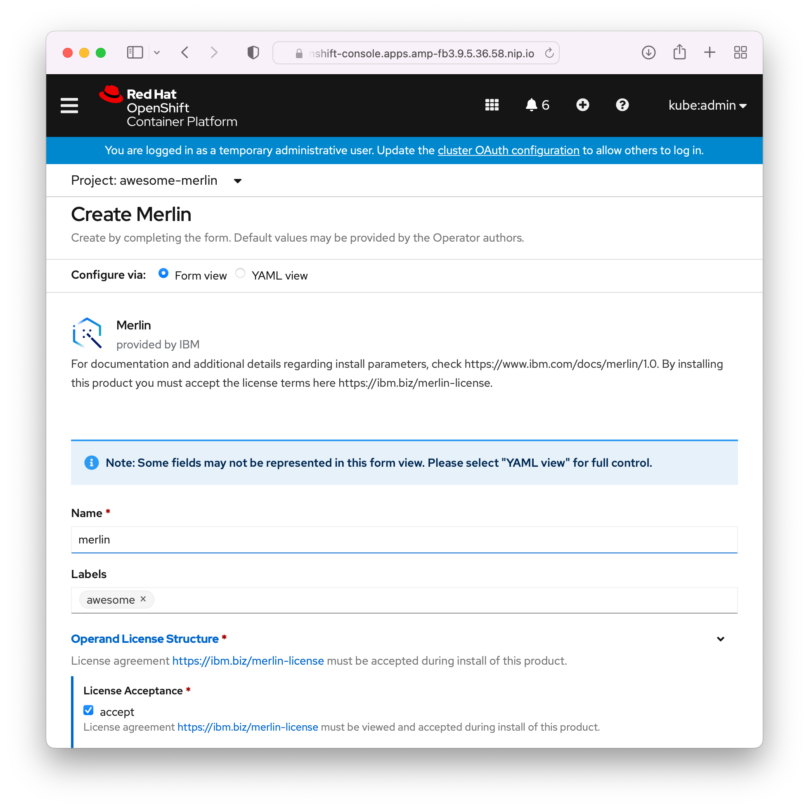

This guide assumes RedHat OpenShift is running, which will allow for the install of IBM i Merlin.

## Creating the Project

First, ensure the entitlement key and CatalogSource has been [setup correctly](./guides/openshift/entitlement.md).


Open the Projects view (**Home -> Projects**). A Project in OpenShift is sort of like an LPAR in the IBM i world, its a Namespace which contains all the resources (like memory, CPUs etc.) that are needed for the Merlin instance.


Select 'Create Project' and fill out the required fields. Click create when done.


When the project has been created, it redirects to the project landing page. This page can be used to track resources the project is using, such as CPU and memory.


## Installing Merlin Operator

Open the OperatorHub view (**Operators -> OperatorHub**). This is where operators (OpenShift  installers/applications) can be installed into projects.

When the OperatorHub page loads, make sure the project that was created above is selected.


Next, search for 'merlin' in the filter input box. This should show the the IBM i Modernization Engine for Lifecycle Integration (Merlin) product.


Clicking on Merlin shows a new window with information about the product. This window also shows what version is available to install. Clicking 'Install'  continues the process.


It redirects to another page where the user can see some configuration options. It is important that the Merlin operator is installed into the correct namespace (OpenShift project created above) and not the default one. The defaults selections for the fields 'Update channel' and 'Update approval' are adequate. Once the correct options are chosen, 'Install' can be selected.



Clicking 'Install' triggers the installation process, which shows a simple status screen to the user.


When the Merlin operator installation process has finished, a green tick appears along with a button to 'View Operator'.


This view shows information about the installed operator inside of the chosen project.


## Installing an Instance of Merlin

Now we have the operator, it is possible for us to create an instance of Merlin. From the Installed Operators view (**Operators -> Installed Operators**), ensure the correct project is selected, and select the Merlin operator.


This shows a detailed view of the Merlin operator. Under 'Provided APIs' is information about Merlin, as well as a button labeled 'Create instance'. Selecting that starts the process of creating an instance of Merlin.


Fill out the required fields ( Name and licence agreement) and click 'Create'. The default values in the optional fields are fine for the purposes of setting up the environment.



Creating the instance redirects back to the Operator view, but under the Merlin tab. Behind the scenes, the Merlin instance is setting itself up. The platform URL may not be visible instantly. If you scroll to the bottom of the Merlin instance details to the Conditions, a list of details is available. This list grows as the installation process progresses.


Once the Type 'Reconciled' column has the Status of 'True', this indicates that it available and ready. The URL to access the Merlin platform should be available when the status is 'True'.


Clicking on the Merlin platform URL opens the Merlin platform. The URL for this Merlin instance should resemble the project name / namespace that it belongs to. If you are presented with certificate errors use these [instructions](https://www.youtube.com/results?search_query=How+to+import+a+Merlin+certificate) to set up the required certificate authority.


> Merlin components will not load until you have setup the certificates on your system. [Check out this page for the guides](guides/openshift/merlin-certs.md).

## Fetching the Merlin Instance Admin Credentials

When you install a new instance of Merlin, there is always a default admin account. Accounts that are created in Merlin are seperate from accounts that are used to access the OpenShift Console.

Head over to the Secrets view (**Workloads -> Secrets**), ensure you have the correct project selected and find 'merlin-credential-secret' item in the list.


Selecting 'merlin-credential-secret' loads another page. Scroll down in the Details view, there is a section named Data which has two values listed:

* `ADMIN_USERNAME` - the Merlin instance admin username (usually `admin`).
* `ADMIN_PASSWORD` - the password for the admin user.

**Do not reveal the values.** To the right side of the text box, there is a button to copy the value from the textbox. This allows you to paste them right into the Merlin login screen.


The admin user can be used to log in to the Merlin instance for first time setup.


## Getting the release information for Merlin and its associated tools

### Release information for Merlin

There are two ways to get release information for Merlin: OpenShift Web Console and CLI.

On OpenShift Web Console, you can go to the Installed Operators view (**Operators -> Installed Operators**), then select the Merlin operator.


In order to use OpenShift CLI, make sure you have already installed the CLI support and log into the server. Replace the `PROJECT` with the actual project name where the Merlin operator is installed, and run the command to get the information.

```shell
oc describe sub ibmi-merlin-operator -n PROJECT | grep 'Current CSV'
```

### Release information for the associated Merlin tools

You can get the release information of the Merlin tools available using the Merlin GUI.

On the Merlin GUI, you can go to the Catalog view (**Tools -> Catalog**), right click on one of tools and select `View Details`. The details page will show up and it contains the release information.


