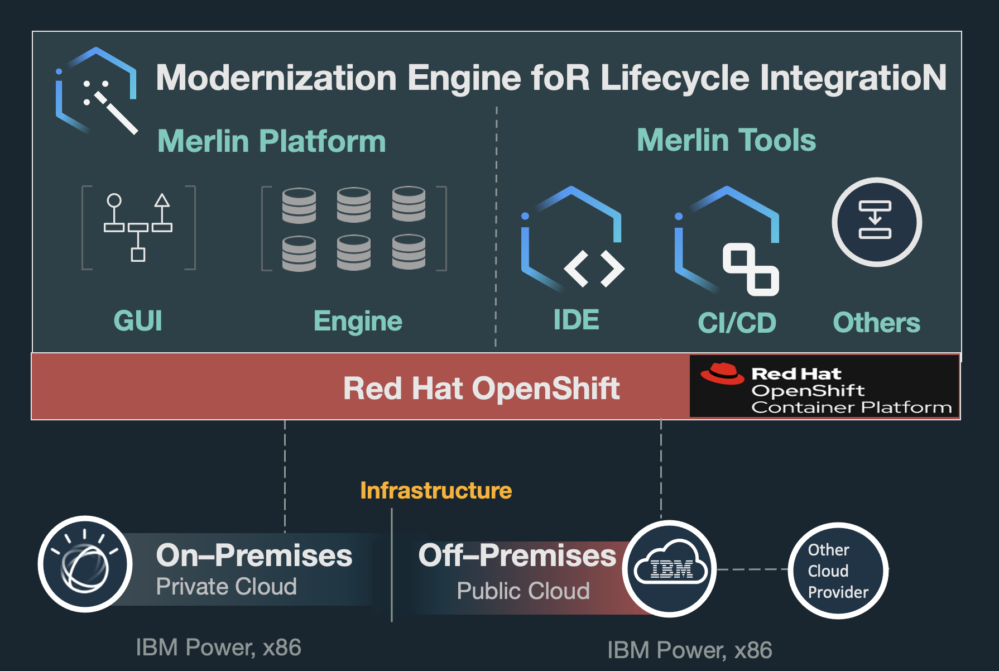

Merlin consists of Merlin Platform and Merlin Tools, which all run on OpenShift Container Platform as container applications.

Merlin Platform provides centralized place to manage different components, including Merlin Tools' lifecycle, IBM i virtual machine provisioning, REST APIs management, Merlin users and authorities management, credential management and so on.

Merlin Tools provide IDE and CI/CD applications to enable modernized DevOps experience for IBM i customers. They also interacts with Merlin Platform as integrated solution.

Merlin is released as IBM certified containers. This offers best practice, security, enterprise grade and so on as IBM standard container application. Merlin runs on IBM Power and x86 architecture on prem or in the cloud.

