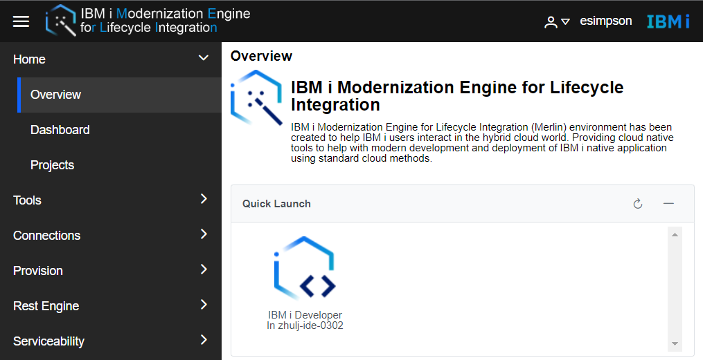

Merlin Platform is the base with functions to support centralized management for Merlin. The core capabilities of the platform include the following major functions:

* Tool Lifecycle Management - Deploys, upgrades and deletes Merlin Tools.
* Authentication - Single signed on capability for Merlin users.
* Certification Management - Creates and manages certifications for TLS based connections among containers and other systems.
* User Management - Creates, modifies and deletes Merlin users and their authorities.
* Monitoring - Monitors resources of Merlin.
* Inventory Management - Stores and manages the information of systems that Merlin interacts and connects.
* Credential Management - Securely stores and manages the credentials of systems that Merlin interacts and connects.
* IBM i VM Management - Provisions, manages, and deletes IBM i virtual machines through PowerVC or IBM Cloud.
* IBM i Software Installer - Installs necessary software packages onto IBM i systems to enable Merlin.
* Rest API management - Creates and manages RESTful APIs against IBM i programs and data stored in Db2 for i.

