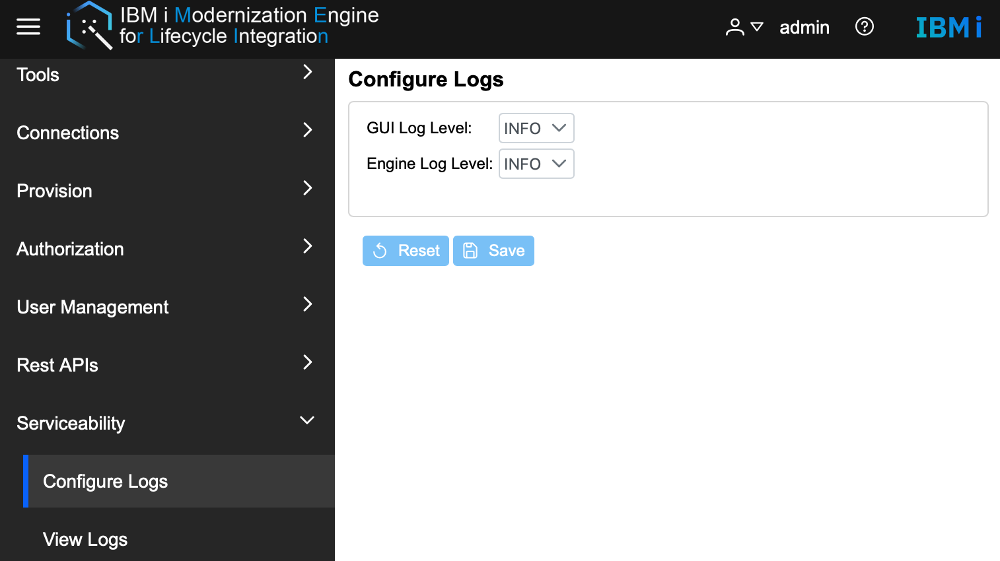

# Configure log level
IBM i Modernization Engine For lifecycle Integration supports configuring log levels and viewing GUI, component, and audit logs.Merlin supports configuring log levels for both GUI and Engine. The default log level is INFO, but that sets it to a different level is supported.
The log levels supported for GUI are **OFF**, **SEVERE**, **WARNING**, **INFO**, **FINEST**, **ALL**.  

The log levels supported for engine are **ERROR**, **WARN**, **INFO**, **DEBUG**, **TRACE**, **ALL**.

