# How to set up Email configurations and enable Forgot Password on Keycloak
This document simply describes how to set up the Email configurations and enable the forgot password function on Keycloak GUI.  
**Requirements:**  
- An available SMTP server that allows to relay mails
- Administration user  
 
Step 1, Go to the project which installed Merlin  
Go to the Openshift GUI, **Home** -> **Projects** -> click specific project  

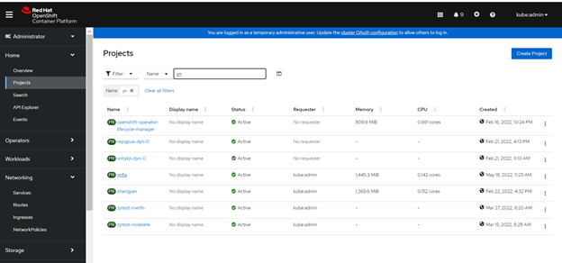  

Step 2, Get the credential of keycloak  
**Workloads** -> **Secrets** -> click **merlin-credential-secret** in the table  

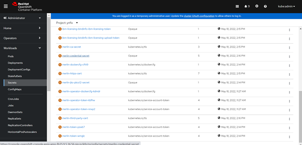  

Get **ADMIN_USERNAME** and **ADMIN_PASSWORD**  

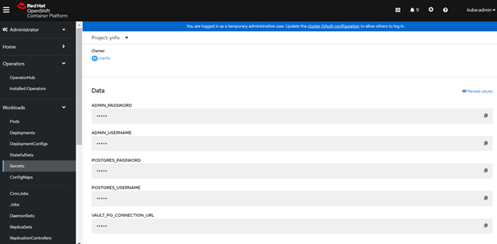    

Step 3, Find the route of keycloak  
**Networking** -> **Routes** -> Click the Location link in the keykloak item. It will open the Keycloak GUI.  

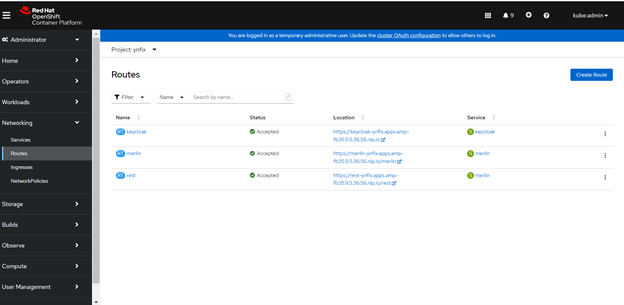  

Step 4, Login  
Click the **Administration Console**.  

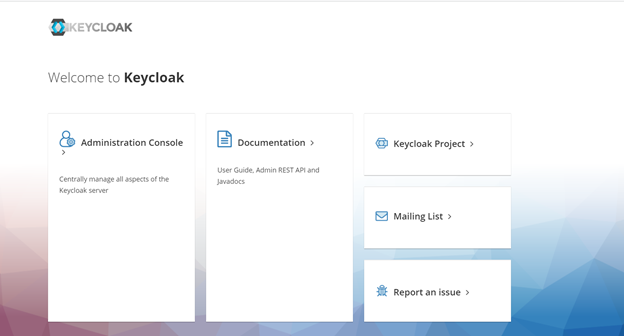  

Login with **ADMIN_USERNAME** and **ADMIN_PASSWORD**  

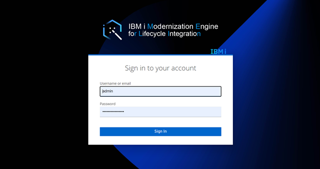  

Step 5, Set up Email  
**Realm Settings** -> Click **Email** tab -> enter the necessary info -> Click Save button.  

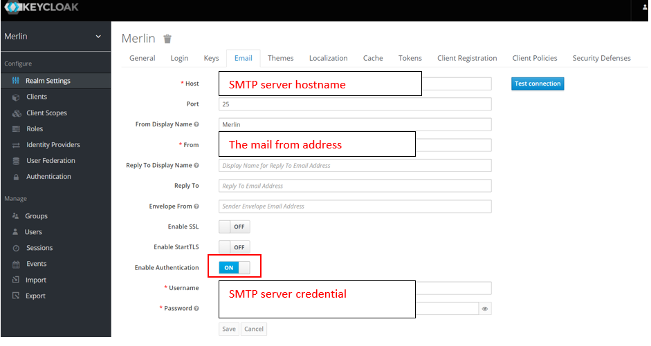  

Step 6, Enable Forgot Password   
**Realm Settings** -> Click **Login** tab -> enable the Forgot Password -> click Save button.  

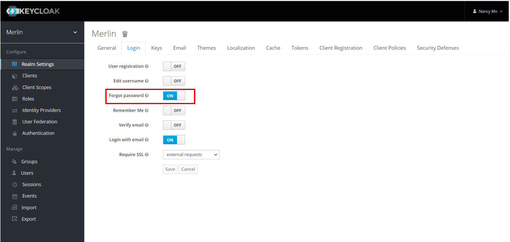  

Step 7, Verify the Forgot Password was enabled  
Go to the Merlin login page -> click **Forgot Password**  

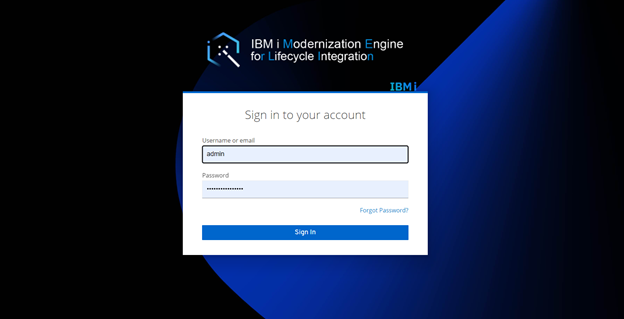  

Enter the username or email address -> click Submit.  

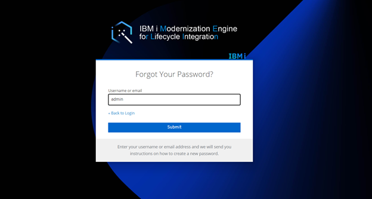

Note: please make sure this account has set up a valid email address in profile, or this account could not receive emails.  
Received a Reset Password Email. 

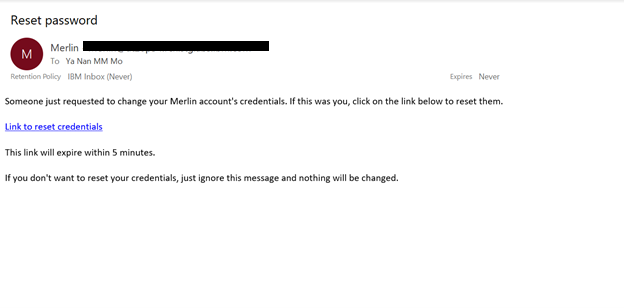 

Step 8, Reset password  
Click the link to reset credentials in the Email -> enter the new password -> click submit, then the password will be reset.

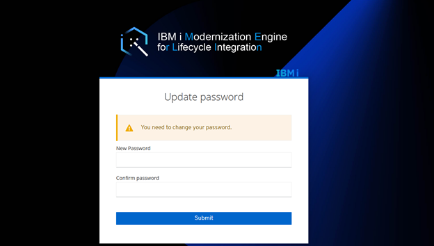  
