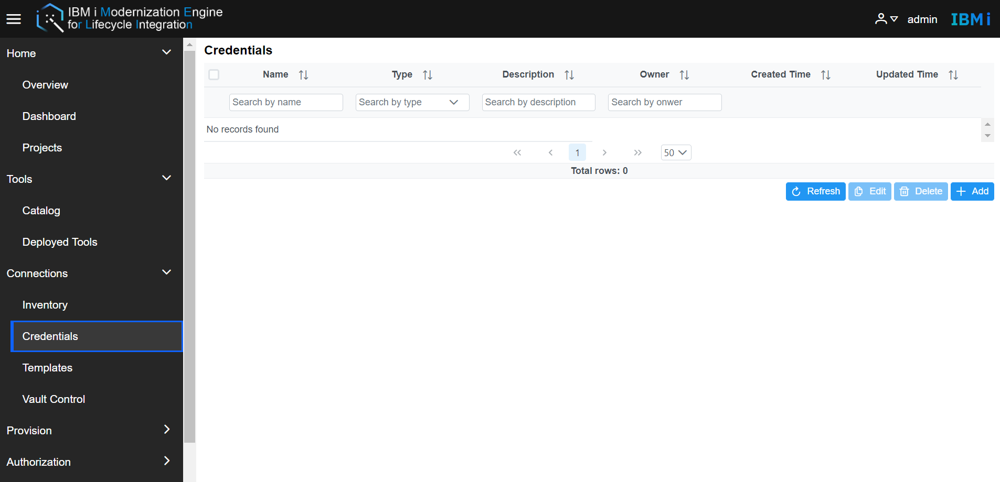
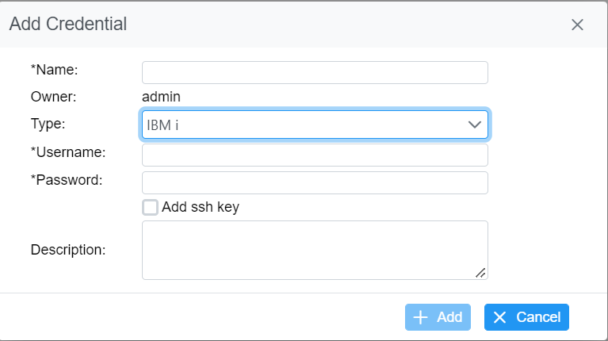

# Manage Credentials  
The Credentials manage the credential info used for Merlin. It will save the credential info including `username`, `password`, `ssh key`, `API token`, etc. The detailed credential info will be changed according to the credential type. Merlin supports four types of credentials which are the same as the inventory host types.

Go to Merlin GUI and select **Connections -> Credentials** to go to the Credentials page.  

An admin will see all credentials, but a user will only see credentials which they own. It will display the `Name`, `Type`, `Description`, `Owner`, `Created Time`, and `Updated Time`. 

- **Add Credential** - Click the `+ Add` button and enter the `Name` and `Type`. After the type is selected, the required fields will updated. For example, if `IBM i` is the selected type, users must enter the `username` and `password` of the IBM i server or the `+ Add` button will be disabled.  Optionally, ssh key information can be specified. If specified, the ssh key will be used instead of the password to connect to the IBM i during the IDE developer build process. Specify all the necessary fields and click the `+ Add` button so then the new credential record will be imported to the Credentials table.

  **Note**: If using ssh key, additional configuration is performed during connection to the IBM i before the build starts.  

  

- **Delete Credentials** - The `Delete` button is disabled by default. Selecting items in the credential table will highlight them and also enable the `Delete` button. Click the `Delete` button and click `Yes` to the confirmation to delete all selected items.

- **Edit Credential** - The `Edit` button is disabled by default. Selecting one item in the credential table will highlight it and also enable the `Edit` button. Click the `Edit` button to see the credential info. All fields may edited except the `owner`.

- **Refresh Credentials** - Click the `Refresh` button for the Merlin GUI to retrieve the latest credential info.
