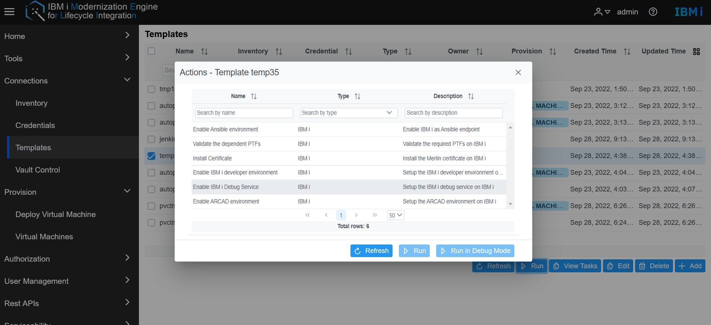
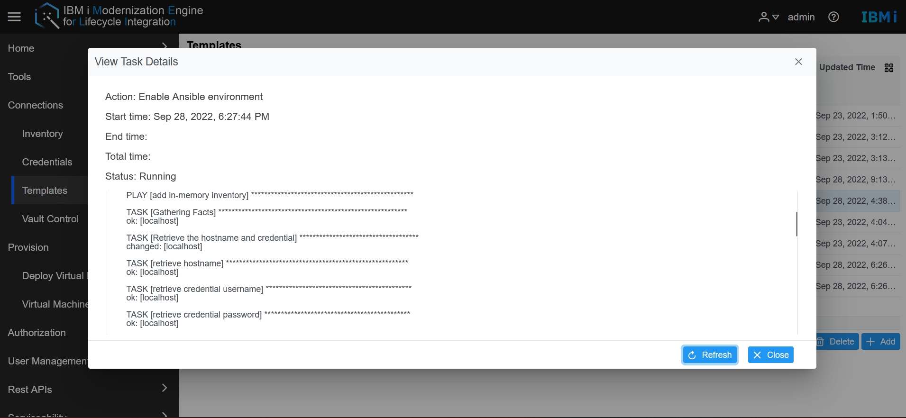
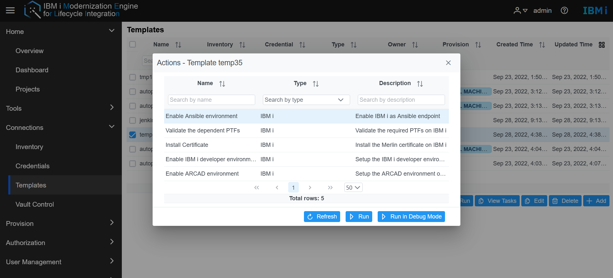
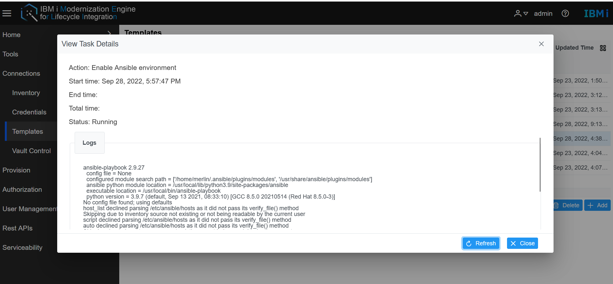
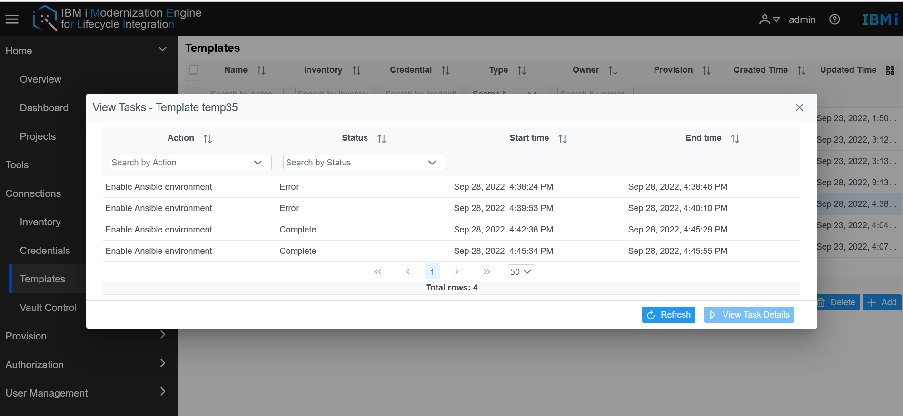
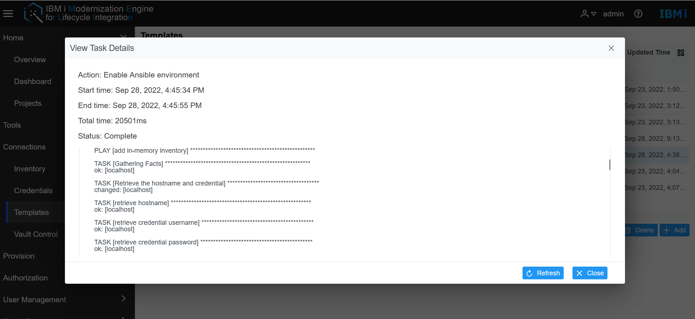

# Manage IBM i Servers
Merlin provides methods to manage IBM i servers, user can run template actions for their IBM i server, also could manage the IBM i VM life cycle which is deployed by the Power VC template.

* [Deploy IBM i server with Power VC Template](#deploy-ibm-i-server-with-power-vc-template)
* [Manage the IBM i server life cycle](#manage-the-ibm-i-server-life-cycle)
* [Running actions on the IBM i server](#running-actions-on-the-ibm-i-server)

## Deploy IBM i server with Power VC Template.
 There are two methods to use Power VC template to deploy an IBM i server.  
  - The first method to deploy IBM i server, go to the Merlin GUI, **Connetions -> Templates**, users turn to the templates page, select one Power VC template, Click the run button.  
   
Select the Provision action and click Run, user will see the Run template window. Before running this action, please make sure all the hardware configuration has been set up in Power VC side.  
   
In the Run Template page, it will display the info which you created in the Power VC template, and select one credential for this new IBM i server, it will create a new user profile with the username and password in the new IBM i server.  
In the Run CL command field, it allows users to operate simple CL command during the IBM i deployment. It begins with the system command and the CL command need write into the following double quotation mark. 
  - The second method to deploy IBM i server, go to the Merlin GUI **Provision->Deploy VM**. Select a Template in the dropdown list, the deployed info will be shown. Select a credential for this new server.  
  No matter which methods to deploy the vm, after clicking the Run button in the Run Template page, the webpage will auto turn to the Virtual Machines page.   
While the server deploying, Merlin will create the related inventory, templates. 

## Manage the IBM i server life cycle
In Merlin, select **Provision -> Virtual Machines** and select a template at the Select template dropdown list.  All the VMs deployed by this template will be shown.  
   
It will display the basic info of IBM i server including Name, IP, status, health, resources, and Running task.   
Merlin support to manage the IBM i server life cycle, user can operate the start, stop, restart and delete operations. Select VM record in the VM tables, which will start, stop, restart, and delete buttons to be available. Click the button, Merlin will send the request to Power VC and get the task status to the Running task column.
> Note: delete the IBM i server, the related record will also be deleted.

## Running actions on the IBM i server  
On the Templates page, select one IBM i template and click the **Run** button to see all actions that are available to run on the IBM i server. Make sure the IBM i server has already started the SSHD service or the action will fail.  
**Note:** Make sure your IBM i user profile has *ALLOBJ, *SECADM, *SERVICE, and *JOBCTL special authorities
before running these actions. 
Merlin provides the following actions.   
  
- For the **Enable Ansible environment** action that will help to initiate the yum, python, and Ansible packages, etc. If the server has not run any task before, this action should run at the first step.  
- For the **Validate the dependent PTFs** action that will help to validate if the dependent PTFs have been installed in the IBM i server.  See [Supported product versions](./guides/platform/Install_IBM_i_Modernization_Engine_for_Lifecycle_Integration.md).
- For the **Install the Merlin Certificate on IBM i** action that will help to initialize the trust store configuration and enable the certificate for the https services.  This will configure TLS on the ADMIN5 Liberty server on port 2012.  
- For the **Enable IBM i developer environment** action that will help to set up the IBM i developer environment on the specific IBM i server.  
- For the **Enable IBM i debug service** action that will start the debug service on the specific IBM i server.  
- For the **Enable ARCAD environment** actions that will help to set up the IBM i ARCAD environment in a specific IBM i server.     
Select one action in the action window, that item will be highlighted, then click the Run button, and the related actions will run.  Click Refresh to see the latest log information.     
   

### Additional action information
 * For getting more detailed action logs, use the **Run in Debug Mode** button.  
   
 * This will produce additional logging information. 
    
 * On the Template page, select a Template and click **View Tasks** button.  The previous action task logs will be displayed.   
  
 * Select one item of the Action record and click **View Task Details** to see the history log of this action.  
  

