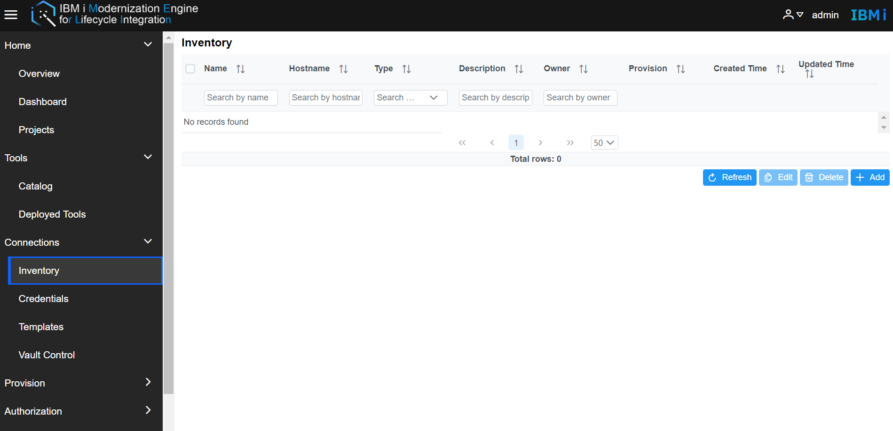
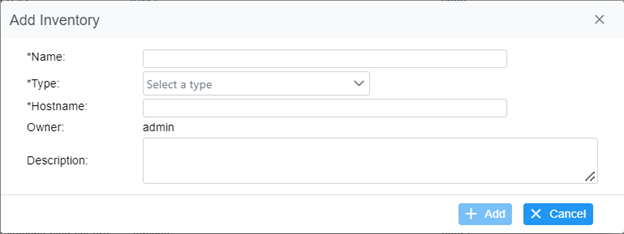
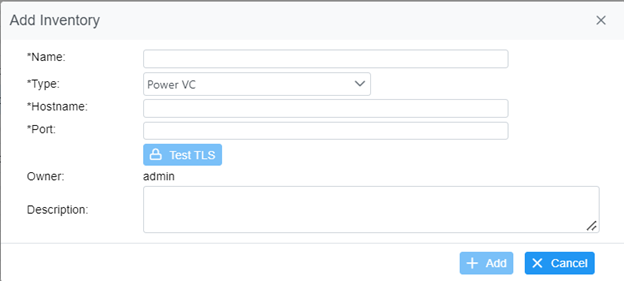

# Manage Inventory
The inventory works for managing the systems information used for Merlin. It will save the general system information including hostname, type, and description and some other information. Merlin supports four types of hosts, IBM i, Power VC, IBM Cloud, and Jenkins.  
Go to Merlin GUI and select **Connections -> Inventory** to go to the Inventory page.    
    
  

All the Inventories which the user created or has permission to will be shown. It includes Name, Hostname, Type, Description, Owner, Provision, Created Time, and Updated Time. The Provision item is a tag that specifies the IBM i server deployed by the Power VC template.  
- **Add Inventory**   
Click Add button, enter the Name, Type and Hostname.  After the type is selected, the required info will update.  If one of requirements are not meet,  the +Add button will stay disabled.  

    

Specify all necessary fields and click +Add button, then the new inventory record will be imported.   
For the security connections, Merlin supports Test TLS function, that allow customer to accept the remote CA. Such as Power VC Inventory.

  

Specify the Hostname and Port, the Test TLS button will be enabled, and it will catch the Power VC CA.  In the detailed certificate windows, click the Accept button.  Then this CA be added to Merlin trust store.

**Note:** Please avoid to use those specific characters .,:;/\"*?<>|=+&%'`@" in Name field. The Hostname supports IP, Hostname, and URL.  

- **Delete Inventory**  
The delete button is disabled by default.  Select items in the inventory table, and the selected items will change to highlight and the delete button change to available status.  Click the delete button, and click yes for the confirmation that will delete all selected items.

- **Edit Inventory**  
The Edit button is disabled by default.  Select one item in the inventory table, and the selected item will change to highlight and the Edit button change to available status. Click the Edit button, the inventory info will be shown, all fields are able to be edited except the owner.
- **Refresh Inventory**   
Click the refresh button, the Merlin GUI will get a refresh so that to get the latest inventory info.

