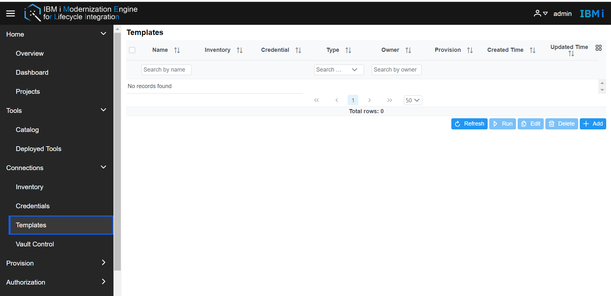
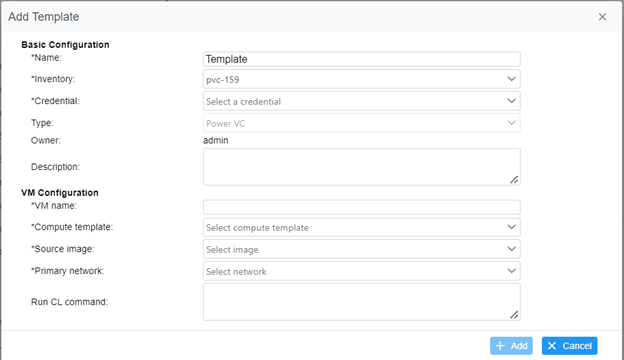

# Manage Templates
The Templates work for managing the template info used for Merlin. It will save the template info, including Name, Inventory, Credential, type, owner, and description. The credential and type info will be changed according to the Inventory type. Now Merlin supports four types of templates same as the inventory host types.    
Go to Merlin GUI, **Connections -> Templates**, user will turn to the Templates page.  

  

For the Admin side, all templates will be shown, but the run action only works on own templates, for the user side, all own templates will be shown, it includes Name, Inventory, Credential, Type, Owner, Created Time, and Updated Time by default. Users also could customize the columns by clicking the icon at the right top of the table.  
- **Add Template**  
Click the Add button, add the Template name, and select an inventory, the template type is the same type as inventory, the credential will be filter to the same type. According to the inventory type, the other required fields will be difference.   
Use Power VC as example, user must enter the vm info which used in this template, or the +Add button will keep disabled. 

 

Fill all necessary fields, the +Add button will be able to click, click the +Add, the new template info will be imported to Templates table.
- **Delete Templates**  
 The delete button is disabled by default, select items in the Templates table, the selected items will change to highlight and the delete button change to available status, click the delete button, and click yes to confirm that will delete all selected items.
- **Edit Template**  
 The Edit button is disabled by default, select one item in the Templates table, the selected item will change to highlight and the Edit button change to available status, click the Edit button, the template info will be shown, all fields can be edited except the owner.
- **Run Template**  
The Run is disabled by default, select one item in the Templates table, the selected item will change to highlight, and the run button change to available status. According to the different templates type, the action will be different.  
For the Power VC template, Merlin supports the Provision actions, that will help the user to deploy a new IBM VM, the user should make sure all the hardware configurations have been set up on the Power VC side.    

  

For the IBM i server template, Merlin supports Enable Ansible environment, Validate the dependent PTFs, Install Certificate, Enable IBM i developer environment, and Enable ARCAD environment.   

  

- **Refresh Templates**  
Click the refresh button, the Merlin GUI will get a refresh so that to get the latest Templates info.
