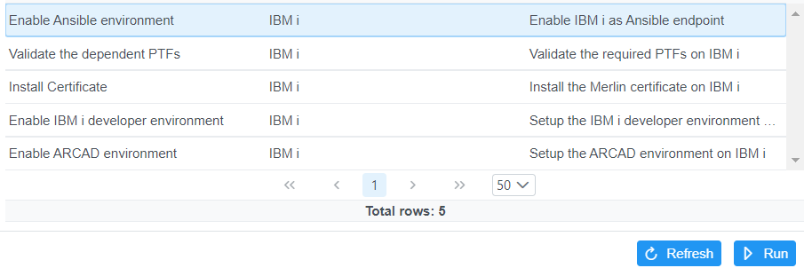

# Manage IBM i virtual machines

## Configuring IBM i for development
  * Prerequistes:
      - SSHD server running 
      - Minimum HTTP Group PTFs:
          - 750 SF99952: IBM HTTP Server for i Group level 01
          - 740 SF99662: IBM HTTP Server for i Group level 20
          - 730 SF99722: IBM HTTP Server for i Group level 39
  * Define template for IBM i under [**Connections**](./guides/platform/Manage_connections.md)
  * Select the template and click **Run** to show available actions.  Each action needs to be run to configure the IBM i.
  * Select an action and click **Run**.  The action will run an ansible playbook on the IBM i.
      
  * The actions will enable ansible on the IBM i, verify required PTFs are installed, configure TLS on the ADMIN5 Liberty server on port 2012, install open source packages to enable the IBM i developer environment, and install ARCAD software. 
