# Manage Merlin users and authorities

## Users and Groups
Merlin support users and groups. Group is the container of a set of users and groups. All the role and permissions granted to a group are inherited by all its members. Merlin supports user federation. Users and groups can be created in Merlin local repository directly or imported from a LDAP server. Multiple LDAP servers can be added to Merlin at the same time. When add a LDAP server to Merlin, the users and groups in the LDAP server are imported into Merlin local user repository. All the updates to users and groups through Merlin are kept in Merlin local repository and are not synchronized back to the original LDAP server.

## Authorization
### Manage Roles
The following roles are supported in Merlin:
*	**Admin** – user with the role is the administrator of Merlin and is allowed to manage all aspects of Merlin.
*	**Manager** – user with the role is allowed to manage all the resources in Merlin but not allowed to do user management.
*	**Creator** – user with the role is allowed to create projects in Merlin.
A user can only be assigned one role in Merlin. When assign a role to a group, all the members of the group inherits the role automatically. When revoke a role from a group, all the members of the group loses the role inherited from the group.

On the left panel of navigation, click **Authorization -> Manage Roles** to launch the **Manage Roles** panel. All the users and groups with specific role is listed on the panel as below
 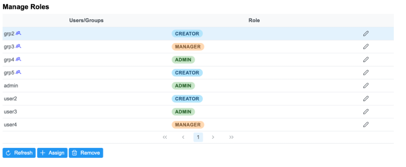

### Assign Role to Users
On the **Manage Roles** panel, click button **Assign** to launch the dialog as below.

 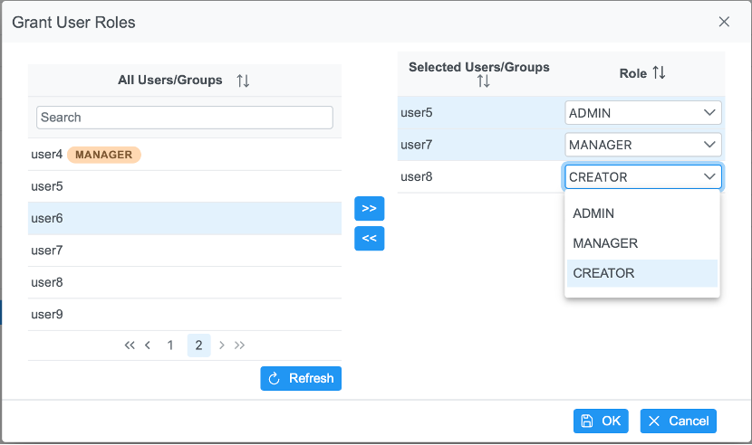
 
Select users and groups from **All Users/Groups** list on the left panel, then click the button to move to **Selected Users/Groups** list.

Select role for each of the **Selected User/Group** on the dropdown box for role.

Click button **OK** to apply the update.

### Edit Role of a User
Click edit icon at the end of each row.

 
 
The **Role** cell is changed to be a dropdown box as below.

 
 
Select the role and click the check icon at the end of the row to save the update.

 

### Revoke Role of a User
Select the row of the user on **Manage Roles** view and then click **Remove** button to get the role revoked from the user.

 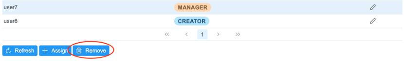 

### Manage Permissions
In Merlin, only users with **Admin** role or **Manager** role are allowed to access all the resources. Owners are granted all the access to the resources created by themselves. For normal users, need to get permission before access the resources. If an authority against a resource is assigned to a group, all the members of the group have the permission automatically.

Currently, authority is allowed to be granted against projects and inventories. There are two authority available in Merlin.
*	**View** – Allow users to view all the information of the resource
*	**Edit** – Allow users to update resources, for example, install/uninstall an application on a project.

On the left navigation panel, click **Authorization -> Manage Permissions** to launch Manage Permissions panel.
On the panel, the left tab is the resource name. And the right tab is the different view, from user/group perspective or from the resource perspective. Below are samples of permissions to Project list from user/group perspective and from project perspective.

 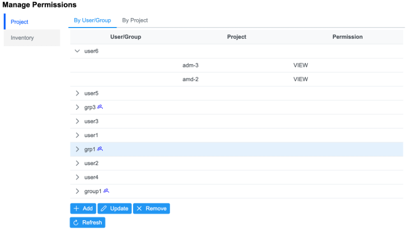 
 
 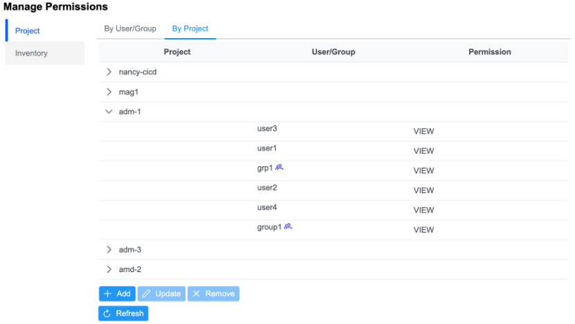 
  
### Grant Permission to Users
Click **Add** button to launch Grant User Permissions wizard.
On the first step, choose the resource type from the **Resource Type** dropdown box. Only **Project** and **Inventory** options are supported. Choose the correct resource type and click **Next** button to the next step.

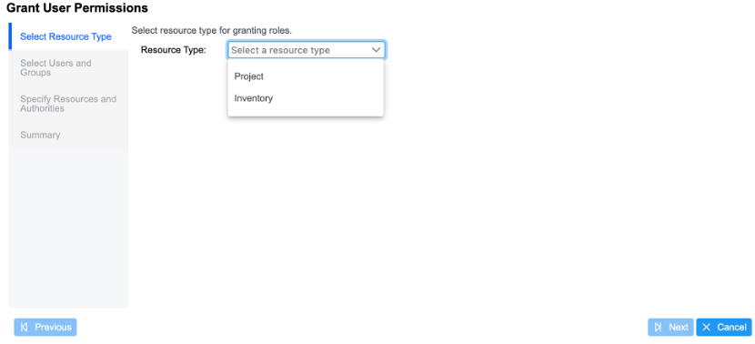 
 
Select the users and groups from **All Users/Groups** list and click the button to add to the **Selected Users/Groups** list. Then click **Next** button to next step.

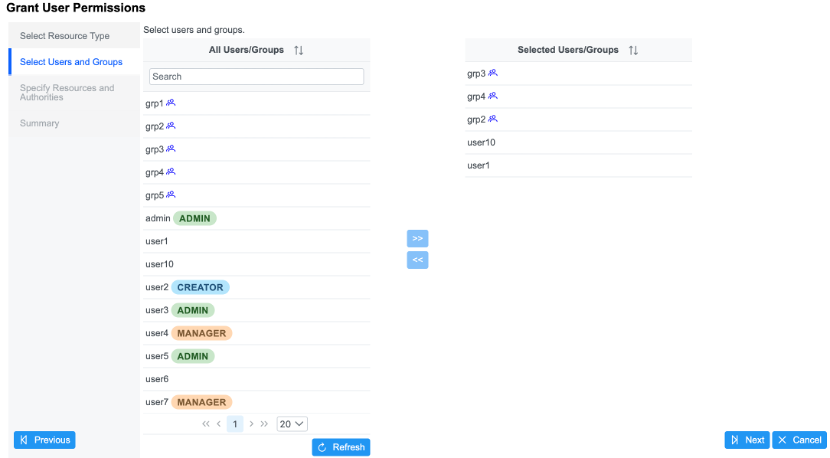 

Select the resources from **All Projects** or **All Inventories** list and click the button to add to the **Selected Projects** or **Selected Inventories** List. Then choose the right authority from dropdown box for each selected user/group. Finally, click **Next** button to the next step.

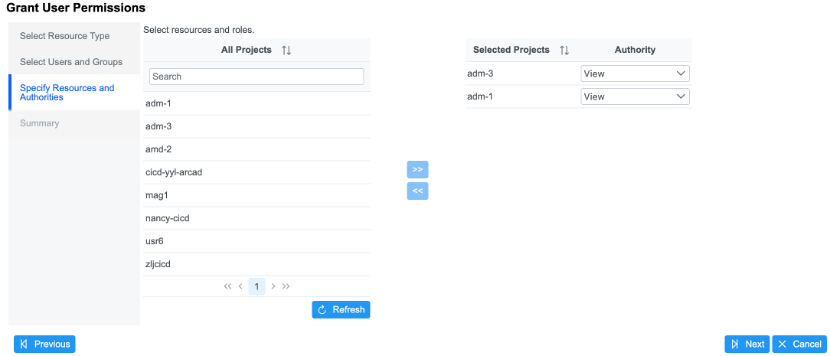 

The summary page will list all the permission information just added. If all the information is correct, click **Finish** button to make the update.

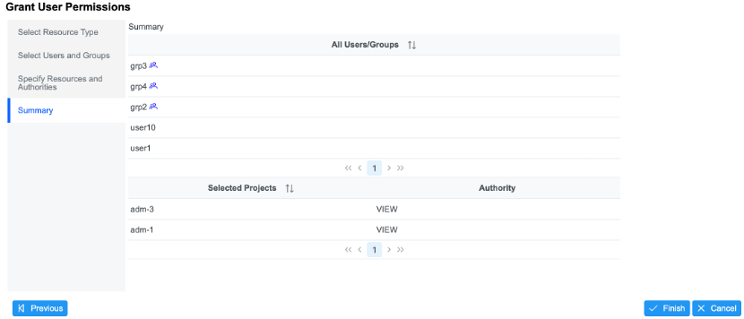 

### Edit Permissions
On **By User/Group** tab or **By Project** tab, select a row and click **Update** button to launch Update User Permissions dialog. 
If from **By User/Group** tab, the dialog lists all the resources the selected user has authorities to as below.

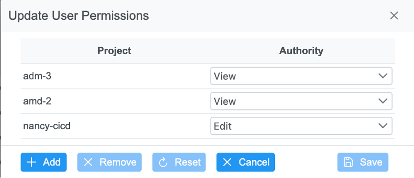 
 
If from By Project/By Inventory tab, the dialog lists all the users have the authorities to the resource as below.

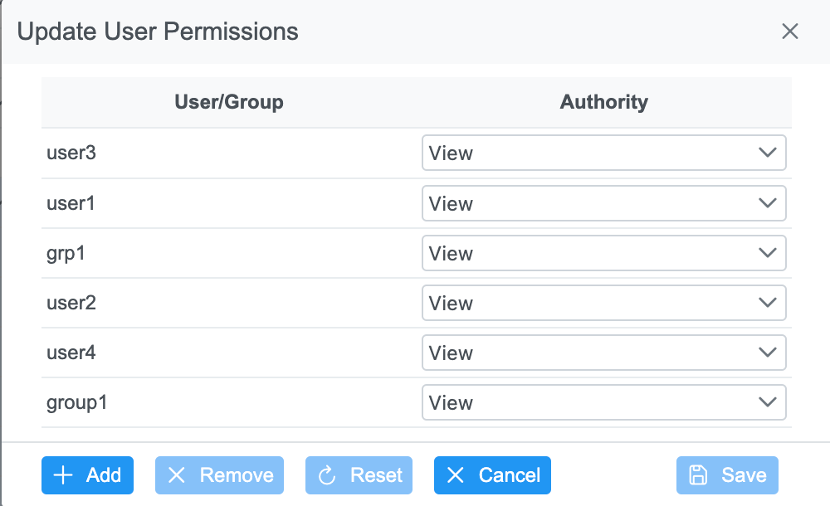  

On the dialog, specify the right authority from **Authority** dropdown box. Finally click **Save** button to apply the change.

### Revoke Permission
On **By User/Group** tab or **By Project** tab, select a row and click **Remove** button. A confirm dialog will be popped up. If all the information is correct, click **OK** button to apply the change.

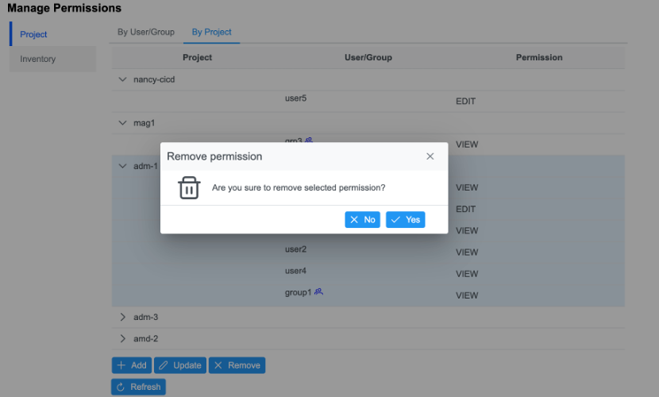  
 
If from **By User/Group** tab, all the permission of the user are revoked. If from **By Project** or **By Inventory** tab, all the users are revoked the authorities to the resource.

