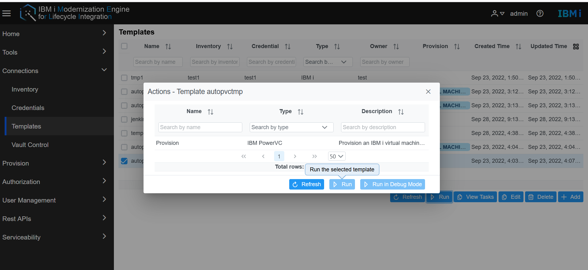
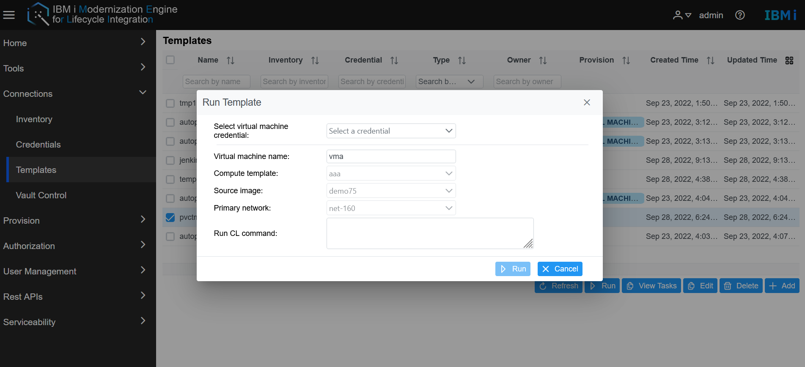
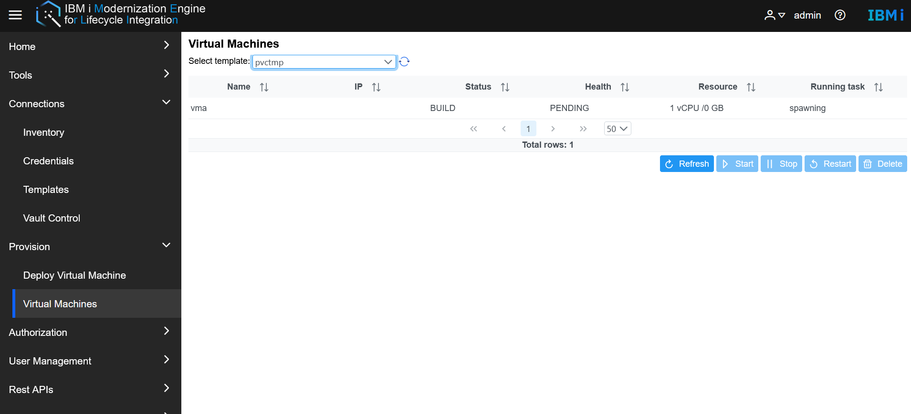

# Manage the lifecycle of IBM i Virtual Machines.

- **Deploy IBM i server with Power VC Template.**
 There are two methods to use Power VC template to deploy an IBM i server.  
 
  - The first method to deploy IBM i server, go to the Merlin GUI, **Connetions -> Templates**, users turn to the templates page, select one Power VC template, Click the run button.  
   

Select the Provision action and click Run, user will see the Run template window. Before running this action, please make sure all the hardware configuration has been set up in Power VC side.  
   
In the Run Template page, it will display the info which you created in the Power VC template, and select one credential for this new IBM i server, it will create a new user profile with the username and password in the new IBM i server.  
In the Run CL command field, it allows users to operate simple CL command during the IBM i deployment. It begins with the system command and the CL command need write into the following double quotation mark. 

  - The second method to deploy IBM i server, go to the Merlin GUI **Provision->Deploy VM**. Select a Template in the dropdown list, the deployed info will be shown. Select a credential for this new server.  
  No matter which methods to deploy the vm, after clicking the Run button in the Run Template page, the webpage will auto turn to the Virtual Machines page.   
While the server deploying, Merlin will create the related inventory, templates. 

- **Manage the IBM i server life cycle**   
Go to the Merlin GUI, **Provision -> Virtual Machines**, select a template at the Select template dropdown list, all the VMs deployed by this template will be shown.  
   

It will display the basic info of IBM i server including Name, IP, status, health, resources, and Running task.   
Merlin support to manage the IBM i server life cycle, user can operate the start, stop, restart and delete operations. Select VM record in the VM tables, which will start, stop, restart, and delete buttons to be available. Click the button, Merlin will send the request to Power VC and get the task status to the Running task column.
> Note: delete the IBM i server, the related record will also be deleted.

