# Manage the lifecycle of Merlin Tools

IBM i Modernization Engine For lifecycle Integration guides and simplifies the use of Merlin tools which help implement DevOps & Services-based software. 
An authorized user can manage the lifecycle of Merlin tools. To learn more about the user role and permissions with Merlin, see [Manage MERLIN users and authorities](./guides/platform/Manage_MERLIN_users_and_authorities.md).

   * View installed tools
   * List Merlin tools in catalog 
   * View details of a Merlin tool
   * Install Merlin tools 
   * Uninstall a Merlin tool

Follow the steps here to manage the lifycle.

- Once a user sign-on Merlin, the installed Merlin tools which the user has permissions to view are shown on the homepage. 

 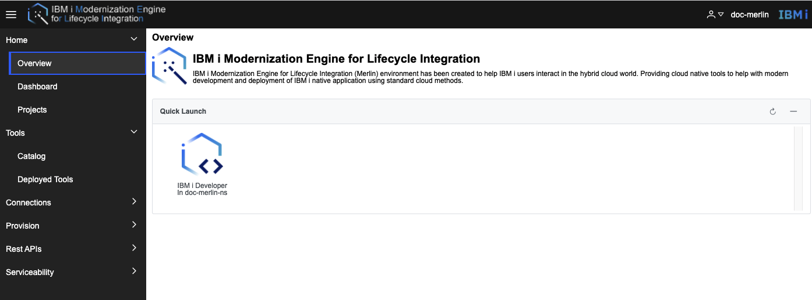

- List Merlin tools in catalog. 

Go to Merlin GUI, then open **Tools->Catalog**, the supported Merlin tools are in the Catalog. 
 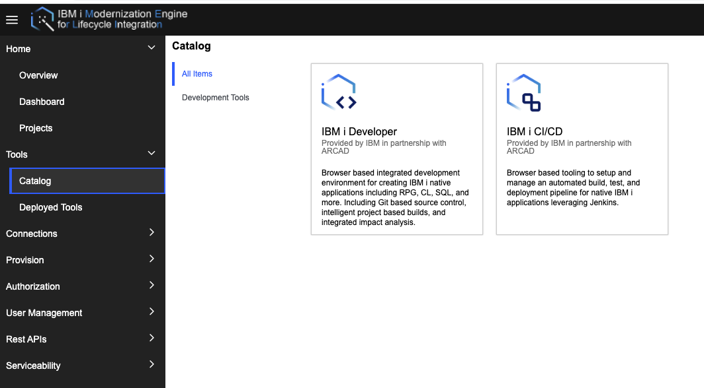

- View details of a Merlin tool
 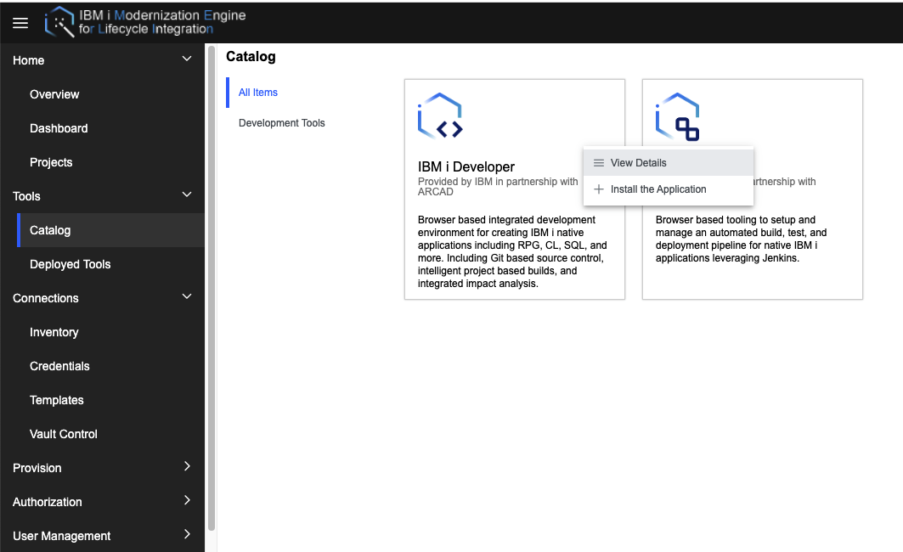
 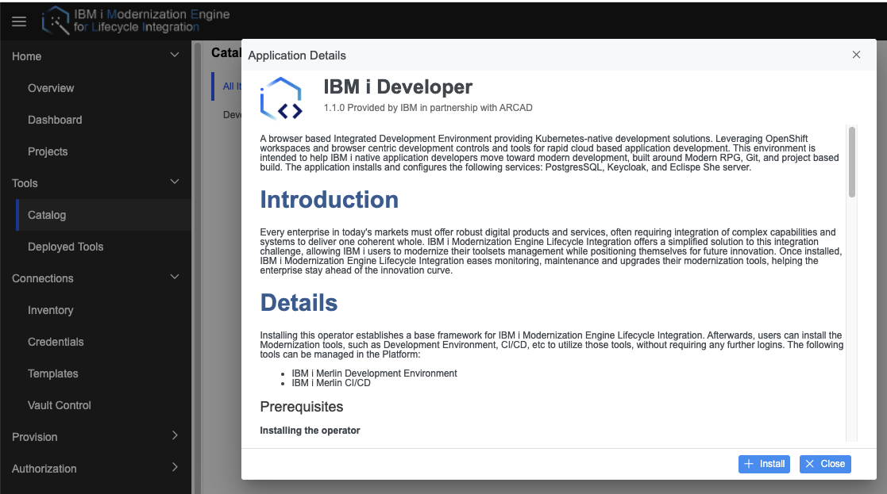

- Install Merlin tools
Ensure a proper role or permissions have been granted to user to do the deployment. To learn more about the user role and permissions with Merlin, see [Manage MERLIN users and authorities](./guides/platform/Manage_MERLIN_users_and_authorities.md).
* In catalog, select the tool to be installed
 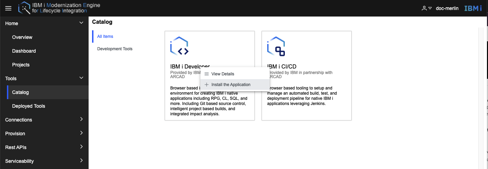
* Read the license terms of the Merlin tool and decide if you accept it. 
 
* Create a project where the Merlin tool is installed into. If the project does exist, the step can be skiped.
 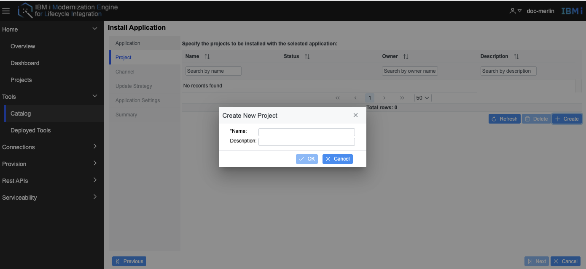
* Choose a project where the Merlin tool is installed into.
 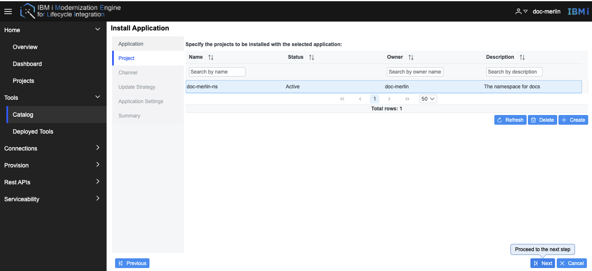
* Choose an update channel, which is used to track and receive updates for the Merlin Tool.
 
* Choose a update stratety, which has two strategies, one is Automatic, that means once new versions are released, the installed Merlin tool will be upgraded to latest version automatically. The other is Manual, that means once new versions are released, the installed Merlin tool will be upgraded to latest version automatically. Otherwise, the update must be manually approved before installation can begin.
 
 * Specify customize application settings.
 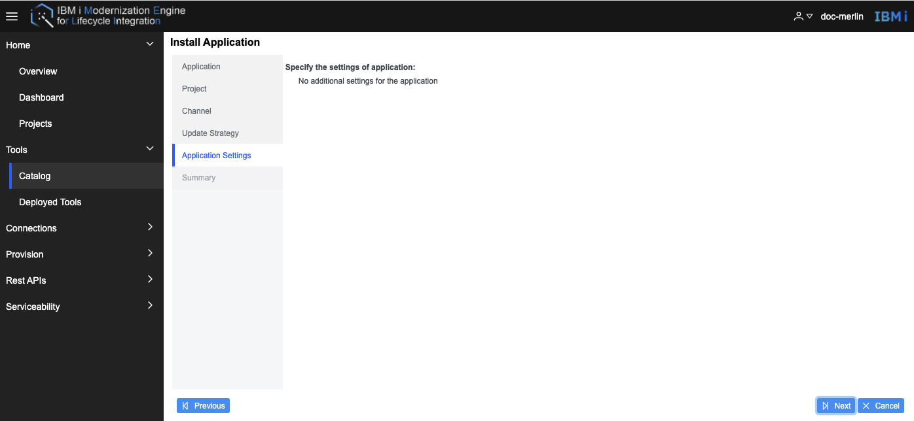
 * Review the summary of the Merlin Tool.
 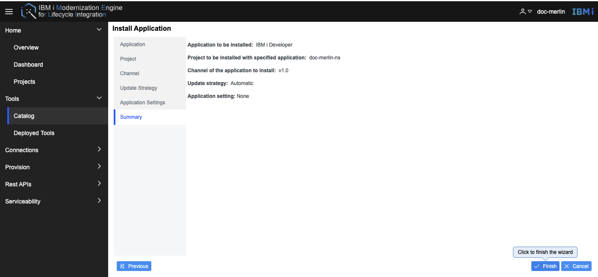
 * Access Merlin Tools after the deployment from the platform or saved URLs.
 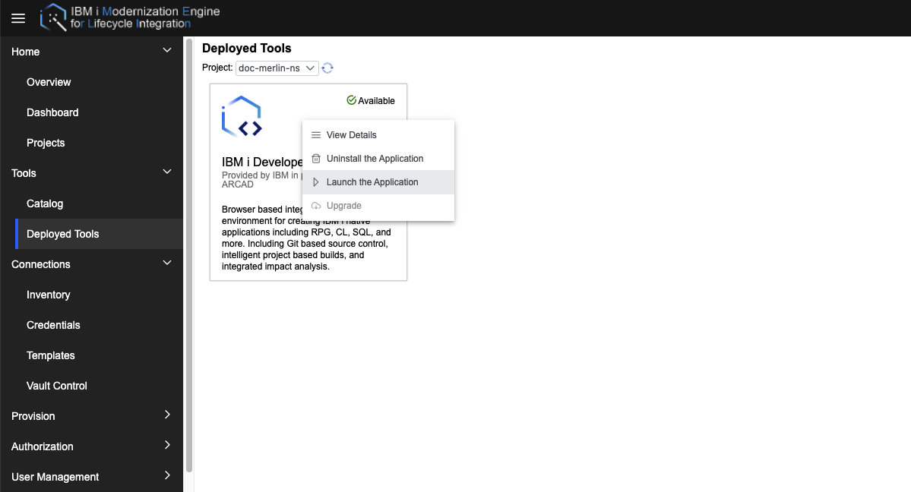

- Uninstall a Merlin tool
Go to Merlin GUI, then open Tools -> Deployed Tools -> select the tool to be uinstalled -> Right click on the tool -> Uninstall the Application. 
 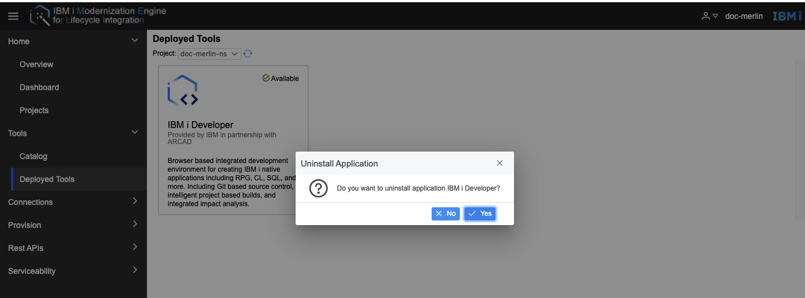
