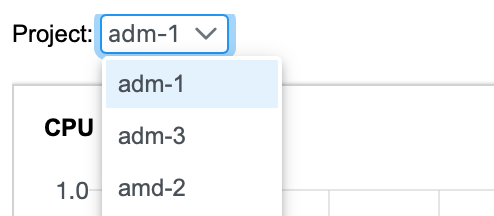
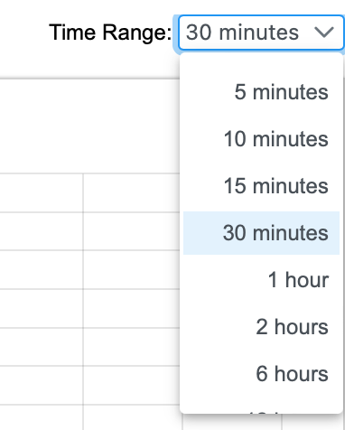
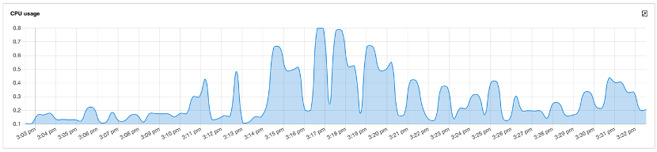

# Monitor resources for Merlin tools

Merlin provides a dashboard to monitor the resource consuming of projects. It includes the following metrics:
* CPU usage
* Memory usage
* Receive bandwidth
* Transmit bandwidth
* Rate of received packets
* Rate of transmitted packets
* Rate of received packets dropped
* Rate of transmitted packets dropped
* File system usage.

On the left navigation panel, click **Home -> Dashboard** to launch dashboard panel. Then select a project from **Project** dropdown box on top of the panel to monitor the resource consuming. 

 

By default, the time range of the charts is 30 minutes. It can be changed from 5 minutes to 2 weeks through **Time range** dropdown box.

 
 
Below is a sample chart of CPU usage.

 

