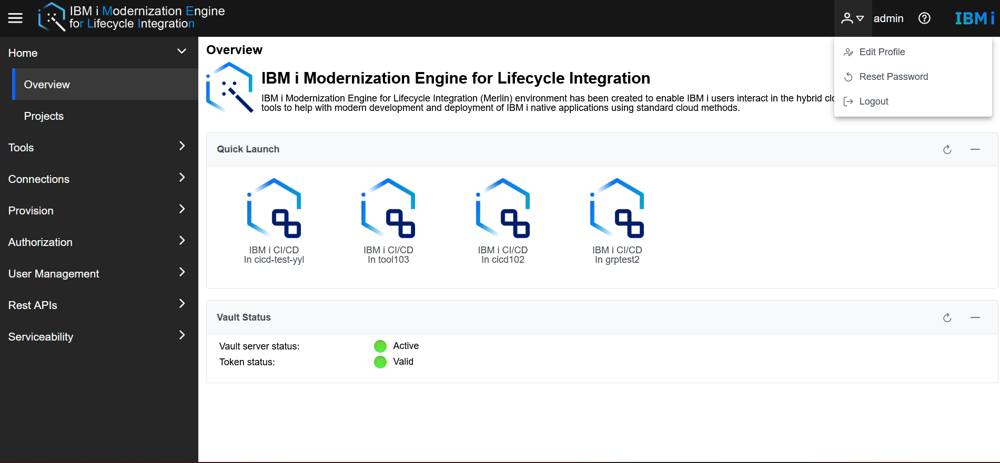
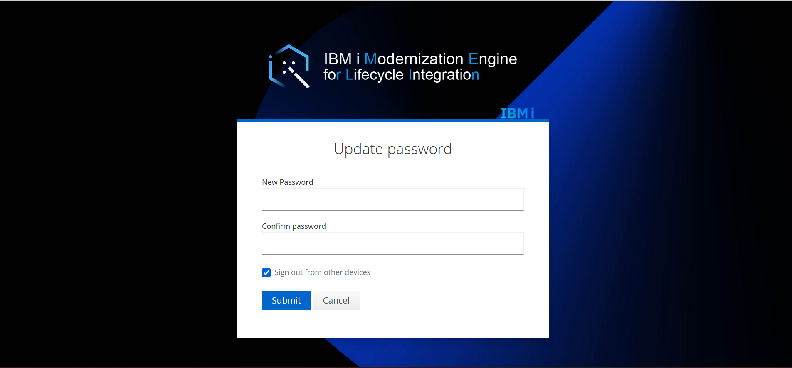
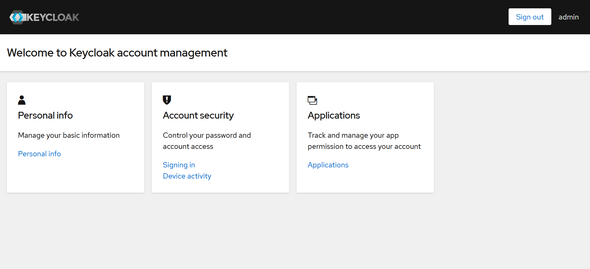
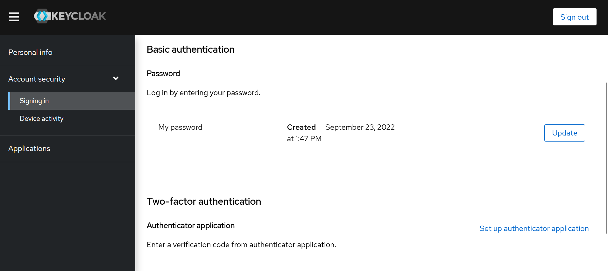

# How to Update Passwrord 
This document simply describes how to update password.  

## Reset Password in Merlin GUI  
Login to the Merlin GUI, click the **Inverted trigonometry** icon on the right top of the Merlin header.    
    
Click the **Reset Password** item, the GUI Will redirect to the **Update Password** page, enter the new password and confirm password -> click **Submit** button.    
    

## Update Password in Keycloak GUI  
Open browser, enter the link https://<keycloak-url<keycloak-url>>/auth/realms/merlin/account, and **sign in**.  
  
Click **Personal Info** link on the Personal info tab -> Click **Account Security** -> **Singing In** -> Click **Update** button.  
  
Will redirect to the **Update password** page -> Enter the New Password and Confirm password -> click **Submit** button. Then the password will be updated.  
  
