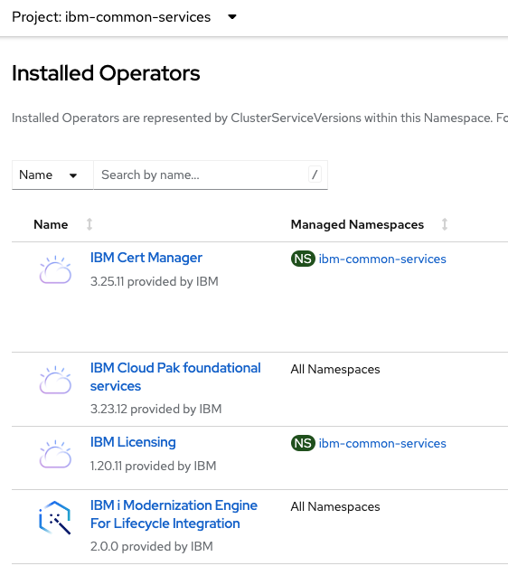
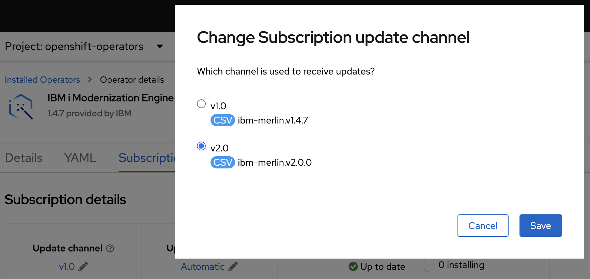

# Upgrade IBM i Modernization Engine for Lifecycle Integration

## How to upgrade from Merlin v1 to v2
To upgrade Merlin v1 to v2, the first step is to backup your existing data. Make sure that all of your work is backed up to a github (or some other source control system) repository before doing any of the next steps.

Once your data is backed up, the next step is to upgrade the catalog source to the latest version (v2). [You can follow the steps here](./guides/platform/Update_catalogsource.md)\
After the catalog source is updated, the next step is to upgrade the Merlin operator to the latest version.

There are 2 cases you can be in.\
Case 1. The Merlin v1 operator is installed in all namespaces mode\
Case 2. The Merlin v1 operator is installed in single namespace mode

Here is an example that shows several operators. It can be seen that in this case the Merlin operator is installed in All Namespaces mode where as the IBM Licensing operator is installed only in the namespace ibm-common-services.

If you have the Merlin operator installed in single namespace mode as in case 2, you will need to first patch the operator group before changing the subscription channel.

## Patching the operator group to use All Namespaces Mode (Only if you were in case 2)
1. Login to your openshift cluster using the openshift cli. `oc login -u <username> -p <password> <openshift-server-url>`
2. Change to use the project that your Merlin instance is installed in. `oc project <Merlin-project>`
3. Get the operator group name. `oc get operatorgroup`
4. Patch the operator group using the name you found in the previous step. `oc patch operatorgroup <operatorgroup-name> --type='json' -p='[{"op": "remove", "path": "/spec/targetNamespaces"}]'`

## Changing the subscription channel
**The next step is to change the subscription channel.**
1. Login to the openshift web console, and go the project that your Merlin instance is installed in.
2. **(Only do this step if you had to patch the operatorgroup. Otherwise, skip to step 3)**
Wait until ibm-cloudpak operator shows an error about intersecting operator groups. This is how you will know the operator group patch completed successfully. Then delete the ibm-cloudpak operator instance and operator in current project.
3. Change the subscription channel to v2, and wait for the install to complete.

4. If you installed the Merlin operator using the manual upgrade strategy, [follow these steps to manually upgrade the operator](./guides/platform/upgrade_merlin_operator).

## Upgrading the installed applications
There are two possible cases you can be in when you are upgrading the applications.

Case 1: You have not installed the IDE and CICD applications in the same project\
Case 2: You have installed the IDE and CICD applications in the same project

If you're in case 1, you can follow the manual upgrade steps (even if you had previously specified the automatic upgrade option). [Here is the documentation regarding manual upgrade steps](./guides/platform/upgrade_tools).

If you're in case 2, then you will need to uninstall the IDE application and install it in a separate project. The CICD application can be upgraded following these [steps.](./guides/platform/upgrade_tools)
## Known Issues 
There are a few known issues that you need to be aware of when upgrading the Merlin operator as well as the installed tools.

1. After upgrading the Merlin operator, it is possible that you may need to restart the engine pod in the namespace for which you have installed Merlin. You will know you need to do this if you see any errors in the Merlin GUI after the Merlin upgrade.

2. When upgrading the IDE, the IDE card will disappear from the screen and you won't be able to see the progress indicator while it is being updated. After 10 minutes, try refreshing the page. The new IDE v2 card should appear on the screen. If it doesn't, you may want to check the ibmi-developer-workspaces-operator pod in the namespace which you've installed the IDE on to check for any potential errors.

3. If the IDE v2 is uninstalled and then reinstalled, a user that has previously logged into the IDE, will not be able to login again. Instead they will receive a message saying "Authentication Error" when trying to login using OpenShift oauth. The work around is to run the command `oc get identity` to get the identity name of the failing user. And then run the command `oc delete identity <identity name>`. Login should work after that. https://access.redhat.com/solutions/6963611

4. You have installed IDE v2 and it shows available, but after logging in to Dev Spaces an error is shown mentioning how it couldn't find "devworkspaces". The work around is to uninstall the IDE, and then reinstall it in a different project.

5. After pressing the upgrade button to upgrade the CICD application from v1 to v2, the CICD card in the Merlin GUI shows that it has been upgraded, but the version still shows v1. If you go to the openshift web console, you will see that the pods are still being recreated in the CICD namespace at this point. Wait a few minutes until the pods have finished being recreated, and then refresh the deployed tools page in the Merlin GUI. You will see the CICD application with the upgraded version.

