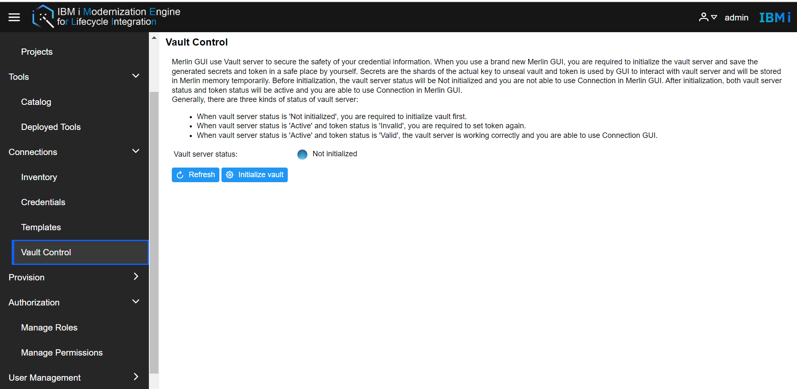
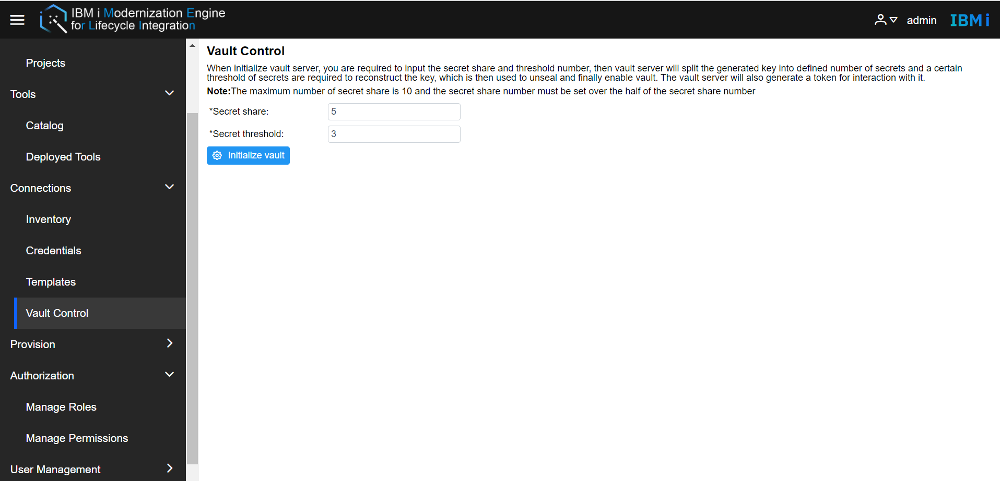
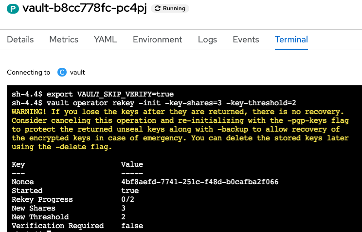
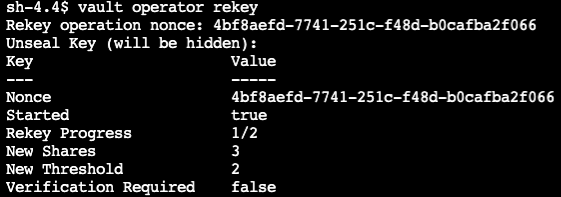
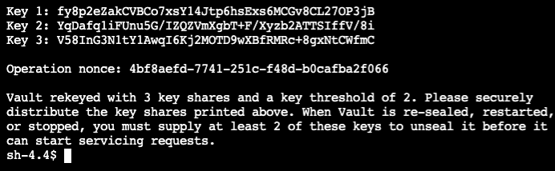
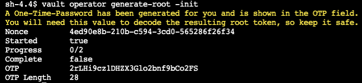
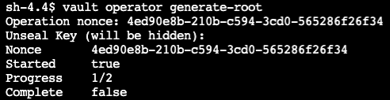
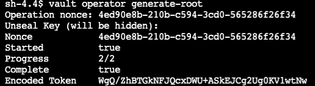

# Vault control
Merlin uses Vault server to secure the safety of Users' credential information. After installing Merlin, admin are required to initialize the vault server and save the generated secrets and tokens in a safe place.     
Before initialization, the vault server status will be Not initialized and users are not able to use Connection in Merlin GUI.   
Go to the Merlin GUI, **Connection -> Vault**, User will turn to Vault Control page.    
   
- **Initialize Vault**  
Click the initialize vault button, admin will turn to the initialize page.  
     
Admin is required to input the secret share and threshold number, then the vault server will split the generated key into a defined number of secrets and a certain threshold of secrets is required to reconstruct the key, which is then used to unseal and finally enable vault. The vault server will also generate a token for interaction with it.    
After entering the shares and threshold, click the Initialize vault button. The credentials and token will be shown. Copy and save them. Both vault server status and token status will be active and you are able to use Connection in Merlin GUI.
- **Seal Vault**  
Admin could click the Seal Vault button the seal the vault which will make users not be able to use credentials, including add and edit credentials. 
- **Unseal Vault**  
 When Merlin is in the Seal status, the Unseal button is available, Admin needs to enter the shares of the correct secret to unseal the vault server.   

**Note:** 
When the vault server status is 'Active' and token status is 'Invalid', the admin is required to set the token again.   


# Vault operation
This section provides steps for users who need to perform operations on vault services that are not yet supported by vault control, such as regenerating keys or root token.  
The following operations need to enter commands in the terminal of the pod in OpenShift, so OpenShift admin and Merlin admin are required to operate together.

**Note:**  
   The following command need to be entered to temporarily skip verification before operating the vault. This setting will be automatically turned off later without affecting security.
   ```shell
   export VAULT_SKIP_VERIFY=true
   ```
The command of vault operator only work when vault server in "unseal" state.  
- **Rekey**   
  The operator rekey command generates a new set of unseal keys (secrets). This can optionally change the total number of key shares or the required threshold of those key shares to reconstruct the root key. This operation is zero downtime, but it requires the Vault is unsealed and a quorum of existing unseal keys are provided.  
  When the unseal key is lost and cannot meet the quorum, this operation cannot be completed. Therefore, the rekey operation is suitable for scenarios where the loss of individual keys or the risk of leakage of keys. In such cases, rekey can help you enhance the security of keys. But remember to keep new keys safe.   
  1. Initialize the rekeying operation. The flags represent the newly desired number of keys and threshold.
     ```shell
     vault operator rekey -init -key-shares=3 -key-threshold=2
     ```
     
  2. Each key holder runs the following command and enters their unseal key.
     ```shell
     vault operator rekey
     ```
     
  3. Repeat the step to complete the rekey operation. When the final unseal key holder enters their key, Vault will output the new unseal keys.   
        

- **Generate root token**   
  The operator generate-root command generates a new root token by combining a quorum of share holders.
  1. Initialize a root token generation.  
     ```shell
     vault operator generate-root -init
     ```
     Nonce and one-time password (OTP) are generated and will need to decode the generated root token later.  
     
  2. Each unseal key holder runs the following command and enter their unseal key.  
     ```shell
     vault operator generate-root
     ```
     
  3. When the quorum of unseal keys are supplied, the final user will also get the encoded root token.
     
  4. Decode the encoded token using the OTP generated during the initialization.  
     ```shell
     vault operator generate-root -decode=WgQ/ZhBTGkNFJQcxDWU+ASkEJCg2Ug0KV1wtNw -otp=2rLHi9cz1DHZX3Glo2bnf9bCo2FS
     ```