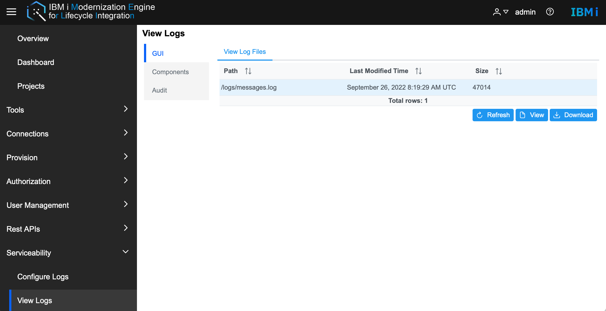
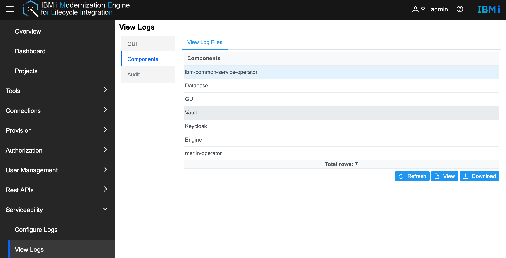
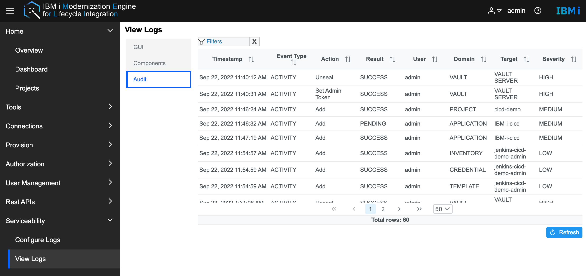
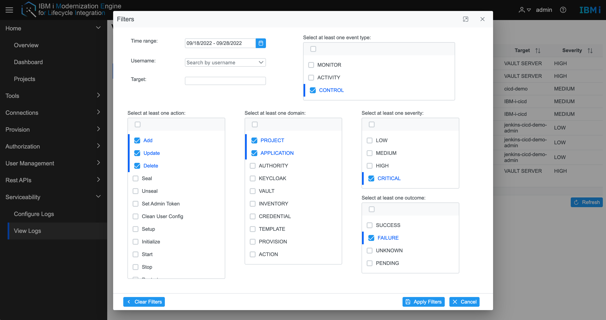

# View logs
Merlin supports viewing and downloading GUI, component, and audit logs.
* View or download GUI logs  
Double-click the log file or click the View button to open the log file.  
Click the **Download** button to download the log file to the local file system.

* View or download component logs  
Double-click the component or click the View button to open the log file.  
Click the **Download** button to download the log file to the local file system.

* View audit log  
By default, Merlin GUI will load the audit logs for the past 10 days.  

&emsp;&emsp;Use the filter to filter the audit log for useful information.  
  

* Filter description:   
&emsp;&emsp;**Domain**: The scope of Domain is the resources managed by Merlin modules.   
&emsp;&emsp;**Event type**: Represents the type of event.  
&emsp;&emsp;**Action, Severity, Outcome**: The meaning of these filters is literally, describing the state of the event.   
&emsp;&emsp;**Target**: Enter the name of a specific resource and search by it, such as entering the name of inventory, it will display the audit log of operations on the specified inventory.   
