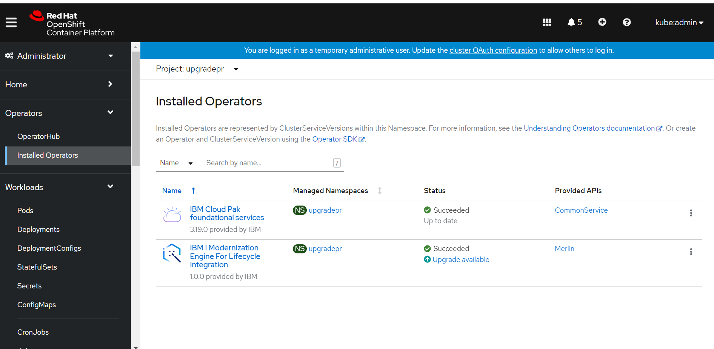
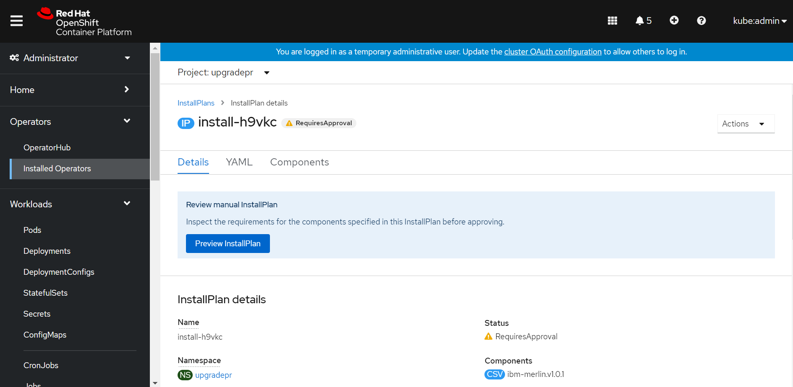
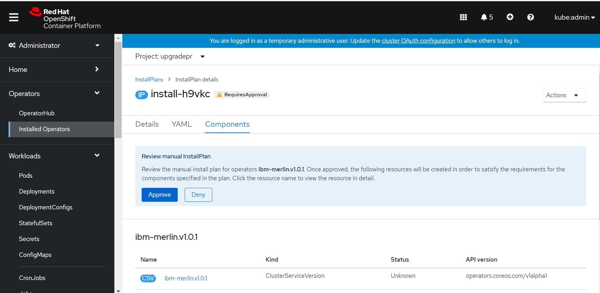
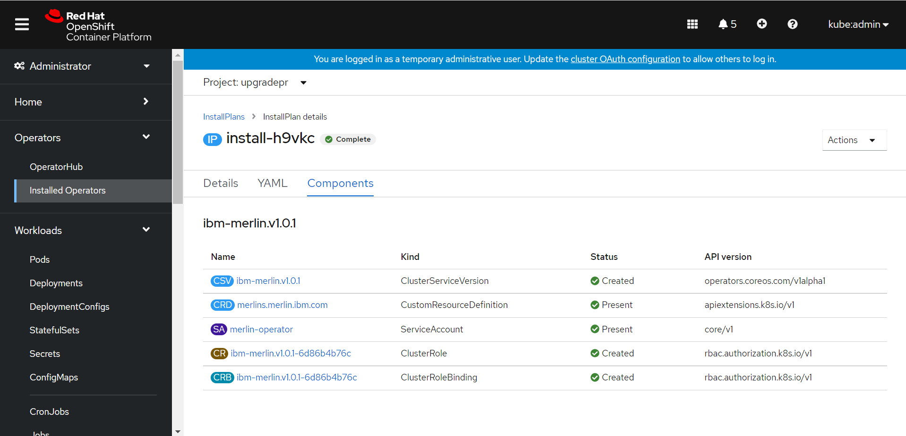

# How to manually upgrade Merlin operator  
There are two methods for Update approval when users install Merlin, Automatic and Manual. If the user select the automatic way, the Merlin will upgrade automatically when the upgrade is available. If the user selects Manual, the user needs to follow the below steps to manually upgrade Merlin. All the operations required Admin authorities of the Openshift platform.
- Step 1: Login to the Openshift platform, Select **Administrator** in the top of the Openshift GUI, click **Operators** -> **Installed Operators**.  
- Step 2: In the right panel, select the Project Name where Merlin installed in the Project droplist. The user will see **upgrade available** button.  
  
- Step 3: Click the **upgrade available** button, turn to Install Plan Page.  
  
- Step 4: Click the **Preview InstallPlan** button, and turn to the Components page, the user could click the name of the resource to see details.    
  
- Step 5: Click the **Approve** button, all the components in the installing status.     
- Step 6: Wait a moment, the installation will be complete status, and back to the Installed Operators page, the operator will be up to date status.  
  
**Note:**  If the user click **Deny** button at the step5, the Openshift Console will send a message to ask if the user want to uninstall the application. Once user select uninstall option, the Merlin operator will be uninstalled. But the Merlin instance still keep alive. Please drop the instance manually.  The detailed information could be reference to [Operator Lifecycle Manager concepts and resources](https://docs.openshift.com/container-platform/4.9/operators/understanding/olm/olm-understanding-olm.html)