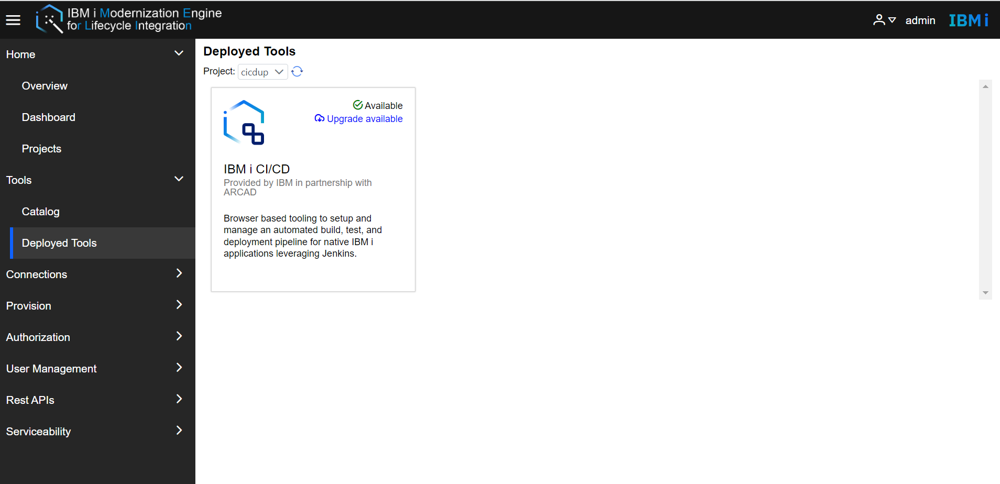
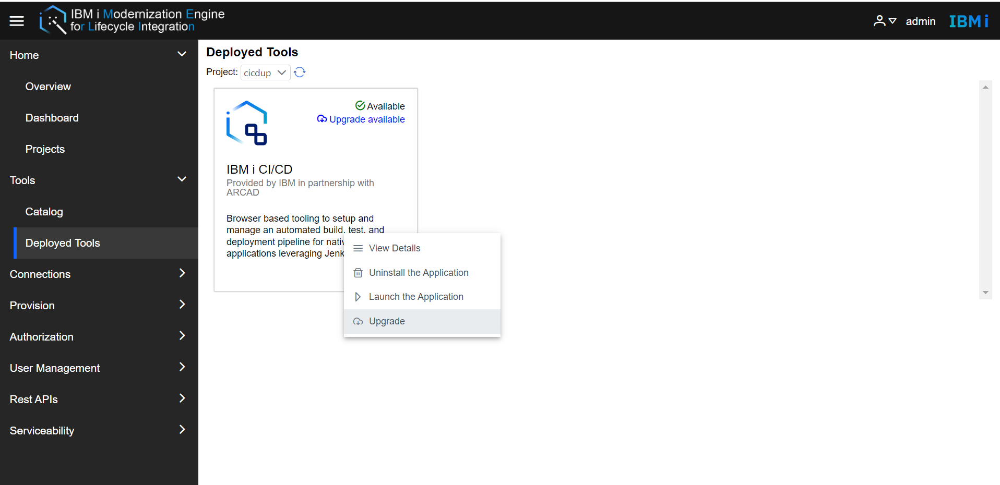
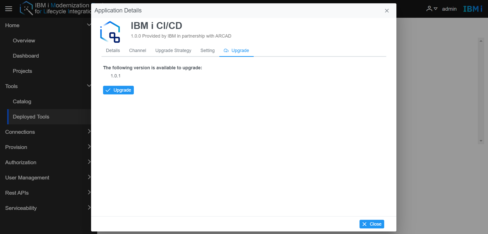
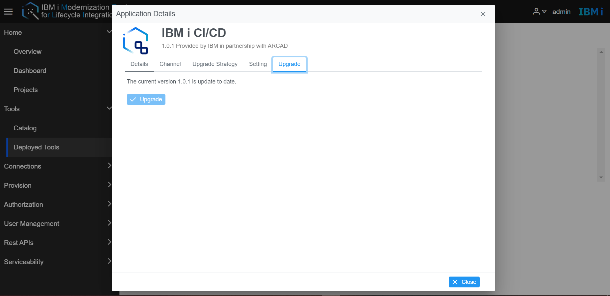

# How to manually upgrade IBM i Developer Integrated Development Environment and IBM i CI/CD Tools  
While installing IBM i Developer Integrated Development Environment and IBM i CI/CD tools, the user specifies the application update strategy. If the user select automatic, the tool will upgrade automatically when the upgrade version is available. The user does not need to do another operation. If the user selects Manual, the user needs to follow the below steps to manually upgrade tool. 

**Note:** Before updating tools, please contact the Administrator to upgrade the Merlin Platform accordingly.

Using IBM i CI/CD upgrade as an example:  
- Login to Merlin, click **Tools** -> **Deployed Tools**, and select the project name in the Project droplist. The user will see  **Upgrade available** tag.  
  
- Right-click the tool image, and the user will see the upgrade button enabled.  
  
- Click the upgrade button. This opens the **Application Details** dialog.  
  
- Click the **upgrade** button. The upgrade process will start.    
- Wait a moment, the user could check the upgrade status.   
   