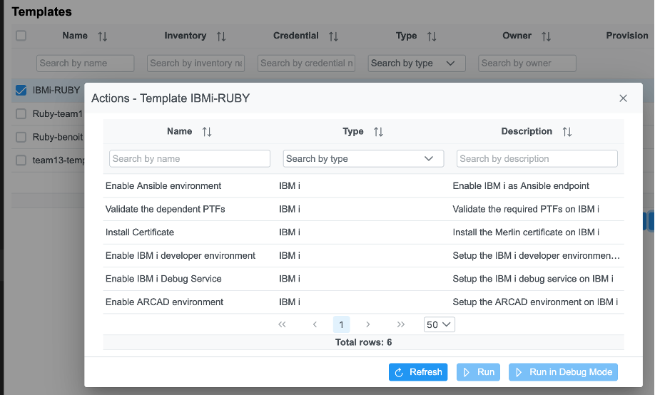
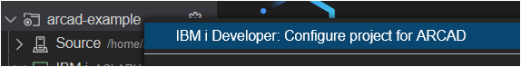

## Review Administrator Preparation

These set-up steps have already been run for you.  They are documented here for your awareness and education and will be useful when you want to set up Merlin in your own environment.

1. Setup git
   1. Configure git repository for Source Configuration Management  
   2. Load ARCAD-EXAMPLE source into git repository (in general, if necessary migrate source from physical files -> IFS -> git repository)
   3. Generate SSH key pair for use from Merlin IDE, git repository, and IBM i userid
   4. Configure webhook for Arcad builder
2. Create ide and cicd projects in Merlin
3. Install IDE tool into ide project, install CICD tool into cicd project
4. Create Merlin users, e.g. `lparXuserY`
5. Add Inventory for each IBM i hostname
6. Add Merlin users and inventory into group
7. Add group to project
8. For each user, create credentials with IBM i userid and password, create template using credential and inventory
9. Run IBM i configuration for Merlin
10. In CICD tool: 
    1. initialize internal Jenkins server
    2. add users
    3. add jenkins credential for IBM i user id to access ARCAD build server,
    4. enable ARCAD integration for jenkins server
<!--4. Create Application definition - source and object libraries-->

### Configuring of Source Control Management
Modern application development presupposes good source control that can enable best practices.
Git is the most popular source code which can be used to drive your CI/CD pipeline using web-hooks that can trigger builds when certain events happen in git. There are many different web interfaces to git that help automate the development process.  These include Github, Gitlab and Gitbucket.  If this is hosted outside of Merlin than the web-hook needs some firewall configuration to access the builders running in Merlin.  The sandbox environment is configured with Gitbucket running on the IBM i.  This means that no new server is required and everything runs within the same secure network.  The source for the demo the repository already contains the sample application source and the web-hook is configured.  Arcad products clone source from the git repository when doing builds on the IBM i and the user profile launching this needs to have the ssh key set up to access the git repository.  This also taken care of the sandbox environment.

### IBM i configuration for Merlin

<!-- panels:start -->

<!-- div:left-panel -->

6 actions on IBM i performed sequentially from Merlin by the Administrator: 

1. Enable ansible (_this is the automation framework used for the subsequent steps_)
2. Validate PTF level (_ensures that the IBM i is at the prerequisite software level_)
3. Install certificates (_required to have encrypted HTTPS communications_)
4. Enable IBM i Developer (_configures IBM i backend for Merlin_)
5. Enable debug service (_configures IBM i backend for the debugger_)
6. Enable Arcad (_install Arcad solutions on the target IBM i_)

<!-- div:right-panel -->

<!-- panels:end -->

---

<!--### Creation of an Arcad Application
-->
<!-- panels:start -->

<!-- div:left-panel -->

<!--The Arcad application has already been created for you.  
When doing this for your own application this can easily be done from with the IDE as an action on the IBM i project or alternatively it can be done through Arcad green screen commands. 
-->
<!-- div:right-panel -->

<!--
-->
<!-- panels:end -->