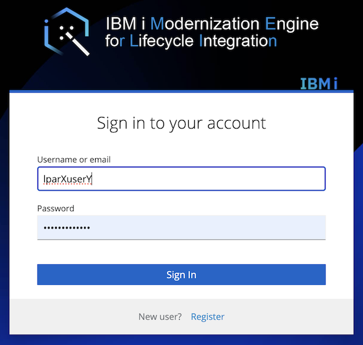

<!--## Preparation: Developer Authentication (SSH)

Result: Source files migrated to git

-->
## Connection to Merlin & Platform overview 

<!-- panels:start -->

<!-- div:left-panel -->

Verify the following information has been provided to you:
* VPN User information
* URL to Merlin landing page
* URL to Git repository
* Merlin userid and password

<!-- div:right-panel -->

First download the VPN client, configure it, and establish a VPN connection.  Then proceed to the Merlin landing page URL.

Before accessing any of the Merlin components, you need to ensure your system has the correct certificates installed, **otherwise Merlin will not load**.

* [See the IBM Documentation](https://www.ibm.com/docs/en/merlin/1.0?topic=guide-manage-browser-certificates) on installing the Merlin certificates
* [Check out this YouTube playlist](https://www.youtube.com/playlist?list=PLPELYviDwCnY6L5r5ZnmCneqhakLcB7ko) where there is a video for each major browser

<!-- panels:end -->

---

<!-- panels:start -->

<!-- div:left-panel -->

### Landing page

Here, users have access to projects "cicd" and "ide" which have provisioned services: IBM i CI/CD and IBM i Developer (as configured by Merlin admin).

Isolation can be done by projects, with different authorizations & roles on resources.

<!-- div:right-panel -->

<!-- panels:end -->

---

<!-- panels:start -->

<!-- div:left-panel -->

### Platform overview

**Inventory**: 

- IBM i managed by Merlin (ex: Dev/Test/Build IBM i, production)

- PowerVC/PowerVS Merlin can provision on private or public clouds

- Jenkins Merlin can trigger CI/CD pipelines

**Provisioning**:

Merlin can provision IBM i VM for a project (dev environment etc). PowerVC / PowerVS

<!-- div:right-panel -->

<!-- panels:end -->

---

<!-- panels:start -->

<!-- div:left-panel -->

**Starting Point**: Under **Connections**, Merlin admin already created an Inventory entry with your IBM i hostname and authorized you to use it. 

<!-- div:right-panel -->

<!-- panels:end -->

---

<!-- panels:start -->

<!-- div:left-panel -->

Merlin admin already created a Credential entry with your IBM i userid and password.

<!-- div:right-panel -->

<!-- panels:end -->

---

<!-- panels:start -->

<!-- div:left-panel -->

Merlin admin already created a template which associates the defined inventory and credential together.  This Merlin template will be used by IBM i Developer so you can interact with your IBM i and services (compiler, debugger, arcad tools, etc.).

<!-- div:right-panel -->

<!-- panels:end -->

---

<!-- panels:start -->

<!-- div:left-panel -->

<!--
### Launch IDE

Go to Tools > Deployed Tools

* Project: merlin-tools

Right click on IBM i Developer, Launch the Application (you may have to Open the workspace if it doesn’t automatically)
-->

<!-- div:right-panel -->

<!--

-->
<!-- panels:end -->