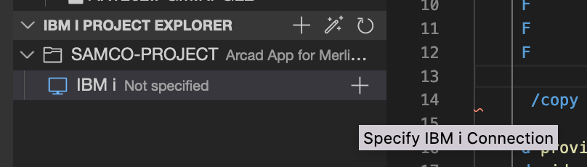
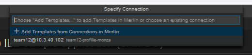
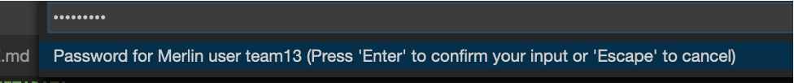
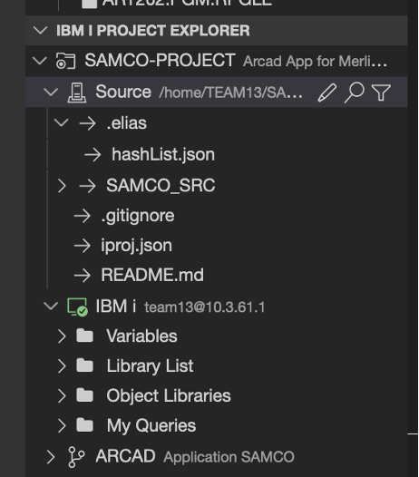
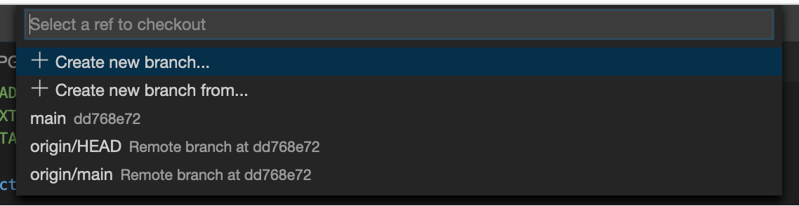
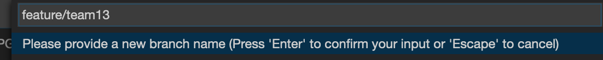
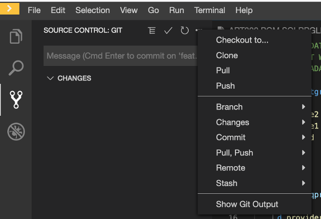
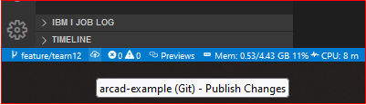

## IBM i Connection from Developer

<!-- panels:start -->

<!-- div:left-panel -->

### Connect to your IBM i from IBM i Developer

1. On the IBM i Project Overview, click on the + icon
   * This should already be configured so just expand the IBMi already there
2. Enter your Merlin credentials (`Passw0rd!`)
   * not your IBM i credentials, that are “stored” by Merlin in the Templates
3. Pick the template that you created in Step 1
4. Choose the default work directory, and click Always if asked to confirm the site validity.

<!-- div:right-panel -->

<!-- panels:end -->

---

<!-- panels:start -->

<!-- div:left-panel -->

### Project Explorer

* **IBM i View**:

   * Variables: used in build (ex: `&lib`)
   * Library lists 
   * Object Libraries: object browser
   * My Queries: list specific objects in a library

* **Arcad View**: (--here SAMCO application)

   * Sites: for deployment
   * Builds: from builder
   * Versions: FT=Feature , SB=Sandbox, etc. (Show link to branch)

<!-- div:right-panel -->

<!-- panels:end -->

## Create git branch

<!-- panels:start -->

<!-- div:left-panel -->

* See the bottom left label: this is the branch your are working on. (never work on the `main`/`master` branch) 
* Create your own branch by clicking on that label then > Create new branch > Type your branch name: `feature/teamXX` > Enter. 

<!-- div:right-panel -->

<!-- panels:end -->

> [!NOTE]
> `feature/xxx` refers to Arcad  mapping between git & Arcad types (feature, sandbox, or release).
>
> GIT BRANCH <==> Arcad Version

---

<!-- panels:start -->

<!-- div:left-panel -->

You are now working locally on your branch. Click on the Git view icon, then the ellipsis (…) in the Source Control: Git toolbar, then Push to create your branch on the git repository.

> [!NOTE]
> This push (Branch creation event)  will be caught by Arcad Builder and will create a first build of your application. 

<!-- div:right-panel -->

<!-- panels:end -->

---

<!-- panels:start -->

<!-- div:left-panel -->

You can also do the same thing just by clicking the git status button:

<!-- div:right-panel -->

<!-- panels:end -->

---

<!-- panels:start -->

<!-- div:left-panel -->

### Change source code

- Save modification can be done automatically or manually Ctrl+S (depends on preferences).
- A badge appears on the Git icon and a M to the right of the source member after the save.

<!-- div:right-panel -->

<!-- panels:end -->