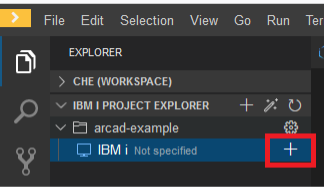

## Launch IBM i Developer IDE

<!-- panels:start -->

<!-- div:left-panel -->

From `Home>Overview` on the Merlin dashboard, launch the `IBM i Developer` application

<!-- div:right-panel -->

<!-- panels:end -->

---

<!-- panels:start -->

<!-- div:left-panel -->

From `Create Workspace`, create a workspace by selecting `IBM i Developer` 

<!-- div:right-panel -->

<!-- panels:end -->

---

## Clone git repository into workspace

<!-- panels:start -->

<!-- div:left-panel -->

From `IBM i Developer Workspaces`, select `Git Clone...`

<!-- div:right-panel -->

<!-- panels:end -->

---

<!-- panels:start -->

<!-- div:left-panel -->

Specify the git repository URL `ssh://git@p337n57.pbm.ihost.com:29418/merlin/arcad-example.git`

<!-- div:right-panel -->

<!-- panels:end -->

---

<!-- panels:start -->

<!-- div:left-panel -->

Do NOT change the repository location from `projects`.  Click `Select Repository Location`

<!-- div:right-panel -->

<!-- panels:end -->

---

<!-- panels:start -->

<!-- div:left-panel -->

If a dialog appears and asks to open the cloned repository or add it do the current workspace, just click `X` to close the dialog.

<!-- div:right-panel -->

<!-- panels:end -->

---

<!-- panels:start -->

<!-- div:left-panel -->

The workspace is now populated with the `arcad-example` project from the git repository

<!-- div:right-panel -->

<!-- panels:end -->

---

## Connect project to IBM i

<!-- panels:start -->

<!-- div:left-panel -->

In `IBM I Project Explorer`, expand `arcad-example` project and click on `+` beside `IBM i` to specify the IBM i connection to use

<!-- div:right-panel -->

<!-- panels:end -->

---

<!-- panels:start -->

<!-- div:left-panel -->

Since the IDE will connect to Merlin to retrieve the templates defined, enter your Merlin password (not the IBM i credentials)

<!-- div:right-panel -->

<!-- panels:end -->

---

<!-- panels:start -->

<!-- div:left-panel -->

Choose the tempate (which has the host name and IBM i credentials to use) to associate with the project

<!-- div:right-panel -->

<!-- panels:end -->

---

<!-- panels:start -->

<!-- div:left-panel -->

The build directory will have a valid default.  Click `Enter`

<!-- div:right-panel -->

<!-- panels:end -->

---

<!-- panels:start -->

<!-- div:left-panel -->

If prompted about authenticity of host, click `Always`

<!-- div:right-panel -->

<!-- panels:end -->

---

<!-- panels:start -->

<!-- div:left-panel -->

The project will be connected to the IBM i.  `arcad-example>IBM i` will have a green icon with a checkmark.  There will be nodes underneath `IBM i`

<!-- div:right-panel -->

<!-- panels:end -->

---

## Configure project for ARCAD

<!-- panels:start -->

<!-- div:left-panel -->

In `IBM I Project Explorer`, right-click on `arcad-example` and select `Configure project for ARCAD`

<!-- div:right-panel -->

<!-- panels:end -->

---

<!-- panels:start -->

<!-- div:left-panel -->

Enter an application code that does NOT already exist, e.g. `SAMCO`.  Press `Enter`

<!-- div:right-panel -->

<!-- panels:end -->

---

<!-- panels:start -->

<!-- div:left-panel -->

For description and CCSID, press `Enter`

<!-- div:right-panel -->

<!-- panels:end -->

---

<!-- panels:start -->

<!-- div:left-panel -->

Enter a prefix for the application, e.g. `SCO`

<!-- div:right-panel -->

<!-- panels:end -->

---

<!-- panels:start -->

<!-- div:left-panel -->

For iASP, press `Enter`

<!-- div:right-panel -->

<!-- panels:end -->

---

<!-- panels:start -->

<!-- div:left-panel -->

When prompted, click `Initialize` to have the linked ARCAD application to be initialized with the content of the project

<!-- div:right-panel -->

<!-- panels:end -->

---

<!-- panels:start -->

<!-- div:left-panel -->

If a warning dialog appears about the default branch and being able to do a ARCAD build on it, click `OK`

<!-- div:right-panel -->

<!-- panels:end -->

---

<!-- panels:start -->

<!-- div:left-panel -->

The initialization will start and messages will be logged in the `Output` view.  When prompt to start a build, click `Proceed`

<!-- div:right-panel -->

<!-- panels:end -->

---

<!-- panels:start -->

<!-- div:left-panel -->

If prompted about authenticity of host, click `Always`

<!-- div:right-panel -->

<!-- panels:end -->

---

<!-- panels:start -->

<!-- div:left-panel -->

The `Output` view will show messages from the build.  It will take several minutes.  A message will appear indicating a successful build

<!-- div:right-panel -->

<!-- panels:end -->

---

<!-- panels:start -->

<!-- div:left-panel -->

In `IBM I Project Explorer`, `arcad-example` will now have an `ARCAD` node

<!-- div:right-panel -->

<!-- panels:end -->

---

## Create git branch

<!-- panels:start -->

<!-- div:left-panel -->

* On the bottom left, the current branch that you are working on will be shown. Work should not be done on the `main`/`master` branch. 
* Create your own branch by clicking on the branch then select `Create new branch`.  Type your branch name, which must be unique, e.g. `feature/teamXX`, and press Enter. 

<!-- div:right-panel -->

<!-- panels:end -->

> [!NOTE]
> `feature/xxx` refers to Arcad  mapping between git & Arcad types (feature, sandbox, or release).
>
> GIT BRANCH <==> Arcad Version

---

<!-- panels:start -->

<!-- div:left-panel -->

You are now working locally on your branch. Click on the Git view icon, then the ellipsis (…) in the Source Control: Git toolbar, then Push to create your branch on the git repository.

> [!NOTE]
> This push (Branch creation event) will be caught by Arcad Builder and will create a build of your application. 

<!-- div:right-panel -->

<!-- panels:end -->

---

<!-- panels:start -->

<!-- div:left-panel -->

You can also push to the git repository by clicking the git status button at the bottom:

<!-- div:right-panel -->

<!-- panels:end -->

---

<!-- panels:start -->

<!-- div:left-panel -->

## Change source code

- Save modification can be done automatically or manually (`File>Save` or key combination, e.g Ctrl+S (depends on preferences)).
- After the save, a badge appears on the Git icon and a `M` to the right of the source member to indicate the file has been modified.

<!-- div:right-panel -->

<!-- panels:end -->

---

<!-- panels:start -->

<!-- div:left-panel -->

In `CHE (WORKSPACE)`, open `arcad-example>QDDSSRC>ART201D.DSPF`

<!-- div:right-panel -->

<!-- panels:end -->
---

<!-- panels:start -->

<!-- div:left-panel -->

Change `ART201-1` to `ART201F1` and save the file

<!-- div:right-panel -->

<!-- panels:end -->
---

<!-- panels:start -->

<!-- div:left-panel -->

Press `F1`.  Type `COMPILE` to find the `IBM i Developer: Compile` action and press `Enter` to run a build which will compile the changed source

<!-- div:right-panel -->

<!-- panels:end -->
---

<!-- panels:start -->

<!-- div:left-panel -->

The `Output` view will show the successful result

<!-- div:right-panel -->

<!-- panels:end -->
---

<!-- panels:start -->

<!-- div:left-panel -->

In `IBM I Project Explorer`, `arcad-example>ARCAD` will have a Sandbox version and underneath `Components` will be shown the object compiled

<!-- div:right-panel -->

<!-- panels:end -->
---

<!-- panels:start -->

<!-- div:left-panel -->

On the bottom left, click on the branch status icon and publish the changes

<!-- div:right-panel -->

<!-- panels:end -->