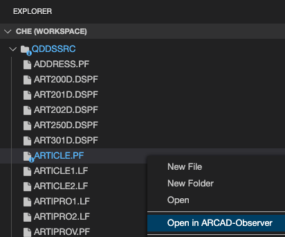
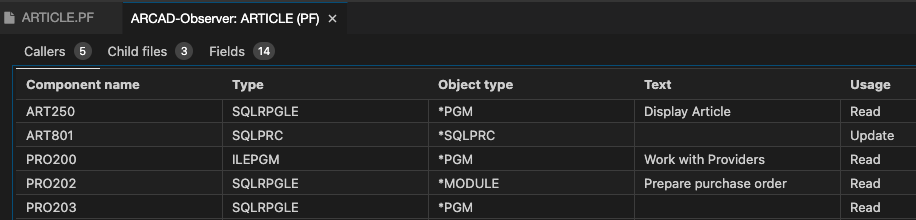
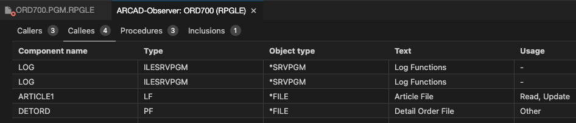

<!-- panels:start -->

<!-- div:left-panel -->

## Explore the Cross reference information (Xrefs)

* Click on the Explorer view icon
* Right-click on `arcad-example/QDDSSRC/ARTICLE.PF` and select the `Open in ARCAD-Observer` option to open a new Xref panel. Each tab of the panel shows different kinds of Xref information:

<!-- div:right-panel -->

<!-- panels:end -->
---
<!-- panels:start -->

<!-- div:left-panel -->

* Right-click on `arcad-example/QRPGLESRC/ORD700.PGM.RPGLE` and select the `Open in ARCAD-Observer`

<!-- div:right-panel -->

<!-- panels:end -->
---

<!-- panels:start -->

<!-- div:left-panel -->

**Code Lens**: in-line links directly available while editing (RPGLE) source

* F-Spec level code lens shows same file-level Xref as “Open in Arcad Observer”
* P-Spec “Peek references” allows you to see/browse source of implementing procedure

<!-- div:right-panel -->

<!-- panels:end -->