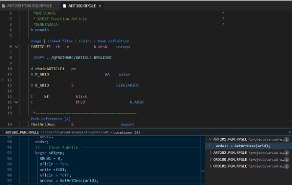

<!-- panels:start -->

<!-- div:left-panel -->

## Explore the Xrefs

Click on the Explorer view icon, then do a right-click on a source member and select the `Open in ARCAD-Observer` option to open a new Xref panel. Each tab of the panel shows different kinds of Xref information:

<!-- div:right-panel -->

<!-- panels:end -->

---

<!-- panels:start -->

<!-- div:left-panel -->

**Code Lens**: in-line links directly available while editing (RPGLE) source

* F-Spec level code lens shows same file-level Xref as “Open in Arcad Observer”
* “Procedure peek” allows you to see/browse source of implementing procedure

<!-- div:right-panel -->

<!-- panels:end -->