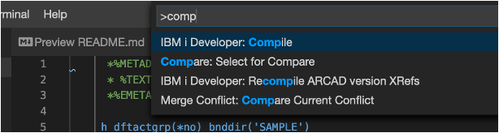

## Compilation in a sandbox

During a development, it can be interesting to compile a source member to check that the compilation works and to be able to do some unit tests.

1. To do that, when a source member is edited, press F1 and select `IBM i Developer: Compile`, or do a right click in the edited source member and select the compilation option, or do a right click on the source member in the explorer view and select the compilation option.
2. The compiling job starts.
3. It is possible to follow the process in the IBM i Build Output.
4. This job creates a new version, a sandbox version linked to the feature version only for the developer.
5. Compilation errors and warnings appear in Problems view.  Spool files can be viewed in .logs folder.

To build a project, use `IBM i Developer: Build Project` function

---

<!-- panels:start -->

<!-- div:left-panel -->

Press F1, choose function “IBM i Developer Compile” (simple compilation)

<!-- div:right-panel -->

<!-- panels:end -->

---

<!-- panels:start -->

<!-- div:left-panel -->

Expand ARCAD view on the left: Compilation result for an Arcad Project creates a SB (Sandbox environment) where the dev can work locally. Here Sandbox is contained in the `SAMDSB0000` library on IBM i.

<!-- div:right-panel -->

<!-- panels:end -->

---

<!-- panels:start -->

<!-- div:left-panel -->

View logs (bottom view) with compilator warnings

<!-- div:right-panel -->

<!-- panels:end -->

---

<!-- panels:start -->

<!-- div:left-panel -->

View Spool files in `.logs` folder:

<!-- div:right-panel -->

<!-- panels:end -->

## Source tracking & compilation

<!-- panels:start -->

<!-- div:left-panel -->

Standard process is: 

1. Show change in Git view
2. See compare
3. Stage change
4. Commit
5. Push

<!-- div:right-panel -->

<!-- panels:end -->